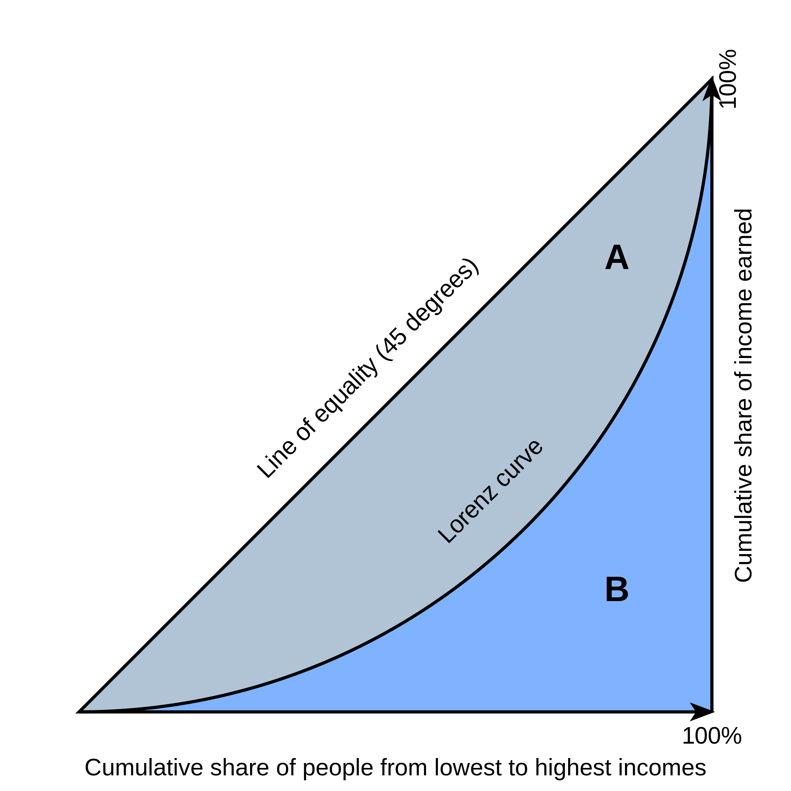
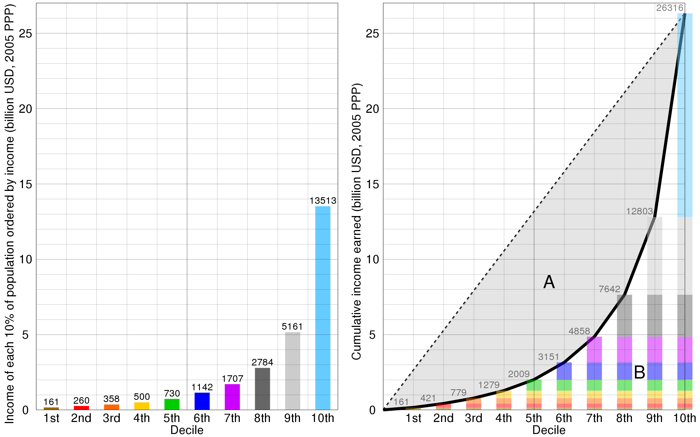

## 第3週

12/21(TH)　不平等を無くすために何をするべきか1

　　　　　  不平等を無くすために何をするべきか2

講義では、所得の世界的格差の現状を踏まえて、高所得者に対する資産課税、金融取引税の可能性について議論します。

01/09(TU)　Rでデータサイエンス3：GNI係数と所得分布　 [[Main](https://ds-sl.github.io/intro2r/ges001/ges001-main.nb.html)]・[授業]

**Poverty and Inequality―Distribution of income or consumption（データが少ない難点）**

GINI index (World Bank estimate)；SI.POV.GINI [[Link](https://data.worldbank.org/indicator/SI.POV.GINI)]

Income share held by lowest 10%：SI.DST.FRST.10 [[Link](https://databank.worldbank.org/metadataglossary/world-development-indicators/series/SI.DST.FRST.10)]

Income share held by lowest 20%：SI.DST.FRST.20 [[Link](https://databank.worldbank.org/metadataglossary/world-development-indicators/series/SI.DST.FRST.20)]

Income share held by second 20%：SI.DST.02ND.20 [[Link](https://databank.worldbank.org/metadataglossary/world-development-indicators/series/SI.DST.02ND.20)]

Income share held by third 20%：SI.DST.03RD.20 [[Link](https://data.worldbank.org/indicator/SI.DST.03RD.20)]

Income share held by fourth 20%：SI.DST.04TH.20 [[Link](https://databank.worldbank.org/metadataglossary/world-development-indicators/series/SI.DST.04TH.20)]

Income share held by highest 20%：SI.DST.05TH.20 [[Link](https://data.worldbank.org/indicator/SI.DST.05TH.20)]

Income share held by highest 10%：SI.DST.10TH.10 [[Link](https://data.worldbank.org/indicator/SI.DST.10TH.10)]

### 指標について

-   GINI index (World Bank estimate)；SI.POV.GINI [[Link](https://data.worldbank.org/indicator/SI.POV.GINI)]

    -   Gini index measures the extent to which the distribution of income (or, in some cases, consumption expenditure) among individuals or households within an economy deviates from a perfectly equal distribution. A Lorenz curve plots the cumulative percentages of total income received against the cumulative number of recipients, starting with the poorest individual or household. The Gini index measures the area between the Lorenz curve and a hypothetical line of absolute equality, expressed as a percentage of the maximum area under the line. Thus a Gini index of 0 represents perfect equality, while an index of 100 implies perfect inequality.

    -   ジニ指数は、経済内の個人または世帯間の所得（または場合によっては消費支出）の分布が、完全に平等な分布からどの程度逸脱しているかを測定する。ローレンツ曲線は、最も貧しい個人または世帯から始まり、受給者の累積数に対する総所得の累積割合をプロットしたものである。ジニ指数は、ローレンツ曲線と絶対的平等の仮想線との間の面積を測定するもので、線の下の最大面積の百分率で表される。したがって、ジニ指数0は完全な平等を表し、指数100は完全な不平等を意味する。

-   Income share held by lowest 10%：SI.DST.FRST.10 [[Link](https://databank.worldbank.org/metadataglossary/world-development-indicators/series/SI.DST.FRST.10)]

    -   Percentage share of income or consumption is the share that accrues to subgroups of population indicated by deciles or quintiles.

    -   所得または消費の割合は、デシルまたは五分位数で示される人口のサブグループに発生する割合です。

-   Income share held by lowest 20%：SI.DST.FRST.20 [[Link](https://databank.worldbank.org/metadataglossary/world-development-indicators/series/SI.DST.FRST.20)]

    -   Percentage share of income or consumption is the share that accrues to subgroups of population indicated by deciles or quintiles. Percentage shares by quintile may not sum to 100 because of rounding.

    -   所得または消費の割合は、デシルまたは五分位数で示される人口のサブグループに発生する割合です。五分位数によるシェアの割合は、四捨五入のため100にならない場合があります。(Apple)

-   Income share held by second 20%：SI.DST.02ND.20 [[Link](https://databank.worldbank.org/metadataglossary/world-development-indicators/series/SI.DST.02ND.20)]

    -   Percentage share of income or consumption is the share that accrues to subgroups of population indicated by deciles or quintiles. Percentage shares by quintile may not sum to 100 because of rounding.

    -   所得または消費に占める割合は、10分位または5分位で示される人口のサブグループに帰属する割合である。四捨五入の関係上、五分位階級別の割合の合計が100にならない場合がある。（DeepL）

-   Income share held by third 20%：SI.DST.03RD.20 [[Link](https://data.worldbank.org/indicator/SI.DST.03RD.20)]

    -   Percentage share of income or consumption is the share that accrues to subgroups of population indicated by deciles or quintiles. Percentage shares by quintile may not sum to 100 because of rounding.

    -   所得または消費に占める割合は、10分位または5分位で示される人口のサブグループに帰属する割合である。四捨五入の関係上、五分位階級別の割合の合計が100にならない場合がある。（DeepL）

-   Income share held by fourth 20%：SI.DST.04TH.20 [[Link](https://databank.worldbank.org/metadataglossary/world-development-indicators/series/SI.DST.04TH.20)]

    -   Percentage share of income or consumption is the share that accrues to subgroups of population indicated by deciles or quintiles. Percentage shares by quintile may not sum to 100 because of rounding.

    -   所得または消費の割合は、十分位数または五分位数で示される人口のサブグループに生じる割合です。四捨五入のため、五分位別の割合の合計が 100 にならない場合があります。(Google)

-   Income share held by highest 20%：SI.DST.05TH.20 [[Link](https://data.worldbank.org/indicator/SI.DST.05TH.20)]

    -   Percentage share of income or consumption is the share that accrues to subgroups of population indicated by deciles or quintiles. Percentage shares by quintile may not sum to 100 because of rounding.

    -   所得または消費の割合は、十分位数または五分位数で示される人口のサブグループに生じる割合です。四捨五入のため、五分位別の割合の合計が 100 にならない場合があります。

-   Income share held by highest 10%：SI.DST.10TH.10 [[Link](https://data.worldbank.org/indicator/SI.DST.10TH.10)]

    -   Percentage share of income or consumption is the share that accrues to subgroups of population indicated by deciles or quintiles.

    -   所得または消費の割合は、十分位数または五分位数で示される人口のサブグループに生じる割合です。

## 内容

```{r}
library(tidyverse)
library(WDI)
```

```{r eval = FALSE}
df_gini <- WDI(indicator = c(gini = "SI.POV.GINI",
                            `0-10` = "SI.DST.FRST.10",
                            `0-20` = "SI.DST.FRST.20",
                            `20-40` = "SI.DST.02ND.20",
                            `40-60` = "SI.DST.03RD.20",
                            `60-80` = "SI.DST.04TH.20",
                            `80-100` = "SI.DST.05TH.20",
                            `90-100` = "SI.DST.10TH.10"))
```

```{r}
df_gini
```

```{r eval = FALSE}
write_csv(df_gini, "data/gini.csv")
```

```{r}
df_gini <- read_csv("data/gini.csv")
```

```{r}
df_gini_long <- df_gini |> 
  pivot_longer(-(1:5), names_to = "levels", values_to = "value")
df_gini_long
```

どのくらい GINI のデータがあるか確かめる

```{r}
df_gini |> group_by(year) |> drop_na(gini) |> 
  summarize(n = n()) |>
  ggplot(aes(year, n)) + geom_col()
```

実際のデータの個数も計算してみる。

```{r}
df_gini_long |> 
  group_by(year, levels) |> drop_na(value) |>
  summarize(num = n()) |> distinct(year, num) |> arrange(desc(year))
```

GINIだけでなく、他の値についても調べる。

```{r}
df_gini_long |> 
  group_by(year, levels) |> drop_na(value) |>
  summarize(num = n()) |> distinct(year, num) |> 
  ggplot(aes(year, num)) + geom_col()
```

2022年は、7カ国分しかデータがないがその国名を表示する。

```{r}
df_gini_long |> filter(year == 2022) |> drop_na(gini) |>
  distinct(country, gini)
```

```{r}
COUNTRY_GINI <- "Bangladesh"
YEAR_GINI <- 2022
df_gini_long |> 
  filter(country == COUNTRY_GINI, year == YEAR_GINI) |>
  ggplot(aes(levels, value)) + geom_col()
```

```{r}
COUNTRY_GINI <- "Bhutan"
YEAR_GINI <- 2022
df_gini_long |> 
  filter(country == COUNTRY_GINI, year == YEAR_GINI) |>
  ggplot(aes(levels, value)) + geom_col()
```

```{r}
COUNTRY_GINI <- "Costa Rica"
YEAR_GINI <- 2022
df_gini_long |> 
  filter(country == COUNTRY_GINI, year == YEAR_GINI) |>
  ggplot(aes(levels, value)) + geom_col()
```

## GINI って何！？

**ジニ係数**（ジニけいすう、[英](https://ja.wikipedia.org/wiki/%E8%8B%B1%E8%AA%9E "英語"): Gini coefficient）とは主に社会における所得の不平等さを測る指標である。0から1で表され、各人の所得が均一で格差が全くない状態を0、たった一人が全ての所得を独占している状態を1とする。ローレンツ曲線をもとに、1912年にイタリアの統計学者、コッラド・ジニによって考案された。それ以外にも、富の偏在性やエネルギー消費における不平等さなどに応用される。（Wikipedia）



ジニ係数のグラフ ジニ係数は、*A*の面積を*A*と*B*の各面積の合計で割ったものに等しい。すなわち、ジニ係数 =*A*/（*A*+*B*）となる。また、*A*+*B*=0.5のため、2×*A*にも等しい（縦軸は0と1の間の値をとるため）



[リンク](https://upload.wikimedia.org/wikipedia/commons/e/e7/Lorenz_curve_global_income_2011.svg)

```{r}
df_gini_calc <- df_gini |> 
  mutate(`0` = 0, `10` = `0-10`, `20` = `0-20`, `40` = `0-20` + `20-40`, `60` = `0-20` + `20-40` + `40-60`, `80` = `0-20` + `20-40` + `40-60` + `60-80`, `90` = `0-20` + `20-40` + `40-60` + `60-80` + `80-100`-`90-100`, `100` = 100) 
df_gini_calc %>% drop_na() |> filter(country == "Bangladesh")
```

```{r}
df_gini_calc_long <- df_gini_calc |>  pivot_longer(`0`:`100`, names_to = "classes", values_to = "cumulative_share") |> mutate(classes = as.numeric(classes))
df_gini_calc_long %>% drop_na() |> filter(country == "Bangladesh")
```

確認

```{r}
df_gini_calc_long |> filter(country == "Bangladesh") |> 
  filter(year == 2022) |> ggplot() + geom_line(aes(classes, cumulative_share)) + geom_segment(aes(x = 0, y = 0, xend = 100, yend = 100), color = 'red') + 
  scale_x_continuous(breaks = seq(0,100,by=20)) + 
  scale_y_continuous(breaks = seq(0,100,by=20)) #+
  #annotate("text", x = 10, y = 80, label = gini)
```

Shade region between two lines with ggplot: [[リンク](https://stackoverflow.com/questions/28586635/shade-region-between-two-lines-with-ggplot)]

```{r}
df_gini_calc |> group_by(country, year) |> 
  drop_na(gini) |>
  summarize(gini, gini_trapezoid = 100-(2*`10` + 3*`20` + 4*`40` + 4*`60` + 3*`80` + 2*`90` + 100)/10) |> 
  distinct(country, year, gini, gini_trapezoid)
```

```{r}
#### For the calcualtion of the area under the curve
    #### Trapezoidal rule
    trapezoid <- function(x, y) {
                     sum(diff(x)*(y[-1]+y[-length(y)]))/2
                 }
    #### Simpson's rule: more accurate
    simpson <- function(x, y){
                   n <- length(y)
                   odd <- n %% 2
                   if (odd)
                       area <- 1/3*sum( y[1] + 2*sum(y[seq(3,(n-2),by=2)]) + 4*sum(y[seq(2,(n-1),by=2)]) + y[n])
                   if (!odd)
                       area <- 1/3*sum( y[1] + 2*sum(y[seq(3,(n-3),by=2)]) + 4*sum(y[seq(2,(n-2),by=2)]) + y[n-1]) + 1/2*(y[n-1] + y[n])
                   dx <- x[2] - x[1]
                   return(area * dx)
    }
    
SIMPSON <- function(x, h=1){
  # AUC function computes the Area Under the Curve of a time serie using
  # the Simpson's Rule (numerical method).
  # https://link.springer.com/chapter/10.1007/978-1-4612-4974-0_26
  
  # Arguments
  # x: (vector) time serie values
  # h: (int) temporal resolution of the time serie. default h=1
  
  n = length(x)-1
  
  xValues = seq(from=1, to=n, by=2)
  
  sum <- list()
  for(i in 1:length(xValues)){
    n_sub <- xValues[[i]]-1
    n <- xValues[[i]]
    n_add <- xValues[[i]]+1
    
    v1 <- x[[n_sub+1]]
    v2 <- x[[n+1]]
    v3 <- x[[n_add+1]]
    
    s <- (h/3)*(v1+4*v2+v3)
    sum <- append(sum, s)
  }
  sum <- unlist(sum)
  
  auc <- sum(sum)
  
  return(auc)
  
}
```

```{r}
simpson(c(0,0.2,0.4,0.6,0.8,1),c(0,0.04,0.16,0.36,0.64,1))
```

```{r}
library(DescTools)
```

Area Under the Curve: [[リンク](https://search.r-project.org/CRAN/refmans/DescTools/html/AUC.html)]

```{r}
df_gini_calc_long |> group_by(country, year) |> 
  drop_na(gini) |>
  summarize(gini, gini_spline = round(100-AUC(classes, cumulative_share, method = "spline")/50, digits = 1), gini_trapezoid = round(100-AUC(classes, cumulative_share)/50, digits = 1), gini_simpson = round(100 - simpson(classes, cumulative_share)/50, digits = 1)) |> 
  distinct(country, year, gini, gini_spline, gini_trapezoid, gini_simpson)
```

```{r}
df_gini_calc_long |> group_by(country, year) |> 
  drop_na(gini) |>
  summarize(gini, gini_spline = round(100-AUC(classes, cumulative_share, method = "spline")/50, digits = 1), gini_trapezoid = round(100-AUC(classes, cumulative_share)/50, digits = 1), gini_simpson = round(100 - simpson(classes, cumulative_share)/50, digits = 1)) |> 
  distinct(country, year, gini, gini_spline, gini_trapezoid, gini_simpson)
```

AUC: Calculating Area under a Curve [[リンク](https://www.smin95.com/dataviz/calculating-area-under-a-curve#calculating-area-under-a-curve)]

### GINI Calculator 

x に、数の列を入れるとその分配に関する、GINI を計算します。

```{r}
x <- c(1,1,1,4,10)
Lc(x)[c(1,2)] |> as.tibble() |> mutate(d = p, .after = 1) |> 
  pivot_longer(-1, names_to = "name", values_to = "value") |>
  ggplot(aes(p, value, fill = name)) + geom_area(position = "identity") +
  annotate("text", x = 0.25, y = 0.75, label = paste("GINI = ",round(Lc(x)$Gini, digits = 2)))
```

```{r}
SER <- c(0,5,3,1,1)
SER1 <- c(0,sort(SER))
SER1
N = length(SER1)
Y <- 0:N/N; Y
```

定義にもどって要確認

```{r}
df_gini_long |> filter(year == 2022) |> drop_na(gini)
```

他の見せ方に修正

```{r}
df_gini_long |> filter(year == 2022) |> drop_na(gini) |>
  ggplot(aes(x = levels, y = adj, col = country)) + geom_line()
```

和をとったものを計算しないといけない。以下はあとで利用

```{r eval = FALSE}
df_gini_long <- df_gini |> 
  pivot_longer(-(1:5), names_to = "levels", values_to = "value") |>
  mutate(levels = as.numeric(levels)) |> 
  mutate(cut = case_when(levels == 5 ~ '0-10',
                         levels == 10 ~ '0-20',
                         levels == 30 ~ '20-40',
                         levels == 50 ~ '40-60',
                         levels == 70 ~ '60-80',
                         levels == 90 ~ '80-100',
                         levels == 95 ~ '90-100'),
         adj = case_when(levels == 5 ~ value*2,
                         levels == 95 ~ value*2,
                         .default = value))
df_gini_long
```

```{r}
df_gini_rev <- WDI(indicator = c(gini = "SI.POV.GINI",
                            '0-10' = "SI.DST.FRST.10",
                            '0-20' = "SI.DST.FRST.20",
                            '20-40' = "SI.DST.02ND.20",
                            '40-60' = "SI.DST.03RD.20",
                            '60-80' = "SI.DST.04TH.20",
                            '80-100' = "SI.DST.05TH.20",
                            '90-100' = "SI.DST.10TH.10"))
```

```{r}
df_gini_rev_long <- df_gini_rev |> 
  pivot_longer(-(1:5), names_to = "levels", values_to = "value")
df_gini_rev_long
```

```{r}
COUNTRY_GINI <- "Bangladesh"
YEAR_GINI <- 2022
df_gini_rev_long |> 
  filter(country == COUNTRY_GINI, year == YEAR_GINI) |>
  ggplot(aes(levels, value)) + geom_col()
```

```{r}
df_gini_rev_long2 <- df_gini_rev |> drop_na(gini) |> 
  mutate('0-10' = `0-10` *2, '90-100' = `90-100` *2) |>
  pivot_longer(-(1:5), names_to = "levels", values_to = "value")
COUNTRY_GINI <- "Bangladesh"
YEAR_GINI <- 2022
df_gini_rev_long2 |> 
  filter(country == COUNTRY_GINI, year == YEAR_GINI) |>
  ggplot(aes(levels, value)) + geom_col()
```

```{r}
COUNTRIES_GINI <- c("Bhutan", "Bangladesh","Indonesia","Costa Rica")
YEAR_GINI <- 2022
df_gini_rev_long2 |> 
  filter(country %in% COUNTRIES_GINI, year == YEAR_GINI) |>
  ggplot(aes(levels, value, fill = factor(country, levels = COUNTRIES_GINI))) + geom_col(position = "dodge") + labs(fill = "")
```

```{r}
YEAR_GINI <- 2000
df_gini_rev |> 
  filter(year == YEAR_GINI) |> drop_na(gini) |>
  ggplot(aes(gini, `90-100`)) + geom_point() + geom_smooth(method = "lm")
```

```{r}
YEAR_GINI <- 2000
df_gini_rev |> 
  filter(year == YEAR_GINI) |> drop_na(gini) |>
  ggplot(aes(gini, `80-100`)) + geom_point() + geom_smooth(method = "lm")
```

```{r}
YEAR_GINI <- 2000
df_gini_rev |> filter(year == YEAR_GINI) |> drop_na(gini) |>
  ggplot(aes(gini)) + geom_histogram(binwidth = 5)
```
