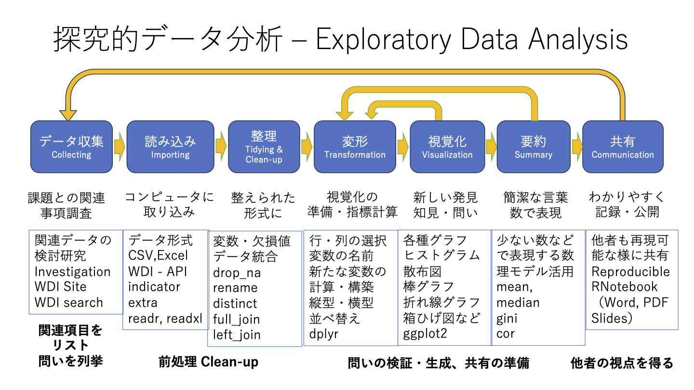

## 期末レポート

講義では、貧困と不平等の拡大の原因として、「富裕層への富の集中」、「機会の不平等」、「気候変動」、「紛争」、などを取り上げ、貧困や不平等の拡大を防ぐ対策について考えた。また、気候変動については今後の自然環境や人間生活に与える影響を分析し、気候変動対策について考えた。講義の内容を踏まえて、下記の課題から一つを選び、経済学的な視点からレポートを作成しなさい。

１．貧困と不平等拡大の原因を調べ、貧困がもたらす悪影響を解決する方法を経済的視点から論じなさい。

２．気候変動問題の現状と原因を調べ、気候変動がもたらす悪影響を解決する方法を経済的視点から論じなさい。

３．紛争の現状と原因を調べ、紛争がもたらす悪影響を解決する方法を経済的視点から論じなさい。

長さ：A4 5枚程度　PDFファイルで提出すること。（ファイル名にID、氏名を書いてください。）

締め切り：03月02日（23：59）；　提出場所：Moodle上の提出Box


## **データサイエンス：未来を切り開くための羅針盤**

現代社会は、情報洪水と複雑化する社会問題に直面しています。膨大なデータが溢れる中で、真実を見抜き、課題解決に貢献できる人材が求められています。

**データサイエンスを学ぶことは、未来を切り開くための羅針盤となるでしょう。**

------------------------------------------------------------------------

### **データサイエンス学習があなたに与える3つの力**

**1. 情報洪水に惑わされない「データリテラシー」**

データサイエンス学習は、データの収集、分析、可視化、解釈などのスキルを習得し、情報洪水の中で真実を見抜く力、**データリテラシー**を高めます。

-   ニュース記事や統計情報の信頼性と正確性を評価

-   データに基づいて論理的に思考し、客観的な判断を下す

-   情報源の意図やバイアスを見抜き、誤情報に惑わされない

これらのスキルは、日常生活や社会生活において、正しい情報に基づいて意思決定を行うために必須です。

------------------------------------------------------------------------

**2. 多様な視点から物事を捉える「批判的思考」**

データには、メディアバイアス、時代的バイアス、個人の背景によるバイアスなど、様々なバイアスが含まれている可能性があります。データサイエンス学習は、これらのバイアスを認識し、データ分析結果を多角的に解釈する**批判的思考**を養います。

-   データの背後にあるストーリーや文脈を読み解く

-   統計的な分析結果を批判的に評価し、妥当性を検証する

-   様々な視点から考察し、多角的な解釈を導き出す

批判的思考は、社会問題や政治問題など、複雑な問題を理解し、解決策を導き出すために必要不可欠です。

------------------------------------------------------------------------

**3. データに基づいて行動し、社会貢献する力**

データサイエンス学習は、データ分析結果に基づいて行動し、社会貢献に繋げる力を与えます。

-   データ分析を通して、地域社会の課題を解決するためのアイデアを提案

-   企業でデータに基づいた意思決定を支援

-   データ分析結果を可視化し、関係者に効果的に伝える

これらの力は、あなたが将来社会で活躍するために必要な**問題解決能力**と**社会貢献意識**を高めます。

------------------------------------------------------------------------

### **データサイエンス学習は、あなたの可能性を無限に広げます。**

データサイエンスは、様々な分野で活用されており、学習方法は多様です。大学での専門的な学習、オンライン講座、書籍など、自分に合った方法で学ぶことができます。

**データサイエンスを学ぶ・学習することは、未来を切り開くための羅針盤となるでしょう。**

**情報洪水に惑わされず、真実を見抜き、社会貢献できる人材**を目指しましょう。

*これは、Google Gemini との対話によって生成されたものです。*

## 探究？　問題解決？

- 課題はたくさん見え、簡単な解決方法もありそうに見える
- さまざまなことが関連し合っている、特定の方法は新たな課題を生み出す
- 探究を続け、行動しながらも、他者の意見を聞き、視点を得、立ち止まり、見直すために探究
- 完全解決は、自分の活動では達成できないことを意識し、探求しながら共有・行動・活動・議論

------------------------------------------------------------------------

{width=100%}

## 人口に関する課題・少子高齢化

```{r include=FALSE}
library(tidyverse)
library(WDI)
library(showtext)
knitr::opts_chunk$set(fig.showtext=TRUE) 
library(plotly)
```

```{r include=FALSE}
REGION <- c("1A", "1W", "4E", "6F", "6N", "6X", "7E", "8S", "A4", "A5", 
"A9", "B1", "B2", "B3", "B4", "B6", "B7", "B8", "C4", "C5", "C6", 
"C7", "C8", "C9", "D2", "D3", "D4", "D5", "D6", "D7", "EU", "F1", 
"F6", "M1", "M2", "N6", "OE", "R6", "S1", "S2", "S3", "S4", "T2", 
"T3", "T4", "T5", "T6", "T7", "V1", "V2", "V3", "V4", "XC", "XD", 
"XE", "XF", "XG", "XH", "XI", "XJ", "XL", "XM", "XN", "XO", "XP", 
"XQ", "XT", "XU", "XY", "Z4", "Z7", "ZB", "ZF", "ZG", "ZH", "ZI", 
"ZJ", "ZQ", "ZT")
```

```{r eval=FALSE, include=FALSE}
df_pop_related_extra <- WDI(indicator = c(pop = "SP.POP.TOTL",
                            birth_rate = "SP.DYN.CBRT.IN",
                            death_rate = "SP.DYN.CDRT.IN",
                            young = "SP.POP.DPND.YG",
                            old = "SP.POP.DPND.OL"), extra = TRUE)
```

```{r eval=FALSE, include=FALSE}
write_csv(df_pop_related_extra, "data/pop_related_extra.csv")
```

```{r include=FALSE}
df_pop_related_extra <- read_csv("data/pop_related_extra.csv")
```

```{r echo=FALSE}
df_pop_related_extra |> filter(country == "Japan") |> 
  ggplot(aes(year, pop, col =  country)) + geom_line() +
  labs(title = "日本の総人口")
```

---

```{r echo=FALSE}
df_pop_related_extra |> pivot_longer(pop:old) |> filter(name %in% c("birth_rate", "death_rate", "young", "old")) |>
  filter(country == "Japan") |> drop_na(value) |>
  ggplot(aes(year, value, col = name)) + geom_line() +
  labs(title = "日本の出生率・死亡率・労働人口に対する高齢・若年扶養率（％）")
```

---

```{r fig.height=6.5, fig.width=9, echo = FALSE}
df_pop_related_extra |> filter(year == 2019, income == "High income", pop > 10000000) |> 
  drop_na(birth_rate, death_rate) |> 
  mutate(pop_rate = birth_rate/death_rate, .after = death_rate) |>
  arrange(desc(pop_rate)) |> 
  ggplot(aes(fct_rev(fct_inorder(country)), pop_rate, fill = region)) + geom_col() + coord_flip() + labs(title = "2019年時点（コロナの影響を除くため）:高所得国の出生率/死亡率ランキング", subtitle = "人口1000万人以上（色は地域別）人口制限なしでも日本は最下位", x = "", y = "", caption = "世界開発指標：出生率 = SP.DYN.CBRT.IN,死亡率 = SP.DYN.CDRT.IN") + 
  theme(legend.position = "none")
```

---

```{r echo = FALSE}
df_pop_related_extra |> filter(pop > 50000000, pop < 150000000, income == "High income") |> 
  ggplot(aes(year, pop, col =  country)) + geom_line() +
  labs(title = "5000万人以上15000万人以下（米国以外）の高所得の国の人口推移")
```

**気づいたこと・疑問点**

-日本とイタリア以外は、みな増加している

## 「日本ごと」を「世界ごと」としてとらえる

```{r echo = FALSE}
df_pop_related_extra |> filter(pop > 50000000, income == "High income") |>
  pivot_longer(pop:old) |> filter(name %in% c("young", "old")) |>
  ggplot(aes(year, value, col = country, linetype = name)) + 
  geom_line() + labs(title = "5000万人以上の高所得の国の高齢者・若年者扶養率")
```

- さまざまなことが見えてきませんか。

## GINI 係数と、絶対的貧困

```{r eval=FALSE, include=FALSE}
df_gini_2.15 <- WDI(indicator = c(gini = "SI.POV.GINI", under_2.15 = "SI.POV.DDAY"), extra = TRUE)
write_csv(df_gini_2.15, "data/gini_2.15.csv")
```

```{r include=FALSE}
df_gini_2.15 <- read_csv("data/gini_2.15.csv")
```

```{r echo = FALSE}
df_gini_2.15 |> pivot_longer(gini:under_2.15) |> drop_na(value) |> group_by(country) |> filter(year == max(year)) |> filter(region %in% c("Sub-Saharan Africa", "Latin America & Caribbean")) |> ggplot(aes(region, value, fill = name)) + geom_boxplot() + 
  labs(title = "Gini係数が高い二地域の、絶対的貧困の割合", subtitle = "gini: ジニ指数、under_2.15: 1日2.15ドル以下で生活する割合", fill = "", x = "", y = "パーセント")
```

- 同じように、ジニ指数は高く、貧富の差は大きいようですが、絶対的貧困の人の割合はかなり異なるようです。指標の理解が大切です。

---

### 箱ひげ図 (Boxplots)・ハズレ値 (Outliers)

```{r echo = FALSE}
outlier_gini <- df_gini_2.15 |> pivot_longer(gini:under_2.15) |> drop_na(value) |> group_by(country) |> filter(year == max(year)) |> ungroup() |> select(country, year, name, value, region) |>
  filter(region %in% c("Sub-Saharan Africa", "Latin America & Caribbean")) |> 
  filter(region == "Sub-Saharan Africa", name == "gini") |> arrange(desc(value)) |> slice_head(n=2)
df_gini_2.15 |> pivot_longer(gini:under_2.15) |> drop_na(value) |> group_by(country) |> filter(year == max(year)) |> ungroup() |> select(country, year, name, value, region) |>
  filter(region %in% c("Sub-Saharan Africa", "Latin America & Caribbean")) |> 
  filter(region == "Latin America & Caribbean", name == "under_2.15") |> arrange(desc(value)) |> slice_head(n=3) |> rbind(outlier_gini)
``` 

### **外れ値に注意**：アンナ・カレーニナ原理（Anna Karenina Principle (AKP）)

- 「幸福な家庭は全て互いに似通っているが、不幸な家庭はどこもその趣が異なっている」（トルストイ）
- All happy families are all alike; each unhappy family is unhappy in its own way
- 外れ値をとる背景には、さまざまな背景があり、それを個別に分析することで、その指標に関して、特別な値をとる理由を垣間見ることができる場合がある。
- 健康ではない理由はさまざま。病気とひとくくりにすると見えないものが多い。

## 二酸化炭素排出量と電力

```{r include=FALSE}
df_environment <- read_csv("data/environment.csv")
```

```{r echo = FALSE}
df_environment |> filter(!(iso2c %in% REGION)) |> filter(year == 2014) |> # 地域以外（国のみ選択）
  drop_na(co2pcap, forest, renewable, fossil, nuclear) |> 
  select(co2pcap, forest, renewable, fossil, nuclear) |> cor() |> as.data.frame()
```

---

### 散布図: 相関は因果にあらず

Correlation is not causation!

```{r echo = FALSE}
df_environment |> filter(!(iso2c %in% REGION)) |> filter(year == 2014) |> # 地域以外（国のみ選択）
  drop_na(renewable, co2pcap) |> 
  ggplot(aes(renewable, co2pcap)) + geom_point() + geom_smooth(formula = 'y~x', method = "lm", se = FALSE) + labs(title = "再生可能エネルギーによる発電割合と一人当たりの二酸化炭素排出量の相関") + geom_text(aes(60,30,label = "相関係数: -0.39024200\ny = 5.79145 - 0.04691 x"))
```

---

### 近似（回帰）直線の方程式

Regression Line: estimate の値が、y 切片（y-intercept）と、x （renewable）の係数（直線の傾き:slope of the line）

```{r}
df_environment |> filter(!(iso2c %in% REGION)) |> filter(year == 2014) |> 
  drop_na(renewable, co2pcap) |> lm(co2pcap ~ renewable, data = _) |> broom::tidy()
```

## 世界開発指標（World Deveopment Indicators）

```{r include=FALSE, cache = TRUE}
wdi_data_selected9 <- read_csv("data/wdi_data_selected9.csv")
```

- WDI のデータ数: 1,486

### 質問

- アメリカ合衆国、日本、中国、ロシア で、世界銀行に、国別データを一番たくさん、提供している国は？
- アメリカ合衆国、日本、中国、ロシア で、世界銀行に、国別データを一番少ししか、提供していない国は？

---

### 国別データの提供数

```{r echo=FALSE}
wdi_data_selected9 |> filter(Country.Code %in% c("CHN", "JPN", "RUS", "USA")) |> ggplot(aes(year, n, col = Country.Name)) + geom_line() +
  labs(title = "アメリカ合衆国、日本、中国、ロシアの提供する国別データ数")
```

ベルリンの壁崩壊 1989年、ソビエト社会主義共和国連邦が崩壊したのは、1988年から1991年、1991年東西ドイツ統合

---

### 2015年の国別データの提供数

```{r echo = FALSE}
wdi_data_selected9 |> filter(year == 2015) |> arrange(desc(n))
```


## おわりに

-「日本ごと」「世界ごと」「自分ごと」
  - 自分が生きている社会の課題　vs 普遍的な人間の課題 vs 自分や個人の課題
  
- 「自分ごと」「世界ごと」「日本ごと」
  - 自分や個人の課題　vs 普遍的な人間の課題 vs 自分が生きている社会の課題
  
**オープンデータ・パブリックデータは、通常は困難な「世界ごと」として課題を相対化、普遍化することに寄与する。**

- 今だけ、金だけ、自分だけにとらわれない生き方
  - 遺伝子的情報のなかに自己防衛本能として書き込まれているものなのかもしれない
  - 単純化バイアス
  - 思考しているその時、見えやすい価値、自分の経験だけに縛られる視野からの、より広い視点へ
  
**制約条件を弱めることで、より（個別の課題だけではない）普遍的な、継続性もある、解決方法の緒（いとぐち clue）がみつかることがある**

## おわりに（つづき）

- 探究的データ分析：探求し続けることを厭わないで

- AI の最大の強みは、学び続けること

ありがとうございました。

