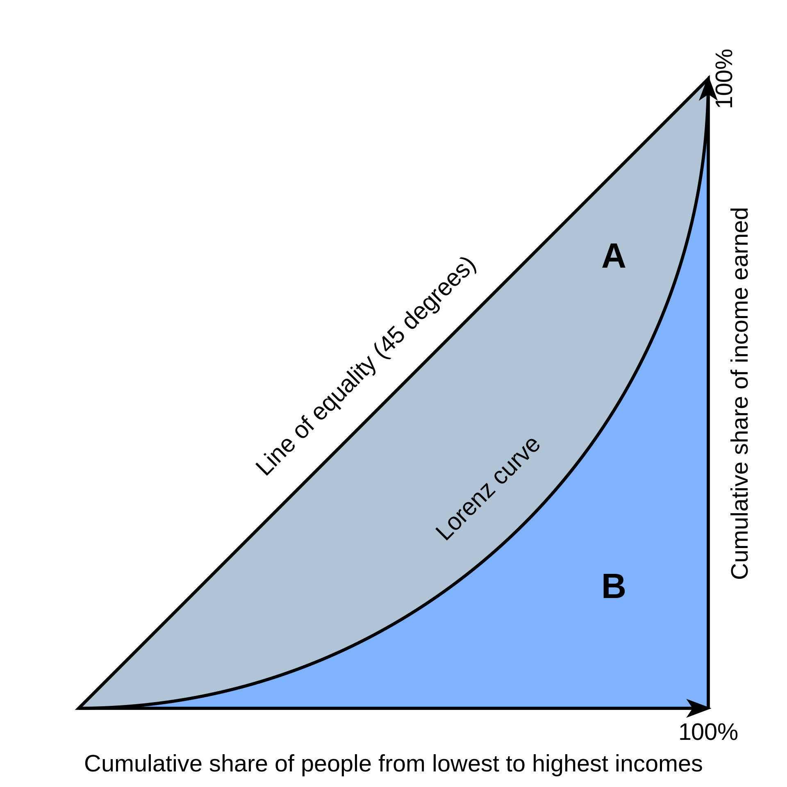

## ジニ指数って知っていますか！？

**ジニ係数**（ジニけいすう、[英](https://ja.wikipedia.org/wiki/%E8%8B%B1%E8%AA%9E "英語"): Gini coefficient）とは主に社会における所得の不平等さを測る指標である。0から1で表され、各人の所得が均一で格差が全くない状態を0、たった一人が全ての所得を独占している状態を1とする。ローレンツ曲線をもとに、1912年にイタリアの統計学者、コッラド・ジニによって考案された。それ以外にも、富の偏在性やエネルギー消費における不平等さなどに応用される。（Wikipedia）



ジニ係数のグラフ ジニ係数は、*A*の面積を*A*と*B*の各面積の合計で割ったものに等しい。すなわち、ジニ係数 =*A*/（*A*+*B*）となる。また、*A*+*B*=0.5のため、2×*A*にも等しい（縦軸は0と1の間の値をとるため）

## ジニ電卓（GINI Calculator）

### 準備

最初はいつでも準備。`tidyverse` 以外に、（R の機能を拡張する）パッケージ `DescTools` を使いますから、インストールしてください。下のコードチャンクを実行してもインストールされます。インストールは初回の一回だけです。

```{r eval=FALSE}
install.packages("DescTools")
```

パッケージを利用するときには、ロードします。

```{r}
library(tidyverse)
library(WDI)
library(DescTools)
```

ジニ指数を計算して表示するプログラムです。

```{r}
GINI <- function(x){
  Lc(x)[c(1,2)] |> as.tibble() |> mutate(A = p, .after = 1) |> 
  pivot_longer(-1, names_to = "name", values_to = "value") |>
  ggplot(aes(p, value, fill = name)) + 
    geom_area(position = "identity") +
    annotate("text", x = 0.25, y = 0.75, label = paste("GINI = A/(A+L) = ", round(Gini(x, unbiased = FALSE), digits = 2))) + 
    scale_y_continuous(labels = scales::percent_format(accuracy = 1))+
    scale_x_continuous(labels = scales::percent_format(accuracy = 1)) +
    labs(title = "GINI Index", x = "People", y = "Wealth", fill = "")}
```

x に、数の列を入れるとその分配に関する、ジニ指数を計算します。非負（マイナスではないかず）であれば、なんでも、どんな順番でも、いくつでも構いません。

下の例では、二人で、最初の人（50%）が 0 で、もう一人（50%）が 1 ですから、グラフを書くと、以下のように 0.5 になります。非常に多い数を想定しているので、これは、補正したジニ指数は1とする場合もあります。

```{r}
x <- c(0,1)
GINI(x)
```

練習：$y$ に色々な列を入れて、ジニ指数が幾つになるか計算してみてください。半角の数字で、カンマで区切ったものを、`c()` の中に入れます。

```{r}
y <- c(1,2,3,4,5,6,7,8,9,10)
GINI(y)
```

### 問い

-   ５人の人を雇って働いてもらいました。全体で5万円を支払います。どのように分けるのが公平ですか。

-   ５人の人を雇って働いてもらいました。全体で5万円を支払います。一人目は朝6時から夕6時まで、二人目は朝9時から夕6時まで、三人目は昼12時から夕6時まで、四人目は午後3時から夕6時まで、五人目は夕5時から夕6時まで働きました。どのように分けるのが公平ですか。

-   ５人の人を雇って働いてもらいました。全体で5万円を支払います。働いた時間は、二番目の状況と同じです。実は、それぞれ家族がいて、その人だけが働ける人です。家族で生活するには、1万円は、ギリギリのお金です。どのように分けるのが公平ですか。

-   ５人の人を雇って働いてもらいました。全体で5万円を支払います。働いた時間は、二番目の状況と同じです。一人目は、単身でいつでも働けます。二人目は家事をし、こどもを保育園に預けてからきました。三人目は体調が悪く午前中寝てからきました。四人目はしょうがいを持っていてなかなか動けず仕事もあまりできないけれど精一杯働きました。五人目は、ヤングケアラーで家からなかなか出ることができませんでした。でも家では空いている時間はゲームもやっていました。どのように分けるのが公平ですか。

あなたが分配する責任を持っていたらどのように分配しますか。

（聖書：マタイによる福音書20章1-16節）

\
労働時間割で計算してみると ジニ指数は、0.36 になります。

```{r}
z <- c(1/12,3/12,6/12,9/12,1)
GINI(z)
```

z に割合を入れると、5万円の分配を計算してくれます。端数を切り捨てた差額も表示しています。

```{r}
z <- c(1/12,3/12,6/12,9/12,1)
50000/sum(z) * z
round(50000/sum(z) * z) # 四捨五入
as.integer(50000/sum(z) * z) # 切り捨て
sum(round(50000/sum(z) * z))-50000 # 四捨五入の差額
sum(as.integer(50000/sum(z) * z)) -50000 # 切り捨ての場合の差額
```

## 前回（12月19日）の復習

-   パッケージ（Package）の利用：

    -   インストール（installation）：Tools \> Install Packages

    -   ロード（load）`library(tidyverse); library(WDI); library(showtext)`

-   データの取得：`WDI(indicator = c(pop = "SP.POP.TOTL"))`

-   特定の行の取得：`filter(), drop_na(), distinct()`

-   折れ線グラフ

    -   `ggplot(aes(x = year, y = pop) + geom_line()`

    -   `ggplot(aes(x = year, y = pop, col = country) + geom_line()`

毎回 tidyverse と WDI を使いますから、R Notebook の最初には、次のコードチャンクを作成し、実行（Run）します。

### 指標について

-   GINI index (World Bank estimate)；SI.POV.GINI [[Link](https://data.worldbank.org/indicator/SI.POV.GINI)]

    -   Gini index measures the extent to which the distribution of income (or, in some cases, consumption expenditure) among individuals or households within an economy deviates from a perfectly equal distribution. A Lorenz curve plots the cumulative percentages of total income received against the cumulative number of recipients, starting with the poorest individual or household. The Gini index measures the area between the Lorenz curve and a hypothetical line of absolute equality, expressed as a percentage of the maximum area under the line. Thus a Gini index of 0 represents perfect equality, while an index of 100 implies perfect inequality.

    -   ジニ指数は、経済内の個人または世帯間の所得（または場合によっては消費支出）の分布が、完全に平等な分布からどの程度逸脱しているかを測定する。ローレンツ曲線は、最も貧しい個人または世帯から始まり、受給者の累積数に対する総所得の累積割合をプロットしたものである。ジニ指数は、ローレンツ曲線と絶対的平等の仮想線との間の面積を測定するもので、線の下の最大面積の百分率で表される。したがって、ジニ指数0は完全な平等を表し、指数100は完全な不平等を意味する。

## ジニ指数の分布

最初に準備をしてあるので、パッケージのロードは不要です。

```{r eval=FALSE}
library(tidyverse)
library(WDI)
```

### データの読み込み

何度も読み込まなくて良いように、保存もしておきます。今回は、extra=TRUE として、地域（region）や、所得レベル（income）も含めてあります。

```{r eval = FALSE}
df_gini_index <- WDI(indicator = c(gini = "SI.POV.GINI"), extra = TRUE)
```

```{r eval = FALSE}
write_csv(df_gini_index, "data/gini_index.csv")
```

```{r}
df_gini_index <- read_csv("data/gini_index.csv")
```

### 地域リスト

人口動態で使った地域のリストをコピーしておきます。

```{r}
REGION <- c("1A", "1W", "4E", "7E", "8S", "B8", "EU", "F1", "OE", "S1", 
"S2", "S3", "S4", "T2", "T3", "T4", "T5", "T6", "T7", "V1", "V2", 
"V3", "V4", "XC", "XD", "XE", "XF", "XG", "XH", "XI", "XJ", "XL", 
"XM", "XN", "XO", "XP", "XQ", "XT", "XU", "XY", "Z4", "Z7", "ZF", 
"ZG", "ZH", "ZI", "ZJ", "ZQ", "ZT")
```

### データの確認

`head(df_gini_index)` または、`df_gini_index` でも確認可能です。

```{r}
df_gini_index
```

必要な変数のみとします。

```{r}
df_gini_index_rev <- df_gini_index |> 
  select(country, iso2c, year, gini, region, income)
df_gini_index_rev
```

日本のジニ指数をみてみます。gini の値が、NA だと意味がないので、その部分は、drop_na(gini) で削除しておきます。

```{r}
df_gini_index_rev |> filter(country == "Japan") |> drop_na(gini)
```

どのくらい GINI のデータがあるか確かめる

```{r}
df_gini_index_rev |> group_by(year) |> drop_na(gini) |> 
  summarize(n = n()) |>
  ggplot(aes(year, n)) + geom_col()
```

```{r}
df_gini_index_rev |> filter(year == 2013) |> drop_na(gini) |> 
  ggplot(aes(gini)) + geom_histogram()
```

練習 bins の値を変えてみてみましょう。

```{r}
df_gini_index_rev |> filter(year == 2013) |> drop_na(gini) |> 
  ggplot(aes(gini)) + geom_histogram(bins = 10)
```

練習 binwidth の値を変えてみてみましょう。

```{r}
df_gini_index_rev |> filter(year == 2013) |> drop_na(gini) |> 
  ggplot(aes(gini)) + geom_histogram(binwidth = 5)
```

地域ごとのデータを表示してみます。

```{r}
df_gini_index_rev |> filter(year == 2013) |> drop_na(gini) |> 
  ggplot(aes(gini, fill = region)) + geom_histogram(bins = 10, col = "black")
```

```{r}
df_gini_index_rev |> filter(year == 2013) |> drop_na(gini) |> 
  ggplot(aes(gini, fill = income)) + geom_histogram(bins = 10, col = "black")
```

```{r}
df_gini_index_rev |> filter(!(iso2c %in% REGION)) |> 
  distinct(iso2c, region, income) |> 
  group_by(region) |> summarize(number_of_countries = n())
```

## 復習

-   パッケージ（Package）の利用：

    -   インストール（installation）：Tools \> Install Packages

    -   ロード（load）`library(tidyverse); library(WDI); library(showtext)`

-   データの取得：`WDI(indicator = c(pop = "SP.POP.TOTL"))`

-   特定の行の取得：`filter(), drop_na(), distinct()`

-   折れ線グラフ

    -   `ggplot(aes(x = year, y = pop) + geom_line()`

    -   `ggplot(aes(x = year, y = pop, col = country) + geom_line()`

## 課題

提出はしなくて良いですが、ぜひ実際に手を動かして実行してください。

## 参考文献

1.  「みんなのデータサイエンス - Data Science for All」[[はじめてのデータサイエンス](https://icu-hsuzuki.github.io/ds4aj/first-example.html#first-example)]

    -   導入として、GDP（国内総生産）のデータを使って説明しています。

2.  Posit Recipes（旧 Posit Primers）: The Basics 対話型の演習サイトの最初 [[Link](https://posit.cloud/learn/recipes)]

3.  Posit Cheat Sheet. 早見表です。印刷して使うために、PDF も提供しています。[[Site Link](https://rstudio.github.io/cheatsheets/)]

4.  DataCamp Cheat Sheet: Tidyverse for Biginners. データサイエンスの教育をしている会社の早見表の一つです。基本が簡単にまとまっています。[[Link](https://images.datacamp.com/image/upload/v1676302697/Marketing/Blog/Tidyverse_Cheat_Sheet.pdf)]
