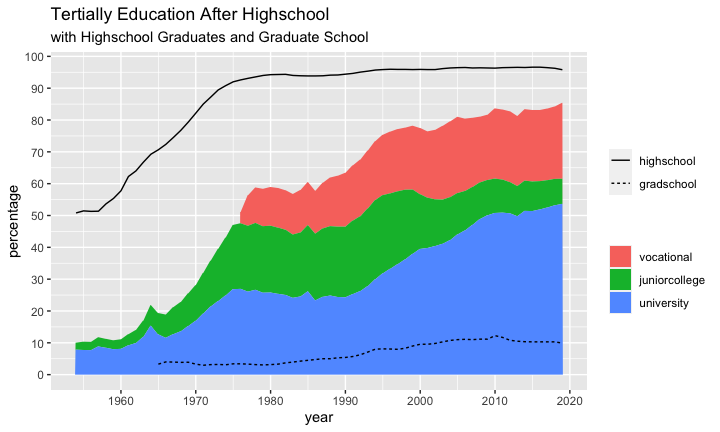

# 日本でのデータサイエンス教育の<br>課題

## 前提：フォーカス、個人の経験

> データサイエンス教育一般ではなく、現在の、日本の大学において、リテラシー・レベルのデータサイエンス教育をどのように始めていったら良いかに絞って、考えていきたいと思います。

以下は、これまで、わたしが、学び、教え、経験しながら、考えてきたことを基盤としていますが、一般的ではないかもしれないことを、最初にお断りしておきます。

### Factfulness（ファクトフルネス）Hans Rosling

* Gapminder: https://www.gapminder.org/
* [How not to be ignorant about the world | Hans and Ola Rosling](https://www.youtube.com/watch?v=Sm5xF-UYgdg)
  - バイアスを意識しながら
* [The best stats you’ve ever seen, Hans Rosling](http://www.edtech.events/the-best-stats-youve-ever-seen-hans-rosling/)

## 前提：すべての学生

学校種類別進学率の推移([男女共同参画局](https://www.gender.go.jp)の資料)

<!-- -->


## デミスハサビス - Demis Hassabis

私が、AI に関して、本当にエキサイティングだと思うの  は、科学をより早く進化させることを期待できるところです。私は AI によって助けられて進歩していく科学を見たいと思います。AI が、多くのつまらない労働をサポートしてくれるとともに、興味深いことを教えてくれ、山のようなデータから構造を見つけてくれ、人間のエキスパートや研究者がブレイクスルーをもっと素早く達成できるように、助けてくれることです。数カ月前にCERNの研究者と話す機会がありましたが、彼らは、データの量があまりにも膨大で処理できないようなデータと格闘しています。AI が膨大なデータの中から新しい何かを見つけてくれる未来はクールだと思います。

[DeepMind founder Demis Hassabis on how AI will shape the future](https://www.theverge.com/2016/3/10/11192774/demis-hassabis-interview-alphago-google-deepmind-ai)

## 経験から

* 児童養護施設でのこと

  - 楽しいこと、興味のあることは、いくらでも学ぶ
  - ゲームより、魅力的であること
  - 英語も、コンピュータも小学校からはじまって、少しずつ変化している

<br>

* データサイエンスの授業を担当して

  - Data Analysis for Researchers 研究者のためのデータ分析
  - Introduction to R 経済を学んでいる大学院生　70分x2
  - R で はじめる データサイエンス 70分x3 + 課題

## 資料へのリンク

<center><font size="10">https://bit.ly/rims2023</font></center>
<center><font size="10">　</font></center>

* データサイエンス教育
  - Appendix に、リンクや、ChatGPT とのやりとりなど
* データサイエンスをはじめましょう
* Data Analysis for Researchers 2022
* Data Analysis for Researchers 2021
* Introduction to R - short course
* Rではじめるデータ・サイエンス
  - 中級マクロ経済学での70分x3回の授業内容が原案
  - 2023年3月9日の数理科学研究所での講演のために作成
* 日本でのデータサイエンス教育の課題にどう向き合うか - 午前
* 生涯学び続ける基盤を構築するデータサイエンス・コースの開発 - 午後

## はじめに

課題をリストする前に、まずは、なぜ、いま、データサイエンスか。さらに、なぜ、すべての人、特に、大学などで学ぶ理系、文系を問わず、学生が、学ばなければならないかを短くまとめると次のようになるとわたしは考えている。


> AI（人工知能）で、**大きく変化しつつある社会**において、**すべての人**が、どのように生きていくかを、個人で、そして、協力して、批判的思考をしながら、根拠を確かめながら考え、意思決定に結びつけていくために、AI の背後にある、データサイエンスと、その考え方の基本を学ぶことが必須である。


そして、これに付け加えると、

> 日本は、国や社会のデジタル化、さらに、教育機関において、AI やデータサイエンス教育に向き合っていくことに、非常に**遅れている**と認識されている。

ということだと思います。みなさんは、どう思われますか。

## 課題の整理

- **教育から学習へ**
  - 学ぶことに、中心がなく、教員がわからないことは、学生は学びようがない。
  - 専門から離れられず、**多様性、社会の変化**に適合した、教育になっていない。

- **世界の課題、人間の課題**として、向き合う認識が薄い
  - ローカルな議論に終始することが多く、世界規模の課題に向き合うために、起業したり、世界の一員として活動することに向かわない。
  - ローカルな課題であっても、同じような課題に世界ではどう向き合っているかを考える視点が欠如している。

- **英語**の学習に時間をかけるが使う機会はない
  - 大学においてすら、教員が使わないので、英語を学習に活用する機会がほとんどない
  - 綺麗な英語を話したいなどの願望は、一部にあるが、聞き取りはできず、学習のために、活用することはない

## 課題の整理（続）


- コンピュータは、ホームページの検索、閲覧、ワープロとしての利用でとまっている
  - 教員が十分使えないので、学生も趣味の範囲でしか使わない
  - ワープロにちょっと表計算のようなものが限度

- 携帯端末は、SNS や ゲーム、写真、音楽プレーやどまり
  - 趣味以上のものにはならない

- 事実や、データを根拠にした、**批判的思考**になじめない
  - 人格を尊重し、相手に配慮することはたいせつだが、丁寧に、論拠を確認しながら、ここは、ただしいが、ここは間違い、ここは、確認できない、他の視点から考えるなどの訓練がされていない
  
- 数学を含めて学問が閉じた世界になってしまっている
  - 教員が楽しめることと、実際に使われることとの差が大きい
  - **教員は、楽しい、自分にとって有用と思えることしか教えない**
  - **学生は、楽しいと思えないもの、自分にとって有用だと思えないことは学ばない**
  
- 時代の変化の中で、教育の中でどう組みたてていくかが考えられない。
  - 教育は、次の世代を担う人たちのためであるはずだが、若い世代の人たちが生きる世界を考えずに教育に携わっている
  - 世の中の変化のスピードが加速しているという考え方は受け入れられない

---

実は、今回のコースデザインで一番、苦労したのは、**英語の問題**である。

英語での**リソース**は、圧倒的で、質も非常に高い。

しかし、それは、現状では、簡単には、勧められない。それを、どのように回避しつつ改善していくか。

自動翻訳を用いることで、デジタル化された**文字情報**は、かなり利用できることを確認したが、ビデオなどのコンテンツが中心の Coursera や、edX など MOOCs のコンテンツの**音声情報**は使えない。

また、AI などの説明や、データサイエンスに関するコンテンツは、YouTube などもふくめて、良い質のものがあるが、英語の音声を日本語で出力する技術は、改善は期待するものの、まだ、十分ではなく、使えない。

一番よいのは、聞いて理解する部分に少しずつ慣れながら、学習することだが、現時点では、その負荷を最初から、かけることは不可能であるとの結論にいたり、その理解のもとで、考えたというのが実情である。
  
## 学生と、一緒に学び始めませんか

数学者、数学の教育者としてからいったん離れ、ひとりの人間として現実を見つめ、将来について考え、共に学ぶ姿勢をもつ。ここでは、以下の学びに焦点を当てる。

1. AI とどう付き合っていったら良いか経験しながら考える
2. 時間的、地域的、個人的なバイアスから少しでも、自由になるためにデータから学ぶ
3. 多様な、価値観も異なる他者と協力しながら、考え、学ぶ価値を経験を通して学ぶ

このなかで、数学など、自分が学んできたことの価値を考え、活用していくかを、個人として考える

データサイエンスは、これらのために、非常に適した学びだと考えています。具体的な学びについては、第二部で、実際に体験したいと考えています。

**カリキュラムの内容を考えるときは**

**数学も、統計学も、コンピュータ科学も一旦忘れて、必要に応じて考える**


## リソースを確認する

- **コンピュータ** - ハード・ソフト共 飛躍的な進歩
  - コンピュータの進化で、膨大なデータ（Big Data）を活用できるようになっている
  - 利用者は（コンピュータサイエンスの）専門家だけではなく、大きな広がりがある
  - コンピュータ言語：R、Python など、特に R
      - これらは、世界中のひとの共通語で、国や地域に依存していない
  - ソフトウェア開発も、世界中の人が協力して行っている
      - **抽象概念が、パッケージ、モジュール化**されて利用できるようになっている
      - Public Domain での共有が一般的

- **データ** - Big Data and Public Data
  - センサーや、インターネットの発達で、膨大なデータ（Big Data）が時々刻々と集められる、取得できるようになっている
  - **Public Data** という、**人間全体の財産**としての、データを適切に共有する動きが、特に国際機関などで進んでいる
  - 世界の中では、この認識に格差もあり、データの利用が十分考えられてない場合もまだある

## リソースを確認する（続）

- 教育、学習コンテンツ
  - 無償または非常に安価に提供されている膨大なコンテンツがある MOOCs (Coursera, edX, Udacity など)、ビジネス化されているものもある
  - 無償まはた非常に安価に、電子書籍などが膨大に出版され、共有されている

- AI の実用化が進んでいる
  - AI を使った教育が進んでいる。
  - Duolingo のような、無償での利用も可能だが、巨大になっているものもある。
     - We’re here to develop the best education in the world and make it universally available.
     - 私訳：すべてのひとに世界最高の教育を提供することがわたしたちの使命です。
     - Personalized education 一人ひとりそれぞれに相応しい教育の提供
  - Chat GPT が有名ですが、Google 以外に、より複雑な検索を扱う、Perplexity もあり、今後、続々と、特徴的な、AI が公開され、有償だけでなく、無償でも利用できるようになっていくと思われる
  
-  自動翻訳の進化
      - Google 翻訳は手軽に使え、ある程度実用的に使える段階にある
      - DeepL のように、十分な質と思われる自動翻訳も無償でも提供され、活用できるようになっている。
      <!-- - Grammary のように、英語母語話者でも、文章を書く時に使うようになっている、文章校正アプリも質が向上している -->
  <!-- - 電子的に提供されているコンテンツであれば、これらを使うことで、英語に対する、ハードルをかなり下げることができる -->
  
  
## カリキュラム例の確認

### edX: Professional Certificate in Data Science

#### 基本情報: HarvardX, through edX 

**演習も無償で殆どすべて提供**

*  URL: https://online-learning.harvard.edu/series/professional-certificate-data-science 
*  Book: https://rafalab.github.io/dsbook/ (R Markdown Document)

#### R で学び、Data Camp で Assessment

    1. Data Science: R Basics; データ解析ソフト R の基本
    2. Data Science: Visualization; データの視覚化
    3. Data Science: Probability; 確率・大数の法則
    4. Data Science: Inference and Modeling; 推定と数学モデル
    5. Data Science: Productivity Tools; Unix, Git, GitHub, R Markdown 
    6. Data Science: Wrangling; データの整理
    7. Data Science: Linear Regression; 線形回帰
    8. Data Science: Machine Learning; 機械学習
    9. Data Science: Capstone まとめと次のステップへの架け橋

## 最近の MOOCs などからみる<br>データサイエンスのコースの特徴

- Theory to Programming 
  - Statistics to Computer Science
- Open Data, Public Domain, Change of Publication Style
  - [bookdown](https://bookdown.org)
- Exploratory Data Analysis
  - Cyclical Workflow
- Focus on Visualization
- Package, Module 
- Hypothesis Testing to Machine Learning
- Productivity Tool: Git-GitHub, R Studio 

AI も、データサイエンスのトレーニングも大学の中から大学の外に移っている

<!-- --- -->

<!-- #### コースの前半で使われるデータ例 -->

<!-- **Professional Certificate in Data Science** -->

<!-- 8 weeks 8 weeks 8 weeks 8 weeks 8 weeks 8 weeks 8 weeks 8 weeks 2 weeks -->
<!-- Required R Packages for Examples: tidyverse, dslabs: https://cran.r-project.org/web/packages/ dslabs/dslabs.pdf -->

<!-- *  男女の身長のデータ -->
<!-- *  アメリカにおける 2010 年の銃による殺人事件の FBI の報告書 -->
<!-- *  Gapminder: Almost nobody knows the basic global facts! (Gapminder Test) -->
<!--     -  TED 増え続ける世界人口(Hans Rosling) https://www.gapminder.org -->
<!--     -  Health and income outcomes for 184 countries from 1960 to 2016 -->
<!--     -  Country, Year, Infant deaths per 1000, Life expectancy in years, Average of children per woman, -->
<!-- Country population, GDP, Continent, Geographical region  -->

<!-- *  Brexit の国民投票の事前調査と実際のデータ -->
<!-- *  2016 年の大統領選挙の事前調査と結果のデータ -->
<!-- *  UC Berkeley の大学院入試における男女差 -->
<!-- *  オランダにおける研究費獲得率に関する男女差 -->
<!-- *  プロ野球の新人の打率予測 -->

---


```r
library(tidyverse)
library(dslabs)
list_dslabs <- data(package='dslabs')
list_dslabs$results %>% as_tibble() %>% select(3:4)
```

```
## # A tibble: 29 × 2
##    Item              Title                                                      
##    <chr>             <chr>                                                      
##  1 admissions        Gender bias among graduate school admissions to UC Berkele…
##  2 brca              Breast Cancer Wisconsin Diagnostic Dataset from UCI Machin…
##  3 brexit_polls      Brexit Poll Data                                           
##  4 death_prob        2015 US Period Life Table                                  
##  5 divorce_margarine Divorce rate and margarine consumption data                
##  6 gapminder         Gapminder Data                                             
##  7 greenhouse_gases  Greenhouse gas concentrations over 2000 years              
##  8 heights           Self-Reported Heights                                      
##  9 historic_co2      Atmospheric carbon dioxide concentration over 800,000 years
## 10 mnist_27          Useful example for illustrating machine learning algorithm…
## # … with 19 more rows
```


## `dslabs` に含まれるデータ（訳 DeepL）

1. "UCバークレーへの大学院入学者におけるジェンダーバイアス", Gender bias among graduate school admissions to UC Berkeley.                                
2. "UCI機械学習リポジトリからの乳がんウィスコンシン診断データセット", Breast Cancer Wisconsin Diagnostic Dataset from UCI Machine Learning Repository           
3. 「Brexit Poll Data（ブレグジット世論調査データ）」, Brexit Poll Data
4. "2015年米国期間生命表", 2015 US Period Life Table 
5. 「離婚率・マーガリン消費データ」", Divorce rate and margarine consumption data        
6. 「ギャップマインダー・データ」, Gapminder Data  
7. "2000年以上の温室効果ガス濃度", Greenhouse gas concentrations over 2000 years          
8.  "自己申告制ハイツ", Self-Reported Heights
9. "80万年にわたる大気中の二酸化炭素濃度", Atmospheric carbon dioxide concentration over 800,000 years                               
10. "MNISTデータに基づく機械学習アルゴリズムの説明に役立つ例", Useful example for illustrating machine learning algorithms based on MNIST data  

## `dslabs` に含まれるデータ（訳 DeepL）(続)

11.  "映画の視聴率", Movie ratings
12. 「2010年米国銃殺数（州別）」, US gun murders by state for 2010
13. "欠損値がいくつかあるカウントデータ", Count data with some missing values
14. "2010年ニューヨーク州リージェンツ試験成績", NYC Regents exams scores 2010
15. 「ギャップマインダー・データ」"Gapminder Data" 
16. "イタリアンオリーブ", Italian olive
17. 「ギャップマインダー・データ」"Gapminder Data"  
18. "成人男性の身長（フィート）（外れ値あり）", Adult male heights in feet with outliers   
19.  "2008年大統領選の人気投票に関する世論調査データ", Poll data for popular vote in 2008 presidential election                                   
20. 「Fivethirtyeight 2016年世論調査データ」, Fivethirtyeight 2016 Poll Data

## `dslabs` に含まれるデータ（訳 DeepL）(続)

21. 「オランダの研究費におけるジェンダーバイアス」"Gender bias in research funding in Netherlands"                                          
22.  "自己申告制のハイツ", Self-reported Heights
23. 「オランダの研究費におけるジェンダーバイアス」"Gender bias in research funding in Netherlands"                                          
24. "Fivethirtyeight 2016年世論調査データ", Fivethirtyeight 2016 Poll Data
25. "星の物理的性質", Physical Properties of Stars
26. "世界の気温異常と炭素排出量、1751-2018", Global temperature anomaly and carbon emissions, 1751-2018                              
27. "7種類の組織から採取した189の生体サンプルの遺伝子発現プロファイル", Gene expression profiles for 189 biological samples taken from seven different tissue types.
28. "2009年から2017年までのトランプのツイート", Trump Tweets from 2009 to 2017
29. "米国各州の伝染病データ", Contagious disease data for US states

---

* 学ぶ課題に適したデータが選ばれている
* 受講者の多様な興味に答えられるようなデータが選ばれている
* 環境課題や、公平性を重視するデータが選ばれている
* 比較的新しいデータも含まれるようにしている

背後には、これだけの公開されているデータを具体的に分析して、分析自体を共有することも進んでいる。日本では、これだけの講義は、可能な人がいないだけでなく、実質的に不可能だと思われる。これは、2017年か2018年には、確立しているコースで、このレベルの内容を日本で提供するのは、現在のところお、永遠に不可能であるように思われる。


## Chat GPT の提案

**Chat GPT** 学生のモチベーションを高め、データサイエンスにワクワクさせるためには、魅力的でインタラクティブなカリキュラムを提供することが重要です。ここでは、そのようなカリキュラムをどのように設計したらよいかを提案します。

1. 問題解決型学習：学生が共感でき、データサイエンスの手法を使って解決できる実世界の問題から始める。貧困と教育の関係の把握、都市の交通パターンの予測、エネルギー消費の傾向の分析などが考えられます。

2. インタラクティブな可視化。Tableau、PowerBI、D3.js^[これらは、いずれも、Business Intelligence と言われるツールで、無償でも使える。D3.js は、Java Script をつかっており、多少の、プログラムスキルが必要。Tableau は、ビジネスでの利用を中心としている。PowerBI は、Microsoft のもの。おそらくPowerBI が大学で使うには、Tableau、D3.js と比較するとよいと思われるが、個人的には、勧めない。] などのデータ可視化ツールを使用して、データを調査、理解するよう生徒に促します。これらのツールを使用してインタラクティブなダッシュボードやビジュアライゼーションを作成すると、データのパターンや関係性を確認することができます。

3. グループプロジェクト：少人数のグループでデータサイエンス、プロジェクトに取り組むことを奨励します。これにより、協力的で協調的な学習環境が構築され、学生同士が互いに学び合い、学んだことを実践の場で応用する機会を得ることができます。

4. ゲストスピーカー：データサイエンス分野の専門家を招き、学生を対象に講演してもらう。データサイエンスがどのような職業なのか、より深く理解することができます。

5. ハンズオンワークショップ。教室で学んだことを応用できるような、実践的なワークショップを提供する。例えば、データ分析にRを使うワークショップや、データの可視化にTableauを使うワークショップを開催することができます。

6. 学生主導のディスカッション：学生がディスカッションをリードし、自分たちの成果をクラスで共有することを奨励する。これにより、協力的な学習環境を構築することができ、学生同士が知識やアイデアを共有する機会を得ることができます。

これらの要素をカリキュラムに取り入れることで、魅力的でインタラクティブな学習環境を構築することができ、データサイエンスについてもっと学びたいという学生の意欲をかき立てることができます。

* 実社会の問題と関連づける
* インタラクティブな可視化を重視
* 少人数グループプロジェクト
* 実際のデータサイエンティストをゲストスピーカとして呼ぶ
* R を使ったり、可視化ツールを使う、ワークショップと連動させる
* 学生主導のディスカッションを奨励する

## World Bank データ

* [GDP(現在の米ドル) - 中国、ドイツ、インド、日本、フランス、アメリカ、イギリス](https://data.worldbank.org/indicator/NY.GDP.MKTP.CD?end=2021&locations=CN-DE-IN-JP-FR-US-GB&start=1960&view=chart)

* [一人当たり GNI、アトラス法 (現在の米ドル)中国、ドイツ、インド、日本、フランス、米国、英国](https://data.worldbank.org/indicator/NY.GNP.PCAP.CD?locations=CN-DE-IN-JP-FR-US-GB)


<!-- ## [Open Government Data Toolkit](http://opendatatoolkit.worldbank.org): [Open Data Defined](http://opendatatoolkit.worldbank.org/en/essentials.html) -->

<!-- The term **Open Data** has a very precise meaning. Data or content is open if anyone is free to use, re-use or redistribute it, subject at most to measures that preserve provenance and openness. -->

<!-- 1. The data must be _legally open_, which means they must be placed in the public domain or under liberal terms of use with minimal restrictions. -->
<!-- 2. The data must be _technically open_, which means they must be published in electronic formats that are machine readable and non-proprietary, so that anyone can access and use the data using common, freely available software tools. Data must also be publicly available and accessible on a public server, without password or firewall restrictions. To make Open Data easier to find, most organizations create and manage Open Data catalogs. -->

## オープンデータの定義（[Open Data Defined](http://opendatatoolkit.worldbank.org/en/essentials.html)）

オープンデータという言葉は、厳密な意味を持っています。データまたはコンテンツは、出所が明示されオープンという性質が維持されれば、誰でも自由に利用、再利用、再配布できるものを言います。

1. データは法的にオープンでなければなりません。つまり、パブリックドメインに置かれ、最小限の制限で自由に使用できなければなりません。

2. データは技術的にオープンでなければならない。つまり、誰でも自由に使える一般的なソフトウェアツールを使ってデータにアクセスし利用できるように、機械で読むことが可読な状態で電子フォーマットで誰でも取得できるように公開されていなければならなりません。また、データはだれにでも公開され、パスワードやファイアウォールによる制限を受けずに、公共のサーバーでアクセスできなければなりません。また、オープンデータを見つけやすくするために、ほとんどの組織がオープンデータカタログを作成し管理しています。


## コースの提案

レベル：リテラシーレベルを二段階に設定して設計

内容：基本的に下の二つとし、それを融合させた形で行う。

1. AI（人工知能）との付き合い方を学ぶ
2. 世界や、ひとびとの課題について、データサイエンスで学ぶ

形式：グループワーク

1. 少人数で、調べることと共に、問いを精査する場面で協力を促す
2. グループの一員として、AI を活用する


## 第一レベル

1. AI に触れる：Duolingo、ChatGPT など
2. WDI: 日本に関するデータ - ダッシュボード
3. WDI: 指標を選択して、課題と向き合う
    - 自分達の興味のあるデータを調べる
    - 問題意識をしっかり持てるようにする
    - データに基づいた思考ができるようにする
    - 批判的思考、バイアスを意識しながら
    - 他者と協力、分担して、調べ、ディスカッション
4. AI の基本を学ぶ
5. AI との付き合い方についての、ディスカッション
6. トピックを決めてグループ発表

* データ自身の用語、指標の定義が重要
* 数学・統計学・コンピュータ科学は不要
* 課題への取り組みを見ながら、アドバイスをし、自分も学ぶ


## 第二レベル

1. AI と データサイエンスについてのディスカッション
2. PositCloud 入門、スクリプトの利用
3. R Notebook 入門
4. WDI パッケージの利用
5. テンプレートの利用
6. tidyverse の基本の学び
7. 可視化の学び
8. WDI 以外のデータの取得
9. プロジェクト
10. 発表

* 探索的データ分析（Expository Data Analysis）
* 統計的概念と意味と活用法はその都度説明
    - 四分位（Quatile）・平均（Mean）・標準偏差（Standard Deviation）
    - 分布（Distribution）・相関（Correlation）
    - 相関係数（Correlation Coefficient）・回帰直線・p値・R Squared

## たいせつにしていること

* 数学・統計学は理解しなくても、たいせつさは、伝わるのでは
    - 背後に多くの、数学・統計学・コンピュータ科学が使われていることは理解できる
    - そのことを理解している親のこどもに、たいせつさが伝わる
    - 現在日本では、自分はできない。自分には関係ないということだけが残っている
* p-値や、R二乗値は、グラフを見てその傾向について結論したいときに説明
* 相関は因果にあらず（Correlation is not causation!）
    - 回帰直線の方程式あたりで必ず誤解するひとが出てくるのでそのとき
* 交絡因子（Confounder）は、学生が疑問に思う時を待つ
    - その授業で例が出てきた時に、使われているデータを使って説明
* 平均回帰の用語の起源 (Francis Galton)
    - "背の高い親の子の身長は、通常の平均値に向かって減少する傾向がある"
* アンナカレーニナの法則 (AKP)
    - “幸せな家庭はみな似たりよったりだが、不幸な家庭はみなそれぞれに不幸である” 
    - 世界のデータに関する傾向や、外れ値や、少数者の理解

