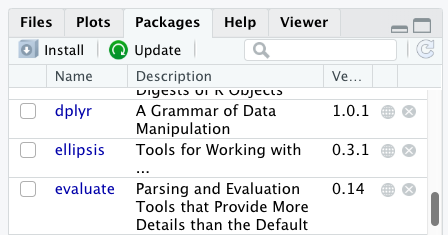
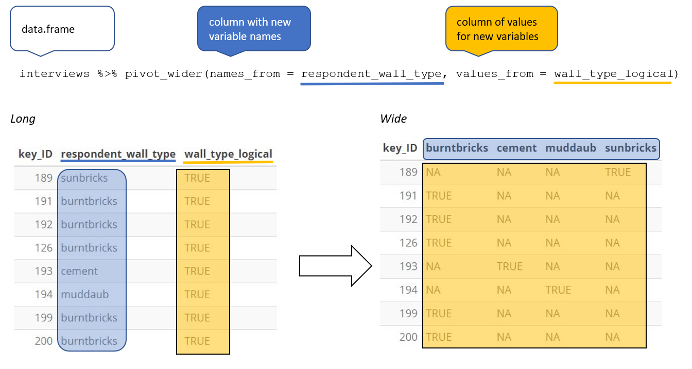

> This is taken from [R for Social Scientists](https://datacarpentry.org/r-socialsci/). See also the [GitHub page](https://github.com/datacarpentry/r-socialsci).

# Before we Start 

---
title: "Before we Start"
teaching: 25
exercises: 15
questions:
- "How to find your way around RStudio?"
- "How to interact with R?"
- "How to manage your environment?"
- "How to install packages?"
objectives:
- "Install latest version of R."
- "Install latest version of RStudio."
- "Navigate the RStudio GUI."
- "Install additional packages using the packages tab."
- "Install additional packages using R code."
keypoints:
- "Use RStudio to write and run R programs."
- "Use `install.packages()` to install packages (libraries)."
source: Rmd
---

## What is R? What is RStudio?

The term "`R`" is used to refer to both the programming language and the
software that interprets the scripts written using it.

[RStudio](https://rstudio.com) is currently a very popular way to not only write
your R scripts but also to interact with the R software. To function correctly,
RStudio needs R and therefore both need to be installed on your computer.

To make it easier to interact with R, we will use RStudio. RStudio is the most
popular IDE (Integrated Development Environment) for R. An IDE is a piece of
software that provides
tools to make programming easier.


## Why learn R?

### R does not involve lots of pointing and clicking, and that's a good thing

The learning curve might be steeper than with other software, but with R, the
results of your analysis do not rely on remembering a succession of pointing
and clicking, but instead on a series of written commands, and that's a good
thing! So, if you want to redo your analysis because you collected more data,
you don't have to remember which button you clicked in which order to obtain
your results; you just have to run your script again.

Working with scripts makes the steps you used in your analysis clear, and the
code you write can be inspected by someone else who can give you feedback and
spot mistakes.

Working with scripts forces you to have a deeper understanding of what you are
doing, and facilitates your learning and comprehension of the methods you use.

### R code is great for reproducibility

Reproducibility is when someone else (including your future self) can obtain the
same results from the same dataset when using the same analysis.

R integrates with other tools to generate manuscripts from your code. If you
collect more data, or fix a mistake in your dataset, the figures and the
statistical tests in your manuscript are updated automatically.

An increasing number of journals and funding agencies expect analyses to be
reproducible, so knowing R will give you an edge with these requirements.

### R is interdisciplinary and extensible

With 10,000+ packages that can be installed to extend its capabilities, R
provides a framework that allows you to combine statistical approaches from many
scientific disciplines to best suit the analytical framework you need to analyze
your data. For instance, R has packages for image analysis, GIS, time series,
population genetics, and a lot more.

### R works on data of all shapes and sizes

The skills you learn with R scale easily with the size of your dataset. Whether
your dataset has hundreds or millions of lines, it won't make much difference to
you.

R is designed for data analysis. It comes with special data structures and data
types that make handling of missing data and statistical factors convenient.

R can connect to spreadsheets, databases, and many other data formats, on your
computer or on the web.

### R produces high-quality graphics

The plotting functionalities in R are endless, and allow you to adjust any
aspect of your graph to convey most effectively the message from your data.

### R has a large and welcoming community

Thousands of people use R daily. Many of them are willing to help you through
mailing lists and websites such as [Stack Overflow](https://stackoverflow.com/),
or on the [RStudio community](https://community.rstudio.com/). Questions which
are backed up with [short, reproducible code
snippets](https://www.tidyverse.org/help/) are more likely to attract
knowledgeable responses.

### Not only is R free, but it is also open-source and cross-platform

Anyone can inspect the source code to see how R works. Because of this
transparency, there is less chance for mistakes, and if you (or someone else)
find some, you can report and fix bugs.

Because R is open source and is supported by a large community of developers and
users, there is a very large selection of third-party add-on packages which are
freely available to extend R's native capabilities.


<figure>
<div class="row">
<div class="col-md-6">
```{r rstudio-analogy, echo = FALSE, fig.show = "hold", out.width = "100%", fig.alt = "RStudio extends what R can do, and makes it easier to write R code and interact with R."}

```
</div>
<div class="col-md-6">
```{r rstudio-analogy-2, echo = FALSE, fig.show = "hold", fig.alt = "automatic car gear shift representing the ease of RStudio", out.width="100%"}

```
</div>
</div>
<figcaption>
RStudio extends what R can do, and makes it easier to write R code and interact
with R. <a href="https://unsplash.com/photos/D19rXKDUPYM">Left photo credit</a>; <a href="https://unsplash.com/photos/Wec3M4dY_LE">Right photo credit</a>.
</figcaption>
</figure>


## A tour of RStudio

## Knowing your way around RStudio

Let's start by learning about [RStudio](https://www.rstudio.com/), which is an
Integrated Development Environment (IDE) for working with R.

The RStudio IDE open-source product is free under the
[Affero General Public License (AGPL) v3](https://www.gnu.org/licenses/agpl-3.0.en.html).
The RStudio IDE is also available with a commercial license and priority email
support from RStudio, Inc.

We will use the RStudio IDE to write code, navigate the files on our computer,
inspect the variables we create, and visualize the plots we generate. RStudio
can also be used for other things (e.g., version control, developing packages,
writing Shiny apps) that we will not cover during the workshop.

One of the advantages of using RStudio is that all the information
you need to write code is available in a single window. Additionally, RStudio
provides many shortcuts, autocompletion, and highlighting for the major file
types you use while developing in R. RStudio makes typing easier and less
error-prone.


## Getting set up

It is good practice to keep a set of related data, analyses, and text
self-contained in a single folder called the **working directory**. All of the
scripts within this folder can then use *relative paths* to files. Relative
paths indicate where inside the project a file is located (as opposed to
absolute paths, which point to where a file is on a specific computer). Working
this way makes it a lot easier to move your project around on your computer and
share it with others without having to directly modify file paths in the
individual scripts.

RStudio provides a helpful set of tools to do this through its "Projects"
interface, which not only creates a working directory for you but also remembers
its location (allowing you to quickly navigate to it). The interface also
(optionally) preserves custom settings and open files to make it easier to
resume work after a break.


### Create a new project

* Under the `File` menu, click on `New project`, choose `New directory`, then
  `New project`
* Enter a name for this new folder (or "directory") and choose a convenient
  location for it. This will be your **working directory** for the rest of the
  day (e.g., `~/data-carpentry`)
* Click on `Create project`
* Create a new file where we will type our scripts. Go to File > New File > R
  script. Click the save icon on your toolbar and save your script as
  "`script.R`".

The simplest way to open an RStudio project once it has been created is to 
navigate through your files to where the project was saved and double
click on the `.Rproj` (blue cube) file. This will open RStudio and start your R
session in the **same** directory as the `.Rproj` file. All your data, plots and
scripts will now be relative to the project directory. RStudio projects have the
added benefit of allowing you to open multiple projects at the same time each
open to its own project directory. This allows you to keep multiple projects
open without them interfering with each other.


### The RStudio Interface

Let's take a quick tour of RStudio.


RStudio is divided into four "panes". The placement of these
panes and their content can be customized (see menu, Tools -> Global Options ->
Pane Layout).

The Default Layout is:
- Top Left - **Source**: your scripts and documents
- Bottom Left - **Console**: what R would look and be like without RStudio
- Top Right - **Environment/History**: look here to see what you have done
- Bottom Right - **Files** and more: see the contents of the project/working
directory here, like your Script.R file


### Organizing your working directory

Using a consistent folder structure across your projects will help keep things
organized and make it easy to find/file things in the future. This
can be especially helpful when you have multiple projects. In general, you might
create directories (folders) for **scripts**, **data**, and **documents**. Here
are some examples of suggested directories:

 - **`data/`** Use this folder to store your raw data and intermediate datasets.
   For the sake of transparency and 
   [provenance](https://en.wikipedia.org/wiki/Provenance), you
   should *always* keep a copy of your raw data accessible and do as much of
   your data cleanup and preprocessing programmatically (i.e., with scripts,
   rather than manually) as possible.
 - **`data_output/`** When you need to modify your raw data,
   it might be useful to store the modified versions of the datasets in a
   different folder.
 - **`documents/`** Used for outlines, drafts, and other
   text.
 - **`fig_output/`** This folder can store the graphics that are generated
   by your scripts.
 - **`scripts/`** A place to keep your R scripts for
   different analyses or plotting.

You may want additional directories or subdirectories depending on your project
needs, but these should form the backbone of your working directory.


### The working directory

The working directory is an important concept to understand. It is the place
where R will look for and save files. When you write code for your project, your
scripts should refer to files in relation to the root of your working directory
and only to files within this structure.

Using RStudio projects makes this easy and ensures that your working directory
is set up properly. If you need to check it, you can use `getwd()`. If for some
reason your working directory is not the same as the location of your RStudio 
project, it is likely that you opened an R script or RMarkdown file **not** your
`.Rproj` file. You should close out of RStudio and open the `.Rproj` file by 
double clicking on the blue cube! If you ever need to modify your working 
directory in a script, `setwd('my/path')` changes the working directory. This 
should be used with caution since it makes analyses hard to share across devices
and with other users.


### Downloading the data and getting set up

For this lesson we will use the following folders in our working directory:
**`data/`**, **`data_output/`** and **`fig_output/`**. Let's write them all in
lowercase to be consistent. We can create them using the RStudio interface by
clicking on the "New Folder" button in the file pane (bottom right), or directly
from R by typing at console:

```{r create-dirs, eval = FALSE}
dir.create("data")
dir.create("data_output")
dir.create("fig_output")
```

Go to the Figshare page for this curriculum and download the dataset called
"`SAFI_clean.csv`". The direct download link is:
<https://ndownloader.figshare.com/files/11492171>. Place this downloaded file in
the `data/` you just created. You can do this directly from R by copying and
pasting this in your terminal (your instructor can place this chunk of code in
the Etherpad):

```{r download-data, eval = FALSE}
download.file("https://ndownloader.figshare.com/files/11492171",
              "data/SAFI_clean.csv", mode = "wb")
```


## Interacting with R

The basis of programming is that we write down instructions for the computer to
follow, and then we tell the computer to follow those instructions. We write, or
*code*, instructions in R because it is a common language that both the computer
and we can understand. We call the instructions *commands* and we tell the
computer to follow the instructions by *executing* (also called *running*) those
commands.

There are two main ways of interacting with R: by using the console or by using
script files (plain text files that contain your code). The console pane (in
RStudio, the bottom left panel) is the place where commands written in the R
language can be typed and executed immediately by the computer. It is also where
the results will be shown for commands that have been executed. You can type
commands directly into the console and press <kbd>Enter</kbd> to execute those
commands, but they will be forgotten when you close the session.

Because we want our code and workflow to be reproducible, it is better to type
the commands we want in the script editor and save the script. This way, there
is a complete record of what we did, and anyone (including our future selves!)
can easily replicate the results on their computer.

RStudio allows you to execute commands directly from the script editor by using
the <kbd>Ctrl</kbd> + <kbd>Enter</kbd> shortcut (on Mac, <kbd>Cmd</kbd> +
<kbd>Return</kbd> will work). The command on the current line in the
script (indicated by the cursor) or all of the commands in
selected text will be sent to the console and executed when you press
<kbd>Ctrl</kbd> + <kbd>Enter</kbd>. If there is information in the console
you do not need anymore, you can clear it with <kbd>Ctrl</kbd> + <kbd>L</kbd>.
You can find other keyboard shortcuts in this
[RStudio cheatsheet about the RStudio IDE](https://raw.githubusercontent.com/rstudio/cheatsheets/main/rstudio-ide.pdf).

At some point in your analysis, you may want to check the content of a variable
or the structure of an object without necessarily keeping a record of it in
your script. You can type these commands and execute them directly in the
console.  RStudio provides the <kbd>Ctrl</kbd> + <kbd>1</kbd> and
<kbd>Ctrl</kbd> + <kbd>2</kbd> shortcuts allow you to jump between the
script and the console panes.

If R is ready to accept commands, the R console shows a `>` prompt. If R
receives a command (by typing, copy-pasting, or sent from the script editor using
<kbd>Ctrl</kbd> + <kbd>Enter</kbd>), R will try to execute it and, when
ready, will show the results and come back with a new `>` prompt to wait for new
commands.

If R is still waiting for you to enter more text,
the console will show a `+` prompt. It means that you haven't finished entering
a complete command. This is likely because you have not 'closed' a parenthesis or
quotation, i.e. you don't have the same number of left-parentheses as
right-parentheses or the same number of opening and closing quotation marks.
When this happens, and you thought you finished typing your command, click
inside the console window and press <kbd>Esc</kbd>; this will cancel the
incomplete command and return you to the `>` prompt. You can then proofread
the command(s) you entered and correct the error.


## Installing additional packages using the packages tab

In addition to the core R installation, there are in excess of
10,000 additional packages which can be used to extend the
functionality of R. Many of these have been written by R users and
have been made available in central repositories, like the one
hosted at CRAN, for anyone to download and install into their own R
environment. You should have already installed the packages 'ggplot2'
and 'dplyr. If you have not, please do so now using these instructions.

You can see if you have a package installed by looking in the `packages` tab
(on the lower-right by default). You can also type the command
`installed.packages()` into the console and examine the output.



Additional packages can be installed from the ‘packages’ tab.
On the packages tab, click the ‘Install’ icon and start typing the
name of the package you want in the text box. As you type, packages
matching your starting characters will be displayed in a drop-down
list so that you can select them.


At the bottom of the Install Packages window is a check box to
‘Install’ dependencies. This is ticked by default, which is usually
what you want. Packages can (and do) make use of functionality
built into other packages, so for the functionality contained in
the package you are installing to work properly, there may be other
packages which have to be installed with them. The ‘Install
dependencies’ option makes sure that this happens.

> ## Exercise
>
> Use both the Console and the Packages tab to confirm that you have the tidyverse
> installed.
>
> > ## Solution
> > Scroll through packages tab down to ‘tidyverse’.  You can also type a few
> > characters into the searchbox.
> > The ‘tidyverse’ package is really a package of packages, including
> > 'ggplot2' and 'dplyr', both of which require other packages to run correctly.
> > All of these packages will be installed automatically. Depending on what
> > packages have previously been installed in your R environment, the install of
> > ‘tidyverse’ could be very quick or could take several minutes. As the install
> > proceeds, messages relating to its progress will be written to the console.
> > You will be able to see all of the packages which are actually being
> > installed.
> {: .solution}
{: .challenge}
Because the install process accesses the CRAN repository, you
will need an Internet connection to install packages.

It is also possible to install packages from other repositories, as
well as Github or the local file system, but we won’t be looking at these options in this lesson.


## Installing additional packages using R code

If you were watching the console window when you started the
install of ‘tidyverse’, you may have noticed that the line

```{r, eval = FALSE}
install.packages("tidyverse")
```

was written to the console before the start of the installation messages.

You could also have installed the **`tidyverse`** packages by running this command directly at the R terminal.



# Introduction to R

---
title: "Introduction to R"
teaching: 50
exercises: 30
questions:
- "What data types are available in R?"
- "What is an object?"
- "How can values be initially assigned to variables of different data types?"
- "What arithmetic and logical operators can be used?"
- "How can subsets be extracted from vectors?"
- "How does R treat missing values?"
- "How can we deal with missing values in R?"
objectives: 
- "Define the following terms as they relate to R: object, assign, call, function, arguments, options."
- "Assign values to objects in R."
- "Learn how to name objects."
- "Use comments to inform script."
- "Solve simple arithmetic operations in R."
- "Call functions and use arguments to change their default options."
- "Inspect the content of vectors and manipulate their content."
- "Subset and extract values from vectors."
- "Analyze vectors with missing data."
keypoints:
- "Access individual values by location using `[]`."
- "Access arbitrary sets of data using `[c(...)]`."
- "Use logical operations and logical vectors to access subsets of data."
source: Rmd
---


## Creating objects in R

You can get output from R simply by typing math in the console:

```{r, purl=FALSE}
3 + 5
12 / 7
```

However, to do useful and interesting things, we need to assign _values_ to
_objects_. To create an object, we need to give it a name followed by the
assignment operator `<-`, and the value we want to give it:

```{r, purl=FALSE}
area_hectares <- 1.0
```

`<-` is the assignment operator. It assigns values on the right to objects on
the left. So, after executing `x <- 3`, the value of `x` is `3`. The arrow can
be read as 3 **goes into** `x`.  For historical reasons, you can also use `=`
for assignments, but not in every context. Because of the
[slight differences](http://blog.revolutionanalytics.com/2008/12/use-equals-or-arrow-for-assignment.html)
in syntax, it is good practice to always use `<-` for assignments. More 
generally we prefer the `<-` syntax over `=` because it makes it clear what
direction the assignment is operating (left assignment), and it increases the
read-ability of the code.

In RStudio, typing <kbd>Alt</kbd> + <kbd>-</kbd> (push <kbd>Alt</kbd> at the
same time as the <kbd>-</kbd> key) will write `<- ` in a single keystroke in a
PC, while typing <kbd>Option</kbd> + <kbd>-</kbd> (push <kbd>Option</kbd> at the
same time as the <kbd>-</kbd> key) does the same in a Mac.

Objects can be given any name such as `x`, `current_temperature`, or
`subject_id`. You want your object names to be explicit and not too long. They
cannot start with a number (`2x` is not valid, but `x2` is). R is case sensitive
(e.g., `age` is different from `Age`). There are some names that
cannot be used because they are the names of fundamental objects in R (e.g.,
`if`, `else`, `for`, see
[here](https://stat.ethz.ch/R-manual/R-devel/library/base/html/Reserved.html)
for a complete list). In general, even if it's allowed, it's best to not use
them (e.g., `c`, `T`, `mean`, `data`, `df`, `weights`). If in
doubt, check the help to see if the name is already in use. It's also best to
avoid dots (`.`) within an object name as in `my.dataset`. There are many
objects in R with dots in their names for historical reasons, but because dots
have a special meaning in R (for methods) and other programming languages, it's
best to avoid them. The recommended writing style it's called snake_case, which 
implies using only lowercaseletters and numbers and separating each word with 
underscores (e.g., animals_weight, average_income). It is also recommended to use nouns for object names, and
verbs for function names. It's important to be consistent in the styling of your
code (where you put spaces, how you name objects, etc.). Using a consistent
coding style makes your code clearer to read for your future self and your
collaborators. In R, three popular style guides are
[Google's](https://google.github.io/styleguide/Rguide.xml), [Jean
Fan's](http://jef.works/R-style-guide/) and the
[tidyverse's](http://style.tidyverse.org/). The tidyverse's is very
comprehensive and may seem overwhelming at first. You can install the
[**`lintr`**](https://github.com/jimhester/lintr) package to automatically check
for issues in the styling of your code.

> ## Objects vs. variables
>
> What are known as `objects` in `R` are known as `variables` in many other
> programming languages. Depending on the context, `object` and `variable` can
> have drastically different meanings. However, in this lesson, the two words
> are used synonymously. For more information see:
> [https://cran.r-project.org/doc/manuals/r-release/R-lang.html#Objects](https://cran.r-project.org/doc/manuals/r-release/R-lang.html#Objects)
{: .callout}
When assigning a value to an object, R does not print anything. You
can force R to print the value by using parentheses or by typing
the object name:

```{r, purl=FALSE}
area_hectares <- 1.0    # doesn't print anything
(area_hectares <- 1.0)  # putting parenthesis around the call prints the value of `area_hectares`
area_hectares         # and so does typing the name of the object
```

Now that R has `area_hectares` in memory, we can do arithmetic with it. For
instance, we may want to convert this area into acres (area in acres is 2.47 times the area in hectares):

```{r, purl=FALSE}
2.47 * area_hectares
```

We can also change an object's value by assigning it a new one:

```{r, purl=FALSE}
area_hectares <- 2.5
2.47 * area_hectares
```

This means that assigning a value to one object does not change the values of
other objects. For example, let's store the plot's area in acres
in a new object, `area_acres`:

```{r, purl=FALSE}
area_acres <- 2.47 * area_hectares
```

and then change `area_hectares` to 50.

```{r, purl=FALSE}
area_hectares <- 50
```

> ## Exercise
> 
> What do you think is the current content of the object `area_acres`? 123.5 or
> 6.175?
>
> > ## Solution
> >
> > The value of `area_acres` is still 6.175 because you have not
> > re-run the line `area_acres <- 2.47 * area_hectares` since
> > changing the value of `area_hectares`.
> {: .solution}
{: .challenge}
## Comments

All programming languages allow the programmer to include comments in their code. Including comments to your code has many advantages: it helps you explain your reasoning and it forces you to be tidy. A commented code is also a great tool not only to your collaborators, but to your future self. Comments are the key to a reproducible analysis. 

To do this in R we use the `#` character.
Anything to the right of the `#` sign and up to the end of the line is treated as a comment and is ignored by R. You can start lines with comments
or include them after any code on the line.

```{r}
area_hectares <- 1.0			# land area in hectares
area_acres <- area_hectares * 2.47	# convert to acres
area_acres				# print land area in acres.
```

RStudio makes it easy to comment or uncomment a paragraph: after selecting the
lines you  want to comment, press at the same time on your keyboard
<kbd>Ctrl</kbd> + <kbd>Shift</kbd> + <kbd>C</kbd>. If you only want to comment
out one line, you can put the cursor at any location of that line (i.e. no need
to select the whole line), then press <kbd>Ctrl</kbd> + <kbd>Shift</kbd> +
<kbd>C</kbd>.


> ## Exercise
>
> Create two variables `r_length` and `r_width` and assign them values. It should be noted that, 
> because `length` is a built-in R function, R Studio might add "()" after you type `length` and 
> if you leave the parentheses you will get unexpected results. 
> This is why you might see other programmers abbreviate common words.
> Create a third variable `r_area` and give it a value based on the current values of `r_length` 
> and `r_width`.
> Show that changing the values of either `r_length` and `r_width` does not affect the value of 
> `r_area`.
> 
> > ## Solution
> > 
> > ```{r}
> > r_length <- 2.5
> > r_width <- 3.2
> > r_area <- r_length * r_width
> > r_area
> > # change the values of r_length and r_width
> > r_length <- 7.0
> > r_width <- 6.5
> > # the value of r_area isn't changed
> > r_area
> > ```
> > 
> {: .solution}
{: .challenge}

### Functions and their arguments

Functions are "canned scripts" that automate more complicated sets of commands
including operations assignments, etc. Many functions are predefined, or can be
made available by importing R *packages* (more on that later). A function
usually gets one or more inputs called *arguments*. Functions often (but not
always) return a *value*. A typical example would be the function `sqrt()`. The
input (the argument) must be a number, and the return value (in fact, the
output) is the square root of that number. Executing a function ('running it')
is called *calling* the function. An example of a function call is:

```{r, eval=FALSE, purl=FALSE}
a <- 2
b <- sqrt(a)
```
Here, the value of `a` is given to the `sqrt()` function, the `sqrt()` function
calculates the square root, and returns the value which is then assigned to
the object `b`. This function is very simple, because it takes just one argument.

The return 'value' of a function need not be numerical (like that of `sqrt()`),
and it also does not need to be a single item: it can be a set of things, or
even a dataset. We'll see that when we read data files into R.

Arguments can be anything, not only numbers or filenames, but also other
objects. Exactly what each argument means differs per function, and must be
looked up in the documentation (see below). Some functions take arguments which
may either be specified by the user, or, if left out, take on a *default* value:
these are called *options*. Options are typically used to alter the way the
function operates, such as whether it ignores 'bad values', or what symbol to
use in a plot.  However, if you want something specific, you can specify a value
of your choice which will be used instead of the default.

Let's try a function that can take multiple arguments: `round()`.

```{r, results='show', purl=FALSE}
round(3.14159)
```


Here, we've called `round()` with just one argument, `3.14159`, and it has
returned the value `3`.  That's because the default is to round to the nearest
whole number. If we want more digits we can see how to do that by getting
information about the `round` function.  We can use `args(round)` or look at the
help for this function using `?round`.

```{r, results='show', purl=FALSE}
args(round)
```

```{r, eval=FALSE, purl=FALSE}
?round
```

We see that if we want a different number of digits, we can
type `digits=2` or however many we want.

```{r, results='show', purl=FALSE}
round(3.14159, digits = 2)
```

If you provide the arguments in the exact same order as they are defined you
don't have to name them:

```{r, results='show', purl=FALSE}
round(3.14159, 2)
```

And if you do name the arguments, you can switch their order:

```{r, results='show', purl=FALSE}
round(digits = 2, x = 3.14159)
```

It's good practice to put the non-optional arguments (like the number you're
rounding) first in your function call, and to specify the names of all optional
arguments.  If you don't, someone reading your code might have to look up the
definition of a function with unfamiliar arguments to understand what you're
doing.

> ## Exercise
>
> Type in `?round` at the console and then look at the output in the Help pane.
> What other functions exist that are similar to `round`?
> How do you use the `digits` parameter in the round function?
{: .challenge}
## Vectors and data types

```{r, echo=FALSE, purl=TRUE}
### Vectors and data types
```

A vector is the most common and basic data type in R, and is pretty much
the workhorse of R. A vector is composed by a series of values, which can be
either numbers or characters. We can assign a series of values to a vector using
the `c()` function. For example we can create a vector of the number of household
members for the households we've interviewed and assign
it to a new object `hh_members`:

```{r, purl=FALSE}
hh_members <- c(3, 7, 10, 6)
hh_members
```

A vector can also contain characters. For example, we can have
a vector of the building material used to construct our
interview respondents' walls (`respondent_wall_type`):

```{r, purl=FALSE}
respondent_wall_type <- c("muddaub", "burntbricks", "sunbricks")
respondent_wall_type
```

The quotes around "muddaub", etc. are essential here. Without the quotes R
will assume there are objects called `muddaub`, `burntbricks` and `sunbricks`. As these objects
don't exist in R's memory, there will be an error message.

There are many functions that allow you to inspect the content of a
vector. `length()` tells you how many elements are in a particular vector:

```{r, purl=FALSE}
length(hh_members)
length(respondent_wall_type)
```

An important feature of a vector, is that all of the elements are the same type of data.
The function `typeof()` indicates the type of an object:

```{r, purl=FALSE}
typeof(hh_members)
typeof(respondent_wall_type)
```

The function `str()` provides an overview of the structure of an object and its
elements. It is a useful function when working with large and complex
objects:

```{r, purl=FALSE}
str(hh_members)
str(respondent_wall_type)
```

You can use the `c()` function to add other elements to your vector:
```{r, purl=FALSE}
possessions <- c("bicycle", "radio", "television")
possessions <- c(possessions, "mobile_phone") # add to the end of the vector
possessions <- c("car", possessions) # add to the beginning of the vector
possessions
```

In the first line, we take the original vector `possessions`,
add the value `"mobile_phone"` to the end of it, and save the result back into
`possessions`. Then we add the value `"car"` to the beginning, again saving the result
back into `possessions`.

We can do this over and over again to grow a vector, or assemble a dataset.
As we program, this may be useful to add results that we are collecting or
calculating.

An **atomic vector** is the simplest R **data type** and is a linear vector of a single type. Above, we saw
2 of the 6 main **atomic vector** types  that R
uses: `"character"` and `"numeric"` (or `"double"`). These are the basic building blocks that
all R objects are built from. The other 4 **atomic vector** types are:

* `"logical"` for `TRUE` and `FALSE` (the boolean data type)
* `"integer"` for integer numbers (e.g., `2L`, the `L` indicates to R that it's an integer)
* `"complex"` to represent complex numbers with real and imaginary parts (e.g.,
`1 + 4i`) and that's all we're going to say about them
* `"raw"` for bitstreams that we won't discuss further

You can check the type of your vector using the `typeof()` function and inputting your vector as the argument.

Vectors are one of the many **data structures** that R uses. Other important
ones are lists (`list`), matrices (`matrix`), data frames (`data.frame`),
factors (`factor`) and arrays (`array`).

> ## Exercise
>
>
> We’ve seen that atomic vectors can be of type character, numeric (or double),
> integer, and logical. But what happens if we try to mix these types in a
> single vector?
>
> > ## Solution
> >
> > R implicitly converts them to all be the same type.
> {: .solution}
>
> What will happen in each of these examples? (hint: use `class()`
> to check the data type of your objects):
>
>  ```{r, results="hide"}
>  num_char <- c(1, 2, 3, "a")
>  num_logical <- c(1, 2, 3, TRUE)
>  char_logical <- c("a", "b", "c", TRUE)
>  tricky <- c(1, 2, 3, "4")
>  ```
>
>
> Why do you think it happens?
>
> > ## Solution
> >
> > Vectors can be of only one data type. R tries to
> > convert (coerce) the content of this vector to find a "common
> > denominator" that doesn't lose any information.
> {: .solution}
>
>
> How many values in `combined_logical` are `"TRUE"` (as a character) in the
> following example:
>
> ```{r, results="hide"}
> num_logical <- c(1, 2, 3, TRUE)
> char_logical <- c("a", "b", "c", TRUE)
> combined_logical <- c(num_logical, char_logical)
> ```
>
> > ## Solution
> >
> > Only one. There is no memory of past data types, and the coercion
> > happens the
> > first time the vector is evaluated. Therefore, the `TRUE` in
> > `num_logical`
> > gets converted into a `1` before it gets converted into `"1"` in
> > `combined_logical`.
> {: .solution}
>
> You've probably noticed that objects of different types get
> converted into a single, shared type within a vector. In R, we
> call converting objects from one class into another class
> _coercion_. These conversions happen according to a hierarchy,
> whereby some types get preferentially coerced into other
> types. Can you draw a diagram that represents the hierarchy of how
> these data types are coerced?
>
{: .challenge}

## Subsetting vectors

If we want to extract one or several values from a vector, we must provide one
or several indices in square brackets. For instance:

```{r, results='show', purl=FALSE}
respondent_wall_type <- c("muddaub", "burntbricks", "sunbricks")
respondent_wall_type[2]
respondent_wall_type[c(3, 2)]
```

We can also repeat the indices to create an object with more elements than the
original one:

```{r, results='show', purl=FALSE}
more_respondent_wall_type <- respondent_wall_type[c(1, 2, 3, 2, 1, 3)]
more_respondent_wall_type
```

R indices start at 1. Programming languages like Fortran, MATLAB, Julia, and R
start counting at 1, because that's what human beings typically do. Languages in
the C family (including C++, Java, Perl, and Python) count from 0 because that's
simpler for computers to do.

### Conditional subsetting

Another common way of subsetting is by using a logical vector. `TRUE` will
select the element with the same index, while `FALSE` will not:

```{r, results='show', purl=FALSE}
hh_members <- c(3, 7, 10, 6)
hh_members[c(TRUE, FALSE, TRUE, TRUE)]
```

Typically, these logical vectors are not typed by hand, but are the output of
other functions or logical tests. For instance, if you wanted to select only the
values above 5:

```{r, results='show', purl=FALSE}
hh_members > 5    # will return logicals with TRUE for the indices that meet the condition
## so we can use this to select only the values above 5
hh_members[hh_members > 5]
```

You can combine multiple tests using `&` (both conditions are true, AND) or `|`
(at least one of the conditions is true, OR):

```{r, results='show', purl=FALSE}
hh_members[hh_members < 4 | hh_members > 7]
hh_members[hh_members >= 4 & hh_members <= 7]
```

Here, `<` stands for "less than", `>` for "greater than", `>=` for "greater than
or equal to", and `==` for "equal to". The double equal sign `==` is a test for
numerical equality between the left and right hand sides, and should not be
confused with the single `=` sign, which performs variable assignment (similar
to `<-`).

A common task is to search for certain strings in a vector.  One could use the
"or" operator `|` to test for equality to multiple values, but this can quickly
become tedious. 

```{r, results='show', purl=FALSE}
possessions <- c("car", "bicycle", "radio", "television", "mobile_phone")
possessions[possessions == "car" | possessions == "bicycle"] # returns both car and bicycle
```

The function `%in%` allows you to test if any of the elements of a search vector
(on the left hand side) are found in the target vector (on the right hand side):

```{r, results='show', purl=FALSE}
possessions %in% c("car", "bicycle")
```

Note that the output is the same length as the search vector on the left hand
side, because `%in%` checks whether each element of the search vector is found
somewhere in the target vector. Thus, you can use `%in%` to select the elements
in the search vector that appear in your target vector:

```{r, results='show', purl=FALSE}
possessions %in% c("car", "bicycle", "motorcycle", "truck", "boat", "bus")
possessions[possessions %in% c("car", "bicycle", "motorcycle", "truck", "boat", "bus")]
```


## Missing data

As R was designed to analyze datasets, it includes the concept of missing data
(which is uncommon in other programming languages). Missing data are represented
in vectors as `NA`.

When doing operations on numbers, most functions will return `NA` if the data
you are working with include missing values. This feature
makes it harder to overlook the cases where you are dealing with missing data.
You can add the argument `na.rm=TRUE` to calculate the result while ignoring
the missing values.

```{r, purl=FALSE}
rooms <- c(2, 1, 1, NA, 7)
mean(rooms)
max(rooms)
mean(rooms, na.rm = TRUE)
max(rooms, na.rm = TRUE)
```

If your data include missing values, you may want to become familiar with the
functions `is.na()`, `na.omit()`, and `complete.cases()`. See below for
examples.


```{r, purl=FALSE}
## Extract those elements which are not missing values.
## The ! character is also called the NOT operator
rooms[!is.na(rooms)]
## Count the number of missing values.
## The output of is.na() is a logical vector (TRUE/FALSE equivalent to 1/0) so the sum() function here is effectively counting
sum(is.na(rooms))
## Returns the object with incomplete cases removed. The returned object is an atomic vector of type `"numeric"` (or `"double"`).
na.omit(rooms)
## Extract those elements which are complete cases. The returned object is an atomic vector of type `"numeric"` (or `"double"`).
rooms[complete.cases(rooms)]
```
Recall that you can use the `typeof()` function to find the type of your atomic vector.

> ## Exercise
>
> 1. Using this vector of rooms, create a new vector with the NAs removed.
>
>     ```r
>     rooms <- c(1, 2, 1, 1, NA, 3, 1, 3, 2, 1, 1, 8, 3, 1, NA, 1)
>     ```
> 2. Use the function `median()` to calculate the median of the `rooms` vector.
>
> 3. Use R to figure out how many households in the set use more than 2 rooms for sleeping.
>
> > ## Solution
> > ```{r, answer=TRUE}
> > rooms <- c(1, 2, 1, 1, NA, 3, 1, 3, 2, 1, 1, 8, 3, 1, NA, 1)
> > rooms_no_na <- rooms[!is.na(rooms)]
> > # or
> > rooms_no_na <- na.omit(rooms)
> > # 2.
> > median(rooms, na.rm = TRUE)
> > # 3.
> > rooms_above_2 <- rooms_no_na[rooms_no_na > 2]
> > length(rooms_above_2)
> > ```
> {: .solution}
{: .challenge}
Now that we have learned how to write scripts, and the basics of R's data
structures, we are ready to start working with the SAFI dataset we have been
using in the other lessons, and learn about data frames.




# Starting with Data

## What are data frames and tibbles?

Data frames are the _de facto_ data structure for tabular data in `R`, and what
we use for data processing, statistics, and plotting.

A data frame is the representation of data in the format of a table where the
columns are vectors that all have the same length. Data frames are analogous to
the more familiar spreadsheet in programs such as Excel, with one key difference.
Because columns are vectors,
each column must contain a single type of data (e.g., characters, integers,
factors). For example, here is a figure depicting a data frame comprising a
numeric, a character, and a logical vector.


Data frames can be created by hand, but most commonly they are generated by the
functions `read_csv()` or `read_table()`; in other words, when importing
spreadsheets from your hard drive (or the web). We will now demonstrate how to
import tabular data using `read_csv()`.

## Presentation of the SAFI Data

SAFI (Studying African Farmer-Led Irrigation) is a study looking at farming
and irrigation methods in Tanzania and Mozambique. The survey data
was collected through interviews conducted between November 2016 and
June 2017. For this lesson, we will be using a subset of the
available data. For information about the full teaching dataset used
in other lessons in this workshop, see the
[dataset description](http://www.datacarpentry.org/socialsci-workshop/data/).

We will be using a subset of the cleaned version of the dataset that
was produced through cleaning in OpenRefine (`data/SAFI_clean.csv`). In this dataset, the missing data is encoded as "NULL", each row holds
information for a single interview respondent, and the columns
represent:

| column_name | description |
| ----------- | ----------- |
| key_id | Added to provide a unique Id for each observation. (The InstanceID field does this as well but it is not as convenient to use) |
| village | Village name |
| interview_date | Date of interview |
| no_membrs | How many members in the household? |
| years_liv | How many years have you been living in this village or neighboring village? |
| respondent_wall_type | What type of walls does their house have (from list) |
| rooms | How many rooms in the main house are used for sleeping? |
| memb_assoc | Are you a member of an irrigation association? |
| affect_conflicts | Have you been affected by conflicts with other irrigators in the area? |
| liv_count | Number of livestock owned. |
| items_owned | Which of the following items are owned by the household? (list) |
| no_meals | How many meals do people in your household normally eat in a day? |
| months_lack_food | Indicate which months, In the last 12 months have you faced a situation when you did not have enough food to feed the household? |
| instanceID | Unique identifier for the form data submission |


## Importing data

You are going to load the data in R's memory using the function `read_csv()`
from the **`readr`** package, which is part of the **`tidyverse`**; learn
more about the **`tidyverse`** collection of packages
[here](https://www.tidyverse.org/).
**`readr`** gets installed as part as the **`tidyverse`** installation.
When you load  the **`tidyverse`** (`library(tidyverse)`), the core packages
(the packages used in most data analyses) get loaded, including **`readr`**.

Even with the use of an RStudio project, it can be difficult to learn how to
specify paths to file locations. Enter the **here** package! The here package
creates paths relative to the top-level directory (your RStudio project). These
relative paths work *regardless* of where the associated source file lives
inside your project, like analysis projects with data and reports in different
subdirectories.  This is an important contrast to using `setwd()`, which 
depends on the way you order your files on your computer. 

<figure>
```{r here-figure, echo = FALSE, fig.show = "hold", fig.alt = "Monsters at a fork in the road, with signs saying here, and not here. One direction, not here, leads to a scary dark forest with spiders and absolute filepaths, while the other leads to a sunny, green meadow, and a city below a rainbow and a world free of absolute filepaths. Art by Allison Horst", out.width="100%"}
knitr::include_graphics("fig/here_horst.png")
```
<figcaption>
Image credit: <a href="https://github.com/allisonhorst/stats-illustrations">Allison Horst</a>
</figcaption>
</figure>


Before we can use the `read_csv()` and `here()` functions, we need to load the 
tidyverse and here packages.

Also, if you recall, the missing data is encoded as "NULL" in the dataset.
We'll tell it to the function, so R will automatically convert all the "NULL"
entries in the dataset into `NA`.

```{r, eval = TRUE,  message = FALSE, purl = FALSE}
library(tidyverse)
library(here)
interviews <- read_csv(
  here("data", "SAFI_clean.csv"), 
  na = "NULL")
```

In the above code, we notice the `here()` function takes folder and file names
as inputs (e.g., `"data"`, `"SAFI_clean.csv"`), each enclosed in quotations 
(`""`) and separated by a comma. The `here()` will accept as many names as are
necessary to navigate to a particular file 
(e.g., `here("analysis", "data", "surveys", "clean", "SAFI_clean.csv)`). 

The `here()` function can accept the folder and file names in an alternate format, 
using a slash ("/") rather than commas to separate the names. The two methods are
equivalent, so that `here("data", "SAFI_clean.csv")` and
`here("data/SAFI_clean.csv")` produce the same result. (The slash is used on all
operating systems; backslashes are not used.)

If you were to type in the code above, it is likely that the `read.csv()`
function would appear in the automatically populated list of functions. This
function is different from the `read_csv()` function, as it is included in the
"base" packages that come pre-installed with R. Overall, `read.csv()` behaves
similar to `read_csv()`, with a few notable differences. First, `read.csv()`
coerces column names with spaces and/or special characters to different names
(e.g. `interview date` becomes `interview.date`). Second, `read.csv()`
stores data as a `data.frame`, where `read_csv()` stores data as a `tibble`.
We prefer tibbles because they have nice printing properties among other
desirable qualities. Read more about tibbles
[here](https://tibble.tidyverse.org/).


The second statement in the code above creates a data frame but doesn't output
any data because, as you might recall, assignments (`<-`) don't display
anything. (Note, however, that `read_csv` may show informational
text about the data frame that is created.) If we want to check that our data
has been loaded, we can see the contents of the data frame by typing its name:
`interviews` in the console.

```{r, results = 'hold', purl = FALSE}
interviews
## Try also
## view(interviews)
## head(interviews)
```

> ## Note
>
> `read_csv()` assumes that fields are delimited by commas. However, in several
> countries, the comma is used as a decimal separator and the semicolon (;) is
> used as a field delimiter. If you want to read in this type of files in R,
> you can use the `read_csv2` function. It behaves exactly like `read_csv` but
> uses different parameters for the decimal and the field separators. If you are
> working with another format, they can be both specified by the user. Check out
> the help for `read_csv()` by typing `?read_csv` to learn more. There is also
> the `read_tsv()` for tab-separated data files, and `read_delim()` allows you
> to specify more details about the structure of your file.
{: .callout}
Note that `read_csv()` actually loads the data as a tibble.
A tibble is an extension of `R` data frames used by the **`tidyverse`**. When
the data is read using `read_csv()`, it is stored in an object of class 
`tbl_df`, `tbl`,  and `data.frame`. You can see the class of an object with

```{r results = 'hold', purl = FALSE}
class(interviews)
```

As a `tibble`, the type of data included in each column is listed in an
abbreviated fashion below the column names. For instance, here `key_ID` is a
column of floating point numbers (abbreviated `<dbl>` for the word 'double'),
`village` is a column of characters (`<chr>`) and the `interview_date` is a 
column in the "date and time" format (`<dttm>`).

## Inspecting data frames

When calling a `tbl_df` object (like `interviews` here), there is already a lot
of information about our data frame being displayed such as the number of rows,
the number of columns, the names of the columns, and as we just saw the class of
data stored in each column. However, there are functions to extract this
information from data frames.  Here is a non-exhaustive list of some of these
functions. Let's try them out!

Size:  

* `dim(interviews)` - returns a vector with the number of rows as the first
element, and the number of columns as the second element (the **dim**ensions of
the object)
* `nrow(interviews)` - returns the number of rows
* `ncol(interviews)` - returns the number of columns

Content: 

* `head(interviews)` - shows the first 6 rows
* `tail(interviews)` - shows the last 6 rows

Names: 

* `names(interviews)` - returns the column names (synonym of `colnames()` for
`data.frame` objects)

Summary:  

* `str(interviews)` - structure of the object and information about the class,
length and content of each column
* `summary(interviews)` - summary statistics for each column
* `glimpse(interviews)` - returns the number of columns and rows of the tibble,
the names and class of each column, and previews as many values will fit on the
screen. Unlike the other inspecting functions listed above, `glimpse()` is not a
"base R" function so you need to have the `dplyr` or `tibble` packages loaded to
be able to execute it.

Note: most of these functions are "generic." They can be used on other types of
objects besides data frames or tibbles.


## Indexing and subsetting data frames

Our `interviews` data frame has rows and columns (it has 2 dimensions).
In practice, we may not need the entire data frame; for instance, we may only
be interested in a subset of the observations (the rows) or a particular set
of variables (the columns). If we want to
extract some specific data from it, we need to specify the "coordinates" we
want from it. Row numbers come first, followed by column numbers.

> ## Tip
> Indexing a `tibble` with `[` always results in a `tibble`.
> However, note this is not true in general for data frames, so be careful!
> Different ways of specifying these coordinates can lead to results with
> different classes. This is covered in the Software Carpentry lesson
> [R for Reproducible Scientific Analysis](https://swcarpentry.github.io/r-novice-gapminder/).
{: .callout}

```{r, purl = FALSE}
## first element in the first column of the tibble
interviews[1, 1]
## first element in the 6th column of the tibble 
interviews[1, 6]
## first column of the tibble (as a vector)
interviews[[1]]
## first column of the tibble
interviews[1]
## first three elements in the 7th column of the tibble
interviews[1:3, 7]
## the 3rd row of the tibble
interviews[3, ]
## equivalent to head_interviews <- head(interviews)
head_interviews <- interviews[1:6, ]
```

`:` is a special function that creates numeric vectors of integers in increasing
or decreasing order, test `1:10` and `10:1` for instance.

You can also exclude certain indices of a data frame using the "`-`" sign:

```{r, purl = FALSE}
interviews[, -1]          # The whole tibble, except the first column
interviews[-c(7:131), ]   # Equivalent to head(interviews)
```

`tibble`s can be subset by calling indices (as shown previously), but also by
calling their column names directly:

```{r, eval = FALSE, purl = FALSE}
interviews["village"]       # Result is a tibble
interviews[, "village"]     # Result is a tibble
interviews[["village"]]     # Result is a vector
interviews$village          # Result is a vector
```

In RStudio, you can use the autocompletion feature to get the full and correct
names of the columns.

> ## Exercise
>
> 1. Create a tibble (`interviews_100`) containing only the data in
>    row 100 of the `interviews` dataset.
>
> 2. Notice how `nrow()` gave you the number of rows in the tibble?
>
>      * Use that number to pull out just that last row in the tibble.
>      * Compare that with what you see as the last row using `tail()` to make
>        sure it's meeting expectations.
>      * Pull out that last row using `nrow()` instead of the row number.
>      * Create a new tibble (`interviews_last`) from that last row.
>
> 3. Using the number of rows in the interviews dataset that you found in
>    question 2, extract the row that is in the middle of the dataset. Store
>    the content of this middle row in an object named `interviews_middle`.
>    (hint: This dataset has an odd number of rows, so finding the middle is a
>    bit trickier than dividing n_rows by 2. Use the median( ) function and what
>    you've learned about sequences in R to extract the middle row!
>
> 4. Combine `nrow()` with the `-` notation above to reproduce the behavior of
>    `head(interviews)`, keeping just the first through 6th rows of the
>    interviews dataset.
>
> > ## Solution
> >
> > ```{r}
> > ## 1.
> > interviews_100 <- interviews[100, ]
> > ## 2.
> > # Saving `n_rows` to improve readability and reduce duplication
> > n_rows <- nrow(interviews)
> > interviews_last <- interviews[n_rows, ]
> > ## 3.
> > interviews_middle <- interviews[median(1:n_rows), ]
> > ## 4.
> > interviews_head <- interviews[-(7:n_rows), ]
> > ```
> {: .solution}
{: .challenge}

## Factors

R has a special data class, called factor, to deal with categorical data that
you may encounter when creating plots or doing statistical analyses. Factors are
very useful and actually contribute to making R particularly well suited to
working with data. So we are going to spend a little time introducing them.

Factors represent categorical data. They are stored as integers associated with
labels and they can be ordered (ordinal) or unordered (nominal). Factors
create a structured  relation between the different levels (values) of a
categorical variable, such as days of the week or responses to a question in
a survey. This can make it easier to see how one element relates to the
other elements in a column. While factors look (and often behave) like
character vectors, they are actually treated as integer vectors by `R`. So
you need to be very careful when treating them as strings.

Once created, factors can only contain a pre-defined set of values, known as
*levels*. By default, R always sorts levels in alphabetical order. For
instance, if you have a factor with 2 levels:

```{r, purl = TRUE}
respondent_floor_type <- factor(c("earth", "cement", "cement", "earth"))
```

R will assign `1` to the level `"cement"` and `2` to the level `"earth"`
(because `c` comes before `e`, even though the first element in this vector is
`"earth"`). You can see this by using the function `levels()` and you can find
the number of levels using `nlevels()`:

```{r, purl = FALSE}
levels(respondent_floor_type)
nlevels(respondent_floor_type)
```

Sometimes, the order of the factors does not matter. Other times you might want
to specify the order because it is meaningful (e.g., "low", "medium", "high").
It may improve your visualization, or it may be required by a particular type of
analysis. Here, one way to reorder our levels in the `respondent_floor_type`
vector would be:

```{r, results = TRUE, purl = FALSE}
respondent_floor_type # current order
respondent_floor_type <- factor(respondent_floor_type, 
                                levels = c("earth", "cement"))
respondent_floor_type # after re-ordering
```

In R's memory, these factors are represented by integers (1, 2), but are more
informative than integers because factors are self describing: `"cement"`,
`"earth"` is more descriptive than `1`, and `2`. Which one is "earth"? You
wouldn't be able to tell just from the integer data. Factors, on the other hand,
have this information built in. It is particularly helpful when there are many
levels. It also makes renaming levels easier. Let's say we made a mistake and
need to recode "cement" to "brick". We can do this using the `fct_recode()`
function from the **`forcats`** package (included in the **`tidyverse`**) which
provides some extra tools to work with factors.

```{r, results = TRUE, purl = FALSE}
levels(respondent_floor_type)
respondent_floor_type <- fct_recode(respondent_floor_type, brick = "cement")
## as an alternative, we could change the "cement" level directly using the
## levels() function, but we have to remember that "cement" is the second level
# levels(respondent_floor_type)[2] <- "brick"
levels(respondent_floor_type)
respondent_floor_type
```

So far, your factor is unordered, like a nominal variable. R does not know the
difference between a nominal and an ordinal variable. You make your factor an
ordered factor by using the `ordered=TRUE` option inside your factor function.
Note how the reported levels changed from the unordered factor above to the
ordered version below. Ordered levels use the less than sign `<` to denote
level ranking.

```{r, results = TRUE, purl = FALSE}
respondent_floor_type_ordered <- factor(respondent_floor_type, 
                                        ordered = TRUE)
respondent_floor_type_ordered # after setting as ordered factor
```


### Converting factors

If you need to convert a factor to a character vector, you use
`as.character(x)`.

```{r, purl = FALSE}
as.character(respondent_floor_type)
```

Converting factors where the levels appear as numbers (such as concentration
levels, or years) to a numeric vector is a little trickier. The `as.numeric()`
function returns the index values of the factor, not its levels, so it will
result in an entirely new (and unwanted in this case) set of numbers.
One method to avoid this is to convert factors to characters, and then to
numbers. Another method is to use the `levels()` function. Compare:

```{r, purl = TRUE}
year_fct <- factor(c(1990, 1983, 1977, 1998, 1990))
as.numeric(year_fct)                     # Wrong! And there is no warning...
as.numeric(as.character(year_fct))       # Works...
as.numeric(levels(year_fct))[year_fct]   # The recommended way.
```

Notice that in the recommended `levels()` approach, three important steps occur:

* We obtain all the factor levels using `levels(year_fct)`
* We convert these levels to numeric values using `as.numeric(levels(year_fct))`
* We then access these numeric values using the underlying integers of the
vector `year_fct` inside the square brackets

### Renaming factors

When your data is stored as a factor, you can use the `plot()` function to get a
quick glance at the number of observations represented by each factor level.
Let's extract the `memb_assoc` column from our data frame, convert it into a
factor, and use it to look at the number of interview respondents who were or
were not members of an irrigation association:

```{r factor-plot-default-order, fig.alt = "Yes/no bar graph showing number of individuals who are members of irrigation association", purl = TRUE}
## create a vector from the data frame column "memb_assoc"
memb_assoc <- interviews$memb_assoc
## convert it into a factor
memb_assoc <- as.factor(memb_assoc)
## let's see what it looks like
memb_assoc
## bar plot of the number of interview respondents who were
## members of irrigation association:
plot(memb_assoc)
```

Looking at the plot compared to the output of the vector, we can see that in
addition to "no"s and "yes"s, there are some respondents for which the
information about whether they were part of an irrigation association hasn't
been recorded, and encoded as missing data. They do not appear on the plot.
Let's encode them differently so they can counted and visualized in our plot.


```{r factor-plot-reorder, fig.alt = "Bar plot of association membership, showing missing responses.", purl = TRUE}
## Let's recreate the vector from the data frame column "memb_assoc"
memb_assoc <- interviews$memb_assoc
## replace the missing data with "undetermined"
memb_assoc[is.na(memb_assoc)] <- "undetermined"
## convert it into a factor
memb_assoc <- as.factor(memb_assoc)
## let's see what it looks like
memb_assoc
## bar plot of the number of interview respondents who were
## members of irrigation association:
plot(memb_assoc)
```


> ## Exercise
>
> * Rename the levels of the factor to have the first letter in uppercase:
>   "No","Undetermined", and "Yes".
>
> * Now that we have renamed the factor level to "Undetermined", can you
>   recreate the barplot such that "Undetermined" is last (after "Yes")?
>
> > ## Solution
> >
> > ```{r factor-plot-exercise, fig.alt = "bar graph showing number of individuals who are members of irrigation association, including undetermined option"}
> > ## Rename levels.
> > memb_assoc <- fct_recode(memb_assoc, No = "no",
> >                          Undetermined = "undetermined", Yes = "yes")
> > ## Reorder levels. Note we need to use the new level names.
> > memb_assoc <- factor(memb_assoc, levels = c("No", "Yes", "Undetermined"))
> > plot(memb_assoc)
> > ```
> {: .solution}
{: .challenge}
## Formatting Dates

One of the most common issues that new (and experienced!) R users have is
converting date and time information into a variable that is appropriate and
usable during analyses. A best
practice for dealing with date data is to ensure that each component of your
date is available as a separate variable. In our dataset, we have a
column `interview_date` which contains information about the
year, month, and day that the interview was conducted. Let's
convert those dates into three separate columns.

```{r, eval = FALSE, purl = FALSE}
str(interviews)
```
We are going to use the package **`lubridate`**, which is included in the
**`tidyverse`** installation but not loaded by default, so we have to load
it explicitly with `library(lubridate)`.

Start by loading the required package:

```{r message = FALSE}
library(lubridate)
```

The lubridate function `ymd()` takes a vector representing year, month, and day,
and converts it to a `Date` vector. `Date` is a class of data recognized by R as
being a date and can be manipulated as such. The argument that the function
requires is flexible, but, as a best practice, is a character vector formatted
as "YYYY-MM-DD".

Let's extract our `interview_date` column and inspect the structure:

```{r, purl = FALSE}
dates <- interviews$interview_date
str(dates)
```

When we imported the data in R, `read_csv()` recognized that this column
contained date information. We can now use the `day()`, `month()` and  `year()`
functions to extract this information from the date, and create new columns in
our data frame to store it:


```{r, purl = FALSE}
interviews$day <- day(dates)
interviews$month <- month(dates)
interviews$year <- year(dates)
interviews
```

Notice the three new columns at the end of our data frame.

In our example above, the `interview_date` column was read in correctly as a
`Date` variable but generally that is not the case. Date columns are often read
in as `character` variables and one can use the `as_date()` function to convert
them to the appropriate `Date/POSIXct`format.

Let's say we have a vector of dates in character format:

```{r, purl = FALSE}
char_dates <- c("7/31/2012", "8/9/2014", "4/30/2016")
str(char_dates)
```

We can convert this vector to dates as :

```{r, purl = FALSE}
as_date(char_dates, format = "%m/%d/%Y")
```

Argument `format` tells the function the order to parse the characters and
identify the month, day and year. The format above is the equivalent of 
mm/dd/yyyy. A wrong format can lead to parsing errors or incorrect results.

For example, observe what happens when we use a lower case y instead of upper
case Y for the year. 
```{r, purl = FALSE}
as_date(char_dates, format = "%m/%d/%y")
```

Here, the `%y` part of the format stands for a two-digit year instead of a
four-digit year, and this leads to parsing errors.

Or in the following example, observe what happens when the month and day
elements of the format are switched.

```{r, purl = FALSE}
as_date(char_dates, format = "%d/%m/%y")
```

Since there is no month numbered 30 or 31, the first and third dates cannot be
parsed.

We can also use functions `ymd()`, `mdy()` or `dmy()` to convert character
variables to date.

```{r, purl = FALSE}
mdy(char_dates)
```



# Data Wrangling with dplyr and tidyr


**`dplyr`** is a package for making tabular data wrangling easier by using a
limited set of functions that can be combined to extract and summarize insights
from your data. It pairs nicely with **`tidyr`** which enables you to swiftly
convert between different data formats (long vs. wide) for plotting and analysis.

Similarly to **`readr`**, **`dplyr`** and **`tidyr`** are also part of the
tidyverse. These packages were loaded in R's memory when we called
`library(tidyverse)` earlier.

> ## Note
>
> The packages in the tidyverse, namely **`dplyr`**, **`tidyr`** and **`ggplot2`**
> accept both the British (e.g. *summarise*) and American (e.g. *summarize*) spelling
> variants of different function and option names. For this lesson, we utilize
> the American spellings of different functions; however, feel free to use
> the regional variant for where you are teaching.
{: .callout}
## What is an R package?

The package **`dplyr`** provides easy tools for the most common data
wrangling tasks. It is built to work directly with dataframes, with many
common tasks optimized by being written in a compiled language (C++) (not all R
packages are written in R!).

The package **`tidyr`** addresses the common problem of wanting to reshape your
data for plotting and use by different R functions. Sometimes we want data sets
where we have one row per measurement. Sometimes we want a dataframe where each
measurement type has its own column, and rows are instead more aggregated
groups. Moving back and forth between these formats is nontrivial, and
**`tidyr`** gives you tools for this and more sophisticated data wrangling.

But there are also packages available for a wide range of tasks including
building plots (**`ggplot2`**, which we'll see later), downloading data from the
NCBI database, or performing statistical analysis on your data set. Many
packages such as these are housed on, and downloadable from, the
**C**omprehensive **R** **A**rchive **N**etwork (CRAN) using `install.packages`.
This function makes the package accessible by your R installation with the
command `library()`, as you did with `tidyverse` earlier.

To easily access the documentation for a package within R or RStudio, use
`help(package = "package_name")`.

To learn more about **`dplyr`** and **`tidyr`** after the workshop, you may want
to check out this [handy data transformation with **`dplyr`** cheatsheet](https://raw.githubusercontent.com/rstudio/cheatsheets/main/data-transformation.pdf)
and this [one about **`tidyr`**](https://raw.githubusercontent.com/rstudio/cheatsheets/main/tidyr.pdf).

> ## Note
>
> There are alternatives to the `tidyverse` packages for data wrangling, including
> the package [`data.table`](https://rdatatable.gitlab.io/data.table/). See this 
> [comparison](https://mgimond.github.io/rug_2019_12/Index.html)
> for example to get a sense of the differences between using `base`, `tidyverse`, and 
> `data.table`.
{: .callout}

## Learning **`dplyr`** and **`tidyr`**

To make sure everyone will use the same dataset for this lesson, we'll read
again the SAFI dataset that we downloaded earlier.

```{r, results = 'hide', purl = FALSE, message = FALSE}
## load the tidyverse
library(tidyverse)
library(here)
interviews <- read_csv(here("data", "SAFI_clean.csv"), na = "NULL")
## inspect the data
interviews
## preview the data
# view(interviews)
```

We're going to learn some of the most common **`dplyr`** functions:

- `select()`: subset columns
- `filter()`: subset rows on conditions
- `mutate()`: create new columns by using information from other columns
- `group_by()` and `summarize()`: create summary statistics on grouped data
- `arrange()`: sort results
- `count()`: count discrete values

## Selecting columns and filtering rows

To select columns of a dataframe, use `select()`. The first argument to this
function is the dataframe (`interviews`), and the subsequent arguments are the
columns to keep, separated by commas. Alternatively, if you are selecting
columns adjacent to each other, you can use a `:` to select a range of columns,
read as "select columns from ___ to ___." You may have done something similar in 
the past using subsetting. `select()` is essentially doing the same thing as 
subsetting, using a package (`dplyr`) instead of R's base functions.

```{r, results = 'hide', purl = FALSE}
# to select columns throughout the dataframe
select(interviews, village, no_membrs, months_lack_food)
# to do the same thing with subsetting
interviews[c("village","no_membrs","months_lack_food")]
# to select a series of connected columns
select(interviews, village:respondent_wall_type)
```

To choose rows based on specific criteria, we can use the `filter()` function.
The argument after the dataframe is the condition we want our final
dataframe to adhere to (e.g. village name is Chirodzo): 

```{r, purl = FALSE}
# filters observations where village name is "Chirodzo" 
filter(interviews, village == "Chirodzo")
```

We can also specify multiple conditions within the `filter()` function. We can
combine conditions using either "and" or "or" statements. In an "and" 
statement, an observation (row) must meet **every** criteria to be included
in the resulting dataframe. To form "and" statements within dplyr, we can  pass
our desired conditions as arguments in the `filter()` function, separated by
commas:

```{r, purl=FALSE}
# filters observations with "and" operator (comma)
# output dataframe satisfies ALL specified conditions
filter(interviews, village == "Chirodzo", 
                   rooms > 1, 
                   no_meals > 2)
```

We can also form "and" statements with the `&` operator instead of commas:

```{r, purl=FALSE}
# filters observations with "&" logical operator
# output dataframe satisfies ALL specified conditions
filter(interviews, village == "Chirodzo" & 
                   rooms > 1 & 
                   no_meals > 2)
```

In an "or" statement, observations must meet *at least one* of the specified conditions. 
To form "or" statements we use the logical operator for "or," which is the vertical bar (|): 

```{r, purl=FALSE}
# filters observations with "|" logical operator
# output dataframe satisfies AT LEAST ONE of the specified conditions
filter(interviews, village == "Chirodzo" | village == "Ruaca")
```


## Pipes

What if you want to select and filter at the same time? There are three
ways to do this: use intermediate steps, nested functions, or pipes.

With intermediate steps, you create a temporary dataframe and use
that as input to the next function, like this:

```{r, purl = FALSE}
interviews2 <- filter(interviews, village == "Chirodzo")
interviews_ch <- select(interviews2, village:respondent_wall_type)
```

This is readable, but can clutter up your workspace with lots of objects that
you have to name individually. With multiple steps, that can be hard to keep
track of.

You can also nest functions (i.e. one function inside of another), like this:

```{r, purl = FALSE}
interviews_ch <- select(filter(interviews, village == "Chirodzo"),
                         village:respondent_wall_type)
```

This is handy, but can be difficult to read if too many functions are nested, as
R evaluates the expression from the inside out (in this case, filtering, then
selecting).

The last option, *pipes*, are a recent addition to R. Pipes let you take the
output of one function and send it directly to the next, which is useful when
you need to do many things to the same dataset. Pipes in R look like `%>%` and
are made available via the **`magrittr`** package, installed automatically with
**`dplyr`**. If you use RStudio, you can type the pipe with:  
- <kbd>Ctrl</kbd> + <kbd>Shift</kbd> + <kbd>M</kbd> if you have a PC or <kbd>Cmd</kbd> +
<kbd>Shift</kbd> + <kbd>M</kbd> if you have a Mac.

```{r, purl = FALSE}
interviews %>%
    filter(village == "Chirodzo") %>%
    select(village:respondent_wall_type)
```

In the above code, we use the pipe to send the `interviews` dataset first
through `filter()` to keep rows where `village` is "Chirodzo", then through
`select()` to keep only the columns from `village` to `respondent_wall_type`. Since `%>%`
takes the object on its left and passes it as the first argument to the function
on its right, we don't need to explicitly include the dataframe as an argument
to the `filter()` and `select()` functions any more.

Some may find it helpful to read the pipe like the word "then". For instance,
in the above example, we take the dataframe `interviews`, *then* we `filter`
for rows with `village == "Chirodzo"`, *then* we `select` columns `village:respondent_wall_type`.
The **`dplyr`** functions by themselves are somewhat simple,
but by combining them into linear workflows with the pipe, we can accomplish
more complex data wrangling operations.

If we want to create a new object with this smaller version of the data, we
can assign it a new name:

```{r, purl = FALSE}
interviews_ch <- interviews %>%
    filter(village == "Chirodzo") %>%
    select(village:respondent_wall_type)
interviews_ch
```

Note that the final dataframe (`interviews_ch`) is the leftmost part of this
expression.

> ## Exercise
>
>  Using pipes, subset the `interviews` data to include interviews
> where respondents were members of an irrigation association
> (`memb_assoc`) and retain only the columns `affect_conflicts`,
> `liv_count`, and `no_meals`.
>
> > ## Solution
> >
> > ```{r}
> > interviews %>%
> >     filter(memb_assoc == "yes") %>%
> >     select(affect_conflicts, liv_count, no_meals)
> > ```
> {: .solution}
{: .challenge}
### Mutate

Frequently you'll want to create new columns based on the values in existing
columns, for example to do unit conversions, or to find the ratio of values in
two columns. For this we'll use `mutate()`.

We might be interested in the ratio of number of household members
to rooms used for sleeping (i.e. avg number of people per room):

```{r, purl = FALSE}
interviews %>%
    mutate(people_per_room = no_membrs / rooms)
```

We may be interested in investigating whether being a member of an
irrigation association had any effect on the ratio of household members
to rooms. To look at this relationship, we will first remove
data from our dataset where the respondent didn't answer the
question of whether they were a member of an irrigation association.
These cases are recorded as "NULL" in the dataset.

To remove these cases, we could insert a `filter()` in the chain:

```{r, purl = FALSE}
interviews %>%
    filter(!is.na(memb_assoc)) %>%
    mutate(people_per_room = no_membrs / rooms)
```

The `!` symbol negates the result of the `is.na()` function. Thus, if `is.na()`
returns a value of `TRUE` (because the `memb_assoc` is missing), the `!` symbol
negates this and says we only want values of `FALSE`, where `memb_assoc` **is
not** missing.

> ## Exercise
>
>  Create a new dataframe from the `interviews` data that meets the following
>  criteria: contains only the `village` column and a new column called
>  `total_meals` containing a value that is equal to the total number of meals
>  served in the household per day on average (`no_membrs` times `no_meals`).
>  Only the rows where `total_meals` is greater than 20 should be shown in the
>  final dataframe.
>
>  **Hint**: think about how the commands should be ordered to produce this data
>  frame!
>
> > ## Solution
> >
> > ``` {r}
> > interviews_total_meals <- interviews %>%
> >     mutate(total_meals = no_membrs * no_meals) %>%
> >     filter(total_meals > 20) %>%
> >     select(village, total_meals)
> > ```
> {: .solution}
{: .challenge}
### Split-apply-combine data analysis and the summarize() function

Many data analysis tasks can be approached using the *split-apply-combine*
paradigm: split the data into groups, apply some analysis to each group, and
then combine the results. **`dplyr`** makes this very easy through the use of
the `group_by()` function.


#### The `summarize()` function

`group_by()` is often used together with `summarize()`, which collapses each
group into a single-row summary of that group.  `group_by()` takes as arguments
the column names that contain the **categorical** variables for which you want
to calculate the summary statistics. So to compute the average household size by
village:

```{r, purl = FALSE}
interviews %>%
    group_by(village) %>%
    summarize(mean_no_membrs = mean(no_membrs))
```

You may also have noticed that the output from these calls doesn't run off the
screen anymore. It's one of the advantages of `tbl_df` over dataframe.

You can also group by multiple columns:

```{r, purl = FALSE}
interviews %>%
    group_by(village, memb_assoc) %>%
    summarize(mean_no_membrs = mean(no_membrs))
```

Note that the output is a grouped tibble. To obtain an ungrouped tibble, use the
`ungroup` function:

```{r, purl = FALSE}
interviews %>%
    group_by(village, memb_assoc) %>%
    summarize(mean_no_membrs = mean(no_membrs)) %>%
    ungroup()
```

When grouping both by `village` and `membr_assoc`, we see rows in our table for
respondents who did not specify whether they were a member of an irrigation
association. We can exclude those data from our table using a filter step.


```{r, purl = FALSE}
interviews %>%
    filter(!is.na(memb_assoc)) %>%
    group_by(village, memb_assoc) %>%
    summarize(mean_no_membrs = mean(no_membrs))
```

Once the data are grouped, you can also summarize multiple variables at the same
time (and not necessarily on the same variable). For instance, we could add a
column indicating the minimum household size for each village for each group
(members of an irrigation association vs not):

```{r, purl = FALSE}
interviews %>%
    filter(!is.na(memb_assoc)) %>%
    group_by(village, memb_assoc) %>%
    summarize(mean_no_membrs = mean(no_membrs),
              min_membrs = min(no_membrs))
```

It is sometimes useful to rearrange the result of a query to inspect the values.
For instance, we can sort on `min_membrs` to put the group with the smallest
household first:


```{r, purl = FALSE}
interviews %>%
    filter(!is.na(memb_assoc)) %>%
    group_by(village, memb_assoc) %>%
    summarize(mean_no_membrs = mean(no_membrs),
              min_membrs = min(no_membrs)) %>%
    arrange(min_membrs)
```

To sort in descending order, we need to add the `desc()` function. If we want to
sort the results by decreasing order of minimum household size:

```{r, purl = FALSE}
interviews %>%
    filter(!is.na(memb_assoc)) %>%
    group_by(village, memb_assoc) %>%
    summarize(mean_no_membrs = mean(no_membrs),
              min_membrs = min(no_membrs)) %>%
    arrange(desc(min_membrs))
```

#### Counting

When working with data, we often want to know the number of observations found
for each factor or combination of factors. For this task, **`dplyr`** provides
`count()`. For example, if we wanted to count the number of rows of data for
each village, we would do:

```{r, purl = FALSE}
interviews %>%
    count(village)
```

For convenience, `count()` provides the `sort` argument to get results in
decreasing order:

```{r, purl = FALSE}
interviews %>%
    count(village, sort = TRUE)
```

> ## Exercise
>
> How many households in the survey have an average of
> two meals per day? Three meals per day? Are there any other numbers
> of meals represented?
>
> > ## Solution
> >
> > ```{r}
> > interviews %>%
> >    count(no_meals)
> > ```
> {: .solution}
>
> Use `group_by()` and `summarize()` to find the mean, min, and max
> number of household members for each village. Also add the number of
> observations (hint: see `?n`).
>
> > ## Solution
> >
> > ```{r}
> > interviews %>%
> >   group_by(village) %>%
> >   summarize(
> >       mean_no_membrs = mean(no_membrs),
> >       min_no_membrs = min(no_membrs),
> >       max_no_membrs = max(no_membrs),
> >       n = n()
> >   )
> > ```
> {: .solution}
>
> What was the largest household interviewed in each month?
>
> > ## Solution
> >
> > ```{r}
> > # if not already included, add month, year, and day columns
> > library(lubridate) # load lubridate if not already loaded
> > interviews %>%
> >     mutate(month = month(interview_date),
> >            day = day(interview_date),
> >            year = year(interview_date)) %>%
> >     group_by(year, month) %>%
> >     summarize(max_no_membrs = max(no_membrs))
> > ```
> {: .solution}
{: .challenge}
## Reshaping with pivot_wider() and pivot_longer()

There are essentially three rules that define a "tidy" dataset:

1. Each variable has its own column
2. Each observation has its own row
3. Each value must have its own cell

In this section we will explore how these rules are linked to the different
data formats researchers are often interested in: "wide" and "long". This
tutorial will help you efficiently transform your data shape regardless of
original format. First we will explore qualities of the `interviews` data and
how they relate to these different types of data formats.

### Long and wide data formats

In the `interviews` data, each row contains the values of variables associated
with each record collected (each interview in the villages), where it is stated
that the `key_ID` was "added to provide a unique Id for each observation"
and the `instance_ID` "does this as well but it is not as convenient to use."

However, with some inspection, we notice that there are more than one row in the
dataset with the same `key_ID` (as seen below). However, the `instanceID`s
associated with these duplicate `key_ID`s are not the same. Thus, we should
think of `instanceID` as the unique identifier for observations!

```{r, purl = FALSE}
interviews %>%
  select(key_ID, village, interview_date, instanceID)
```

As seen in the code below, for each interview date in each village no
`instanceID`s are the same. Thus, this format is what is called a "long" data
format, where each observation occupies only one row in the dataframe.

```{r, purl = FALSE}
interviews %>%
  filter(village == "Chirodzo") %>%
  select(key_ID, village, interview_date, instanceID) %>%
  sample_n(size = 10)
```

We notice that the layout or format of the `interviews` data is in a format that
adheres to rules 1-3, where

- each column is a variable
- each row is an observation
- each value has its own cell

This is called a "long" data format. But, we notice that each column represents
a different variable. In the "longest" data format there would only be three
columns, one for the id variable, one for the observed variable, and one for the
observed value (of that variable). This data format is quite unsightly
and difficult to work with, so you will rarely see it in use.

Alternatively, in a "wide" data format we see modifications to rule 1, where
each column no longer represents a single variable. Instead, columns can
represent different levels/values of a variable. For instance, in some data you
encounter the researchers may have chosen for every survey date to be a
different column.

These may sound like dramatically different data layouts, but there are some
tools that make transitions between these layouts much simpler than you might
think! The gif below shows how these two formats relate to each other, and
gives you an idea of how we can use R to shift from one format to the other.


Long and wide dataframe layouts mainly affect readability. You may find that
visually you may prefer the "wide" format, since you can see more of the data on
the screen. However, all of the R functions we have used thus far expect for
your data to be in a "long" data format. This is because the long format is more
machine readable and is closer to the formatting of databases.

### Questions which warrant different data formats

In interviews, each row contains the values of variables associated with each
record (the unit), values such as the village of the respondent, the number
of household members, or the type of wall their house had. This format allows
for us to make comparisons across individual surveys, but what if we wanted to
look at differences in households grouped by different types of housing
construction materials?

To facilitate this comparison we would need to create a new table where each row
(the unit) was comprised of values of variables associated with housing material
(e.g. the `respondent_wall_type`). In practical terms this means the values of
the wall construction materials in `respondent_wall_type` (e.g. muddaub,
burntbricks, cement, sunbricks) would become the names of column variables and
the cells would contain values of `TRUE` or `FALSE`, for whether that house had
a wall made of that material.

Once we we've created this new table, we can explore the relationship within and
between villages. The key point here is that we are still following a tidy data
structure, but we have **reshaped** the data according to the observations of
interest.

Alternatively, if the interview dates were spread across multiple columns, and
we were interested in visualizing, within each village, how irrigation
conflicts have changed over time. This would require for the interview date to
be included in a single column rather than spread across multiple columns. Thus,
we would need to transform the column names into values of a variable.

We can do both these of transformations with two `tidyr` functions,
`pivot_wider()` and `pivot_longer()`.

### Pivoting wider

`pivot_wider()` takes three principal arguments:

1. the data
2. the *names_from* column variable whose values will become new column names.
3. the *values_from* column variable whose values will fill the new column
   variables.

Further arguments include `values_fill` which, if set, fills in missing values
with the value provided.

Let's use `pivot_wider()` to transform interviews to create new columns for each
type of wall construction material. We will make use of the pipe operator as
have done before. Because both the `names_from` and `values_from` parameters
must come from column values, we will create a dummy column (we'll name it
`wall_type_logical`) to hold the value `TRUE`, which we will then place into the
appropriate column that corresponds to the wall construction material for that
respondent. When using `mutate()` if you give a single value, it will be used
for all observations in the dataset.

For each row in our newly pivoted table, only one of the newly created wall type
columns will have a value of `TRUE`, since each house can only be made of one
wall type. The default value that `pivot_wider` uses to fill the other wall
types is `NA`.



If instead of the default value being `NA`, we wanted these values to be `FALSE`,
we can insert a default value into the `values_fill` argument. By including
`values_fill = list(wall_type_logical = FALSE)` inside `pivot_wider()`, we can
fill the remainder of the wall type columns for that row with the value `FALSE`.


```{r, purl = FALSE}
interviews_wide <- interviews %>%
    mutate(wall_type_logical = TRUE) %>%
    pivot_wider(names_from = respondent_wall_type,
                values_from = wall_type_logical,
                values_fill = list(wall_type_logical = FALSE))
```


View the `interviews_wide` dataframe and notice that there is no longer a
column titled `respondent_wall_type`. This is because there is a default
parameter in `pivot_wider()` that drops the original column. The values that
were in that column have now become columns named `muddaub`, `burntbricks`,
`sunbricks`, and `cement`. You can use `dim(interviews)` and
`dim(interviews_wide)` to see how the number of columns has changed between
the two datasets.

### Pivoting longer

The opposing situation could occur if we had been provided with data in the form
of `interviews_wide`, where the building materials are column names, but we
wish to treat them as values of a `respondent_wall_type` variable instead.

In this situation we are gathering these columns turning them into a pair
of new variables. One variable includes the column names as values, and the
other variable contains the values in each cell previously associated with the
column names. We will do this in two steps to make this process a bit clearer.

`pivot_longer()` takes four principal arguments:

1. the data
2. *cols* are the names of the columns we use to fill the a new values variable
   (or to drop).
3. the *names_to* column variable we wish to create from the *cols* provided.
4. the *values_to* column variable we wish to create and fill with values
associated with the *cols* provided.

To recreate our original dataframe, we will use the following:

1. the data - `interviews_wide`
2. a list of *cols* (columns) that are to be reshaped; these can be specified
   using a  `:` if the columns to be reshaped are in one area of the dataframe,
   or with a vector (`c()`) command if the columns are spread throughout the
   dataframe.
3. the *names_to* column will be a character string of the name the column
   these columns will be collapsed into ("respondent_wall_type").
4. the *values_to* column will be a character string of the name of the
   column the values of the collapsed columns will be inserted into
   ("wall_type_logical"). This column will be populated with values of
   `TRUE` or `FALSE`.


```{r, purl = FALSE}
interviews_long <- interviews_wide %>%
  pivot_longer(cols = c("muddaub", "cement", "sunbricks", "burntbricks"),
               names_to = "respondent_wall_type",
               values_to = "wall_type_logical")
```


This creates a dataframe with `r nrow(interviews_long)` rows (4 rows per
interview respondent). The four rows for each respondent differ only in the
value of the "respondent_wall_type" and "wall_type_logical" columns. View the
data to see what this looks like.

Only one row for each interview respondent is informative--we know that if the
house walls are made of "sunbrick" they aren't made of any other the other
materials. Therefore, it would make sense to filter our dataset to only keep
values where `wall_type_logical` is `TRUE`. Because `wall_type_logical` is
already either `TRUE` or `FALSE`, when passing the column name to `filter()`,
it will automatically already only keep rows where this column has the value
`TRUE`. We can then remove the `wall_type_logical` column.

We do all of these steps together in the next chunk of code:

```{r, purl = FALSE}
interviews_long <- interviews_wide %>%
    pivot_longer(cols = c(burntbricks, cement, muddaub, sunbricks),
                 names_to = "respondent_wall_type",
                 values_to = "wall_type_logical") %>%
    filter(wall_type_logical) %>%
    select(-wall_type_logical)
```

View both `interviews_long` and `interviews_wide` and compare their structure.

## Applying `pivot_wider()` to clean our data

Now that we've learned about `pivot_longer()` and `pivot_wider()` we're going to
put these functions to use to fix a problem with the way that our data is
structured. In the spreadsheets lesson, we learned that it's best practice to
have only a single piece of information in each cell of your spreadsheet. In
this dataset, we have several columns which contain multiple pieces of
information. For example, the `items_owned` column contains information about
whether our respondents owned a fridge, a television, etc. To make this data
easier to analyze, we will split this column and create a new column for each
item. Each cell in that column will either be `TRUE` or `FALSE` and will
indicate whether that interview respondent owned that item (similar to what
we did previously with `wall_type`).

```{r, purl = FALSE}
interviews_items_owned <- interviews %>%
  separate_rows(items_owned, sep = ";") %>%
  replace_na(list(items_owned = "no_listed_items")) %>%
  mutate(items_owned_logical = TRUE) %>%
    pivot_wider(names_from = items_owned,
                values_from = items_owned_logical,
                values_fill = list(items_owned_logical = FALSE))
nrow(interviews_items_owned)
```

There are a couple of new concepts in this code chunk, so let's walk through it
line by line. First we create a new object (`interviews_items_owned`) based on
the `interviews` dataframe.

```#{r, eval = FALSE}
interviews_items_owned <- interviews %>%
```

Then we use the new function `separate_rows()` from the **`tidyr`** package to
separate the values of `items_owned` based on the presence of semi-colons (`;`).
The values of this variable were multiple items separated by semi-colons, so
this action creates a row for each item listed in a household's possession.
Thus, we end up with a long format version of the dataset, with multiple rows
for each respondent. For example, if a respondent has a television and a solar
panel, that respondent will now have two rows, one with "television" and the
other with "solar panel" in the `items_owned` column.

```#{r, eval = FALSE}
separate_rows(items_owned, sep = ";") %>%
```

You may notice that one of the columns is called `´NA´`. This is because some
of the respondents did not own any of the items that was in the interviewer's
list. We can use the `replace_na()` function to change these `NA` values to
something more meaningful. The `replace_na()` function expects for you to give
it a `list()` of columns that you would like to replace the `NA` values in,
and the value that you would like to replace the `NA`s. This ends up looking
like this:

```#{r, eval = FALSE}
replace_na(list(items_owned = "no_listed_items")) %>%
```

Next, we create a new variable named `items_owned_logical`, which has one value
(`TRUE`) for every row. This makes sense, since each item in every row was owned
by that household. We are constructing this variable so that when spread the
`items_owned` across multiple columns, we can fill the values of those columns
with logical values describing whether the household did (`TRUE`) or didn't
(`FALSE`) own that particular item.  

```#{r, eval = FALSE}
mutate(items_owned_logical = TRUE) %>%
```

Lastly, we use `pivot_wider()` to switch from long format to wide format. This
creates a new column for each of the unique values in the `items_owned` column,
and fills those columns with the values of `items_owned_logical`. We also
declare that for items that are missing, we want to fill those cells with the
value of `FALSE` instead of `NA`.

```{r, eval = FALSE}
pivot_wider(names_from = items_owned,
            values_from = items_owned_logical,
            values_fill = list(items_owned_logical = FALSE))
```

View the `interviews_items_owned` dataframe. It should have
`r nrow(interviews)` rows (the same number of rows you had originally), but
extra columns for each item. How many columns were added?

This format of the data allows us to do interesting things, like make a table
showing the number of respondents in each village who owned a particular item:

```{r, purl = FALSE}
interviews_items_owned %>%
  filter(bicycle) %>%
  group_by(village) %>%
  count(bicycle)
```

Or below we calculate the average number of items from the list owned by
respondents in each village. This code uses the `rowSums()` function to count
the number of `TRUE` values in the `bicycle` to `car` columns for each row,
hence its name. Note that we replaced `NA` values with the value `no_listed_items`,
so we must exclude this value in the aggregation. We then group the data by 
villages and calculate the mean number of items, so each average is grouped
by village.

```{r, purl = FALSE}
interviews_items_owned %>%
    mutate(number_items = rowSums(select(., bicycle:car))) %>%
    group_by(village) %>%
    summarize(mean_items = mean(number_items))
```

> ## Exercise
>
> 1. Create a new dataframe (named `interviews_months_lack_food`) that has one
> column for each month and records `TRUE` or `FALSE` for whether each interview
> respondent was lacking food in that month.
>
> > ## Solution
> >
> > ```{r}
> > interviews_months_lack_food <- interviews %>%
> >   separate_rows(months_lack_food, sep = ";") %>%
> >   mutate(months_lack_food_logical  = TRUE) %>%
> >   pivot_wider(names_from = months_lack_food,
> >               values_from = months_lack_food_logical,
> >               values_fill = list(months_lack_food_logical = FALSE))
> > ```
> {: .solution}
>
> 2. How many months (on average) were respondents without food if
> they did belong to an irrigation association? What about if they didn't?
>
> > ## Solution
> >
> > ```{r}
> > interviews_months_lack_food %>%
> >   mutate(number_months = rowSums(select(., Jan:May))) %>%
> >   group_by(memb_assoc) %>%
> >   summarize(mean_months = mean(number_months))
> > ```
> {: .solution}
{: .challenge}
## Exporting data

Now that you have learned how to use **`dplyr`** to extract information from
or summarize your raw data, you may want to export these new data sets to share
them with your collaborators or for archival.

Similar to the `read_csv()` function used for reading CSV files into R, there is
a `write_csv()` function that generates CSV files from dataframes.

Before using `write_csv()`, we are going to create a new folder, `data_output`,
in our working directory that will store this generated dataset. We don't want
to write generated datasets in the same directory as our raw data. It's good
practice to keep them separate. The `data` folder should only contain the raw,
unaltered data, and should be left alone to make sure we don't delete or modify
it. In contrast, our script will generate the contents of the `data_output`
directory, so even if the files it contains are deleted, we can always
re-generate them.

In preparation for our next lesson on plotting, we are going to create a version
of the dataset where each of the columns includes only one data value. To do
this, we will use `pivot_wider` to expand the `months_lack_food` and
`items_owned` columns. We will also create a couple of summary columns.


```{r, purl = FALSE}
interviews_plotting <- interviews %>%
  ## pivot wider by items_owned
  separate_rows(items_owned, sep = ";") %>%
  ## if there were no items listed, changing NA to no_listed_items
  replace_na(list(items_owned = "no_listed_items")) %>%
  mutate(items_owned_logical = TRUE) %>%
  pivot_wider(names_from = items_owned,
              values_from = items_owned_logical,
              values_fill = list(items_owned_logical = FALSE)) %>%
  ## pivot wider by months_lack_food
  separate_rows(months_lack_food, sep = ";") %>%
  mutate(months_lack_food_logical = TRUE) %>%
  pivot_wider(names_from = months_lack_food,
              values_from = months_lack_food_logical,
              values_fill = list(months_lack_food_logical = FALSE)) %>%
  ## add some summary columns
  mutate(number_months_lack_food = rowSums(select(., Jan:May))) %>%
  mutate(number_items = rowSums(select(., bicycle:car)))
```

Now we can save this dataframe to our `data_output` directory.

```{r, purl = FALSE, eval = FALSE}
write_csv (interviews_plotting, file = "data_output/interviews_plotting.csv")
```

```{r, purl = FALSE, eval = TRUE, echo = FALSE}
if (!dir.exists("data_output")) dir.create("data_output")
write_csv(interviews_plotting, "data_output/interviews_plotting.csv")
```



# Data Visualisation with ggplot2

We start by loading the required package. **`ggplot2`** is also included in the
**`tidyverse`** package.

```{r load-package, message=FALSE, purl=FALSE}
library(tidyverse)
```

If not still in the workspace, load the data we saved in the previous lesson.


```{r load-data, purl=FALSE}
interviews_plotting <- read_csv("data_output/interviews_plotting.csv")
```

If you were unable to complete the previous lesson or did not save the data,
then you can create it now.

```{r, purl = FALSE, eval = FALSE}
## Not run, but can be used to load in data from previous lesson!
interviews_plotting <- interviews %>%
  ## pivot wider by items_owned
  separate_rows(items_owned, sep = ";") %>%
  ## if there were no items listed, changing NA to no_listed_items
  replace_na(list(items_owned = "no_listed_items")) %>%
  mutate(items_owned_logical = TRUE) %>%
  pivot_wider(names_from = items_owned, 
              values_from = items_owned_logical, 
              values_fill = list(items_owned_logical = FALSE)) %>%
  ## pivot wider by months_lack_food
  separate_rows(months_lack_food, sep = ";") %>%
  mutate(months_lack_food_logical = TRUE) %>%
  pivot_wider(names_from = months_lack_food, 
              values_from = months_lack_food_logical, 
              values_fill = list(months_lack_food_logical = FALSE)) %>%
  ## add some summary columns
  mutate(number_months_lack_food = rowSums(select(., Jan:May))) %>%
  mutate(number_items = rowSums(select(., bicycle:car)))
```

## Plotting with **`ggplot2`**

**`ggplot2`** is a plotting package that makes it simple to create complex plots
from data stored in a data frame. It provides a programmatic interface for
specifying what variables to plot, how they are displayed, and general visual
properties. Therefore, we only need minimal changes if the underlying data
change or if we decide to change from a bar plot to a scatterplot. This helps in
creating publication quality plots with minimal amounts of adjustments and
tweaking.

**`ggplot2`** functions work best with data in the 'long' format, i.e., a column for every
dimension, and a row for every observation. Well-structured data will save you
lots of time when making figures with **`ggplot2`**

ggplot graphics are built step by step by adding new elements. Adding layers in
this fashion allows for extensive flexibility and customization of plots.

Each chart built with ggplot2 must include the following

* Data  
* Aesthetic mapping (aes)  

  + Describes how variables are mapped onto graphical attributes  
  + Visual attribute of data including x-y axes, color, fill, shape, and alpha  
* Geometric objects (geom)  

  + Determines how values are rendered graphically, as bars (`geom_bar`), scatterplot (`geom_point`), line (`geom_line`), etc. 

Thus, the template for graphic in ggplot2 is:

```
<DATA> %>%
    ggplot(aes(<MAPPINGS>)) +
    <GEOM_FUNCTION>()
```
Remember from the last lesson that the pipe operator `%>%` places the result of the previous line(s) into the first argument of the function. **`ggplot`** is a function that expects a data frame to be the first argument. This allows for us to change from specifying the `data =` argument within the `ggplot` function and instead pipe the data into the function.

- use the `ggplot()` function and bind the plot to a specific data frame.

```{r ggplot-steps-1, eval=FALSE, purl=FALSE}
interviews_plotting %>%
    ggplot()
```

- define a mapping (using the aesthetic (`aes`) function), by selecting the variables to be plotted and specifying how to present them in the graph, e.g. as x/y positions or characteristics such as size, shape, color, etc.

```{r ggplot-steps-2, eval=FALSE, purl=FALSE}
interviews_plotting %>%
    ggplot(aes(x = no_membrs, y = number_items))
```

- add 'geoms' – graphical representations of the data in the plot (points,
lines, bars). **`ggplot2`** offers many different geoms; we will use some
common ones today, including:

	* `geom_point()` for scatter plots, dot plots, etc.
	* `geom_boxplot()` for, well, boxplots!
	* `geom_line()` for trend lines, time series, etc.

To add a geom to the plot use the `+` operator. Because we have two continuous variables, let's use `geom_point()` first:

```{r first-ggplot, purl=FALSE}
interviews_plotting %>%
    ggplot(aes(x = no_membrs, y = number_items)) +
    geom_point()
```

The `+` in the **`ggplot2`** package is particularly useful because it allows
you to modify existing `ggplot` objects. This means you can easily set up plot
templates and conveniently explore different types of plots, so the above plot
can also be generated with code like this, similar to the "intermediate steps" 
approach in the previous lesson:

```{r first-ggplot-with-plus, fig.alt = "Scatter plot of number of items owned versus number of household members.", eval=FALSE, purl=FALSE}
# Assign plot to a variable
interviews_plot <- interviews_plotting %>%
    ggplot(aes(x = no_membrs, y = number_items))
# Draw the plot as a dot plot
interviews_plot +
    geom_point()
```

> ## Notes
>
> - Anything you put in the `ggplot()` function can be seen by any geom layers
>   that you add (i.e., these are universal plot settings). This includes the x-
>   and y-axis mapping you set up in `aes()`.
> - You can also specify mappings for a given geom independently of the mapping
>   defined globally in the `ggplot()` function.
> - The `+` sign used to add new layers must be placed at the end of the line
>   containing the *previous* layer. If, instead, the `+` sign is added at the
>   beginning of the line containing the new layer, **`ggplot2`** will not add
>   the new layer and will return an error message.
{: .callout}

```{r ggplot-with-plus-position, eval=FALSE, purl=FALSE}
## This is the correct syntax for adding layers
interviews_plot +
    geom_point()
## This will not add the new layer and will return an error message
interviews_plot
+ geom_point()
```

## Building your plots iteratively

Building plots with **`ggplot2`** is typically an iterative process. We start by
defining the dataset we'll use, lay out the axes, and choose a geom:

```{r create-ggplot-object, fig.alt = "Scatter plot of number of items owned versus number of household members.", purl=FALSE}
interviews_plotting %>%
    ggplot(aes(x = no_membrs, y = number_items)) +
    geom_point()
```

Then, we start modifying this plot to extract more information from it. For
instance, when inspecting the plot we notice that points only appear at the 
intersection of whole numbers of `no_membrs` and `number_items`. Also, from a 
rough estimate, it looks like there are far fewer dots on the plot than there 
rows in our dataframe. This should lead us to believe that there may be multiple
observations plotted on top of each other (e.g. three observations where 
`no_membrs` is 3 and `number_items` is 1). 

There are two main ways to alleviate overplotting issues: 
1. changing the transparency of the points 
2. jittering the location of the points

Let's first explore option 1, changing the transparency of the points. What we 
mean when we say "transparency" we mean the opacity of point, or your ability to 
see through the point. We can control the transparency of the points with the 
`alpha` argument to `geom_point`. Values of `alpha` range from 0 to 1, with
lower values corresponding to more transparent colors (an `alpha` of 1 is the 
default value). Specifically, an alpha of 0.1, would make a point one-tenth as 
opaque as a normal point. Stated differently ten points stacked on top of 
each other would correspond to a normal point.

Here, we change the `alpha` to 0.5, in an attempt to help fix the overplotting. 
While the overplotting isn't solved, adding transparency begins to address this
problem, as the points where there are overlapping observations are darker (as 
opposed to lighter gray):

```{r adding-transparency, fig.alt = "Scatter plot of number of items owned versus number of household members, with transparency added to points.", purl=FALSE}
interviews_plotting %>%
    ggplot(aes(x = no_membrs, y = number_items)) +
    geom_point(alpha = 0.3)
```

That only helped a little bit with the overplotting problem, so let's try option
two. We can jitter the points on the plot, so that we can see each point in the
locations where there are overlapping points. Jittering introduces a little bit
of randomness into the position of our points. You can think of this process as 
taking the overplotted graph and giving it a tiny shake. The points will move a 
little bit side-to-side and up-and-down, but their position from the original 
plot won't dramatically change. 

We can jitter our points using the `geom_jitter()` function instead of the
`geom_point()`  function, as seen below:

```{r adding-jitter, fig.alt = "Scatter plot of number of items owned versus number of household members, showing jitter.", purl=FALSE}
interviews_plotting %>%
    ggplot(aes(x = no_membrs, y = number_items)) +
    geom_jitter()
```
The `geom_jitter()` function allows for us to specify the amount of random
motion in the jitter, using the `width` and `height` arguments. When we don't 
specify values for `width` and `height`, `geom_jitter()` defaults to 40% of the
resolution of the data (the smallest change that can be measured). Hence, if we 
would like *less* spread in our jitter than was default, we should pick values 
between 0.1 and 0.4. Experiment with the values to see how your plot changes.

```{r adding-width-height, fig.alt = "Scatter plot of number of items owned versus number of household members, with jitter and transparency.", purl=FALSE}
interviews_plotting %>%
    ggplot(aes(x = no_membrs, y = number_items)) +
    geom_jitter(alpha = 0.3,
                width = 0.2,
                height = 0.2)
```

For our final change, we can also add colours for all the points by specifying 
a `color` argument inside the `geom_jitter()` function:

```{r adding-colors, fig.alt = "Scatter plot of number of items owned versus number of household members, showing points as blue.", purl=FALSE}
interviews_plotting %>%
    ggplot(aes(x = no_membrs, y = number_items)) +
    geom_jitter(alpha = 0.3,
                color = "blue",
                width = 0.2,
                height = 0.2)
```

To colour each village in the plot differently, you could use a vector as an input 
to the argument **`color`**.  However, because we are now mapping features of the
data to a colour, instead of setting one colour for all points, the colour of the 
points now needs to be set inside a call to the **`aes`** function. When we map 
a variable in our data to the colour of the points, **`ggplot2`** will provide a
different colour corresponding to the different values of the variable. We will 
continue to specify the value of **`alpha`**, **`width`**, and **`height`**
outside of the **`aes`** function because we are using the same value for 
every point. ggplot2 understands both the Commonwealth English and 
American English spellings for colour, i.e., you can use either `color` 
or `colour`. Here is an example where we color points by the **`village`** 
of the observation:


```{r color-by-species, purl=FALSE}
interviews_plotting %>%
    ggplot(aes(x = no_membrs, y = number_items)) +
    geom_jitter(aes(color = village), alpha = 0.3, width = 0.2, height = 0.2)
```

There appears to be a positive trend between number of household
members and number of items owned (from the list provided). Additionally, 
this trend does not appear to be different by village.

> ## Notes 
> 
> As you will learn, there are multiple ways to plot the a relationship
> between variables. Another way to plot data with overlapping points is 
> to use the `geom_count` plotting function. The `geom_count()`  function 
> makes the size of each point representative of the number of data items 
> of that type and the legend gives point sizes associated to particular 
> numbers of items. 
>
> ```{r color-by-species-notes, fig.alt = "Previous plot with dots colored by village.", purl=FALSE}
> interviews_plotting %>% 
>    ggplot(aes(x = no_membrs, y = number_items, color = village)) +
>    geom_count()
> ```    
{: .callout}

> ## Exercise
>
> Use what you just learned to create a scatter plot of `rooms` by `village`
> with the `respondent_wall_type` showing in different colours. Does this 
> seem like a good way to display the relationship between these variables? 
> What other kinds of plots might you use to show this type of data?
>
> > ## Solution
> >
> > ```{r scatter-challenge, answer=TRUE, purl=FALSE}
> > interviews_plotting %>%
> >     ggplot(aes(x = village, y = rooms)) +
> >     geom_jitter(aes(color = respondent_wall_type),
> >		    alpha = 0.3,
> > 		    width = 0.2,
> > 		    height = 0.2)
> > ```
> >
> > This is not a great way to show this type of data because it is difficult to
> > distinguish between villages. What other plot types could help you visualize
> > this relationship better?
> {: .solution}
{: .challenge}

## Boxplot

We can use boxplots to visualize the distribution of rooms for each
wall type:

```{r boxplot, fig.alt = "Box plot of number of rooms by wall type.", purl=FALSE}
interviews_plotting %>%
    ggplot(aes(x = respondent_wall_type, y = rooms)) +
    geom_boxplot()
```

By adding points to a boxplot, we can have a better idea of the number of
measurements and of their distribution:

```{r boxplot-with-jitter, fig.alt = "Previous plot with dot plot added as additional layer to show individual values. Boxplot layer is transparent.", purl=FALSE}
interviews_plotting %>%
    ggplot(aes(x = respondent_wall_type, y = rooms)) +
    geom_boxplot(alpha = 0) +
    geom_jitter(alpha = 0.3,
    		color = "tomato",
    		width = 0.2,
    		height = 0.2)
```

We can see that muddaub houses and sunbrick houses tend to be smaller than
burntbrick houses.

Notice how the  boxplot layer is behind the jitter layer? What do you need to
change in the code to put the boxplot layer in front of the jitter layer?

> ## Exercise
>
> Boxplots are useful summaries, but hide the *shape* of the distribution. For
> example, if the distribution is bimodal, we would not see it in a
> boxplot. An alternative to the boxplot is the violin plot, where the shape
> (of the density of points) is drawn.
>
> - Replace the box plot with a violin plot; see `geom_violin()`.
>
> > ## Solution
> >
> > ```{r violin-plot}
> > interviews_plotting %>%
> >   ggplot(aes(x = respondent_wall_type, y = rooms)) +
> >   geom_violin(alpha = 0) +
> >   geom_jitter(alpha = 0.5, color = "tomato")
> > ```
> {: .solution}
>
> So far, we've looked at the distribution of room number within wall type. Try
> making a new plot to explore the distribution of another variable within wall
> type.
>
> - Create a boxplot for `liv_count` for each wall type. Overlay the boxplot
>   layer on a jitter layer to show actual measurements.
>
> > ## Solution
> > ```{r boxplot-exercise, fig.alt = "Box plot of number of livestock owned by wall type, with dot plot added as additional layer to show individual values."}
> > interviews_plotting %>%
> >    ggplot(aes(x = respondent_wall_type, y = liv_count)) +
> >    geom_boxplot(alpha = 0) +
> >    geom_jitter(alpha = 0.5, width = 0.2, height = 0.2)
> > ```
> {: .solution}
>
> - Add colour to the data points on your boxplot according to whether the
>   respondent is a member of an irrigation association (`memb_assoc`).
>
> > ## Solution
> > ```{r boxplot-exercise-factor, fig.alt = "Previous plot with dots colored based on whether respondent was a member of an irrigation association."}
> > interviews_plotting %>%
> >   ggplot(aes(x = respondent_wall_type, y = liv_count)) +
> >   geom_boxplot(alpha = 0) +
> >   geom_jitter(aes(color = memb_assoc), alpha = 0.5, width = 0.2, height = 0.2)
> > ```
> {: .solution}
{: .challenge}
## Barplots

Barplots are also useful for visualizing categorical data. By default,
`geom_bar` accepts a variable for x, and plots the number of instances each
value of x (in this case, wall type) appears in the dataset.

```{r barplot-1, fig.alt = "Bar plot showing counts of respondent wall types."}
interviews_plotting %>%
    ggplot(aes(x = respondent_wall_type)) +
    geom_bar()
```

We can use the `fill` aesthetic for the `geom_bar()` geom to colour bars by
the portion of each count that is from each village.

```{r barplot-stack, fig.alt = "Stacked bar plot of wall types showing each village as a different color."}
interviews_plotting %>%
    ggplot(aes(x = respondent_wall_type)) +
    geom_bar(aes(fill = village))
```

This creates a stacked bar chart. These are generally more difficult to read
than side-by-side bars. We can separate the portions of the stacked bar that
correspond to each village and put them side-by-side by using the `position`
argument for `geom_bar()` and setting it to "dodge".


```{r barplot-dodge, fig.alt = "Bar plot of respondent wall types with each village as a separate bar."}
interviews_plotting %>%
    ggplot(aes(x = respondent_wall_type)) +
    geom_bar(aes(fill = village), position = "dodge")
```

This is a nicer graphic, but we're more likely to be interested in the
proportion of each housing type in each village than in the actual count of
number of houses of each type (because we might have sampled different numbers
of households in each village). To compare proportions, we will first create a
new data frame (`percent_wall_type`) with a new column named "percent"
representing the percent of each house type in each village. We will remove
houses with cement walls, as there was only one in the dataset.


```{r wall-type-data}
percent_wall_type <- interviews_plotting %>%
    filter(respondent_wall_type != "cement") %>%
    count(village, respondent_wall_type) %>%
    group_by(village) %>%
    mutate(percent = (n / sum(n)) * 100) %>%
    ungroup()
```

Now we can use this new data frame to create our plot showing the
percentage of each house type in each village.

```{r barplot-wall-type, fig.alt = "Side by side bar plot showing percent of respondents in each village with each wall type."}
percent_wall_type %>%
    ggplot(aes(x = village, y = percent, fill = respondent_wall_type)) +
    geom_bar(stat = "identity", position = "dodge")
```

> ## Exercise
>
> Create a bar plot showing the proportion of respondents in each
> village who are or are not part of an irrigation association
> (`memb_assoc`). Include only respondents who answered that question
> in the calculations and plot. Which village had the lowest proportion of
> respondents in an irrigation association?
>
> > ## Solution
> >
> > ```{r barplot-memb-assoc, fig.alt = "Bar plot showing percent of respondents in each village who were part of association."}
> > percent_memb_assoc <- interviews_plotting %>%
> >   filter(!is.na(memb_assoc)) %>%
> >   count(village, memb_assoc) %>%
> >   group_by(village) %>%
> >   mutate(percent = (n / sum(n)) * 100) %>%
> >   ungroup()
> >
> > percent_memb_assoc %>%
> >    ggplot(aes(x = village, y = percent, fill = memb_assoc)) +
> >     geom_bar(stat = "identity", position = "dodge")
> > ```
> >
> > Ruaca had the lowest proportion of members in an irrigation association.
> {: .solution}
{: .challenge}

## Adding Labels and Titles

By default, the axes labels on a plot are determined by the name of the variable
being plotted. However, **`ggplot2`** offers lots of customization options,
like specifying the axes labels, and adding a title to the plot with
relatively few lines of code. We will add more informative x-and y-axis
labels to our plot, a more explanatory label to the legend, and a plot title.

The `labs` function takes the following arguments: 

- `title` -- to produce a plot title
- `subtitle` -- to produce a plot subtitle (smaller text placed beneath the title) 
- `caption` -- a caption for the plot
- `...` -- any pair of name and value for aesthetics used in the plot (e.g., 
`x`, `y`, `fill`, `color`, `size`)

```{r barplot-wall-types-labeled, fig.alt = "Previous plot with plot title and labells added."}
percent_wall_type %>%
    ggplot(aes(x = village, y = percent, fill = respondent_wall_type)) +
    geom_bar(stat = "identity", position = "dodge") +
    labs(title = "Proportion of wall type by village",
         fill = "Type of Wall in Home", 
         x = "Village",
         y = "Percent")
```

## Faceting

Rather than creating a single plot with side-by-side bars for each
village, we may want to create multiple plot, where each plot shows the
data for a single village. This would be especially useful if we had
a large number of villages that we had sampled, as a large number of
side-by-side bars will become more difficult to read.

**`ggplot2`** has a special technique called *faceting* that allows the 
user to split one plot into multiple plots based on a factor included 
in the dataset. We will use it to split our barplot of housing type 
proportion by village so that each village has its own panel in a 
multi-panel plot:

```{r barplot-faceting, fig.alt = "Bar plot showing percent of each wall type in each village."}
percent_wall_type %>%
    ggplot(aes(x = respondent_wall_type, y = percent)) +
    geom_bar(stat = "identity", position = "dodge") +
    labs(title="Proportion of wall type by village",
         x="Wall Type",
         y="Percent") +
    facet_wrap(~ village)
```

Click the "Zoom" button in your RStudio plots pane to view a larger
version of this plot.

Usually plots with white background look more readable when printed.  We can set
the background to white using the function `theme_bw()`. Additionally, you can remove
the grid:

```{r barplot-theme-bw, fig.alt = "Bar plot showing percent of each wall type in each village, with black and white theme applied.", purl=FALSE}
percent_wall_type %>%
    ggplot(aes(x = respondent_wall_type, y = percent)) +
    geom_bar(stat = "identity", position = "dodge") +
    labs(title="Proportion of wall type by village",
         x="Wall Type",
         y="Percent") +
    facet_wrap(~ village) +
    theme_bw() +
    theme(panel.grid = element_blank())
```

What if we wanted to see the proportion of respondents in each village
who owned a particular item? We can calculate the percent of people
in each village who own each item and then create a faceted series of
bar plots where each plot is a particular item. First we need to
calculate the percentage of people in each village who own each item:

```{r percent-items-data}
percent_items <- interviews_plotting %>% 
    group_by(village) %>%
    summarize(across(bicycle:no_listed_items, ~ sum(.x) / n() * 100)) %>% 
    pivot_longer(bicycle:no_listed_items, names_to = "items", values_to = "percent")
```

To calculate this percentage data frame, we needed to use the `across()` 
function within a `summarize()` operation. Unlike the previous example with a 
single wall type variable, where each response was exactly one of the types 
specified, people can (and do) own more than one item. So there are multiple 
columns of data (one for each item), and the percentage calculation needs to be 
repeated for each column.

Combining `summarize()` with `across()` allows us to specify first, the columns 
to be summarized (`bicycle:no_listed_items`) and then the calculation. Because 
our calculation is a bit more complex than is available in a built-in function, 
we define a new formula:
* `~` indicates that we are defining a formula, 
* `sum(.x)` gives the number of people owning that item by counting the number of `TRUE` 
values (`.x` is shorthand for the column being operated on), 
* and `n()` gives the current group size.

After the `summarize()` operation, we have a table of percentages with each item 
in its own column, so a `pivot_longer()` is required to transform the table into 
an easier format for plotting. Using this data frame, we can now create a 
multi-paneled bar plot.

```{r percent-items-barplot, fig.alt = "Multi-panel bar chart showing percent  of respondents in each village and who owned each item, with no grids behid bars."}
percent_items %>%
    ggplot(aes(x = village, y = percent)) +
    geom_bar(stat = "identity", position = "dodge") +
    facet_wrap(~ items) +
    theme_bw() +
    theme(panel.grid = element_blank())
```

## **`ggplot2`** themes

In addition to `theme_bw()`, which changes the plot background to white,
**`ggplot2`** comes with several other themes which can be useful to quickly
change the look of your visualization. The complete list of themes is available
at <https://ggplot2.tidyverse.org/reference/ggtheme.html>. `theme_minimal()` and
`theme_light()` are popular, and `theme_void()` can be useful as a starting
point to create a new hand-crafted theme.

The
[ggthemes](https://jrnold.github.io/ggthemes/reference/index.html)
package provides a wide variety of options (including an Excel 2003 theme). The
[**`ggplot2`** extensions website](https://exts.ggplot2.tidyverse.org/) provides a list
of packages that extend the capabilities of **`ggplot2`**, including additional
themes.

> ## Exercise
>
> Experiment with at least two different themes. Build the previous plot
> using each of those themes. Which do you like best?
{: .challenge}
## Customization

Take a look at the [**`ggplot2`** cheat
sheet](https://raw.githubusercontent.com/rstudio/cheatsheets/main/data-visualization.pdf),
and think of ways you could improve the plot.

Now, let's change names of axes to something more informative than 'village' and
'percent' and add a title to the figure:

```{r ggplot-customization, purl=FALSE}
percent_items %>%
    ggplot(aes(x = village, y = percent)) +
    geom_bar(stat = "identity", position = "dodge") +
    facet_wrap(~ items) +
    labs(title = "Percent of respondents in each village who owned each item",
         x = "Village",
         y = "Percent of Respondents") +
    theme_bw()
```

The axes have more informative names, but their readability can be improved by
increasing the font size:

```{r ggplot-customization-font-size, purl=FALSE}
percent_items %>%
    ggplot(aes(x = village, y = percent)) +
    geom_bar(stat = "identity", position = "dodge") +
    facet_wrap(~ items) +
    labs(title = "Percent of respondents in each village who owned each item",
         x = "Village",
         y = "Percent of Respondents") +
    theme_bw() +
    theme(text = element_text(size = 16))
```

Note that it is also possible to change the fonts of your plots. If you are on
Windows, you may have to install the [**`extrafont`**
package](https://github.com/wch/extrafont), and follow the instructions included
in the README for this package.

After our manipulations, you may notice that the values on the x-axis are still
not properly readable. Let's change the orientation of the labels and adjust
them vertically and horizontally so they don't overlap. You can use a 90-degree
angle, or experiment to find the appropriate angle for diagonally oriented
labels. With a larger font, the title also runs off. We can add "\n" in the string
for the title to insert a new line:

```{r ggplot-customization-label-orientation, fig.alt = "Multi-panel bar charts showing percent of respondents in each village and who owned each item, with grids behind the bars.", purl=FALSE}
percent_items %>%
    ggplot(aes(x = village, y = percent)) +
    geom_bar(stat = "identity", position = "dodge") +
    facet_wrap(~ items) +
    labs(title = "Percent of respondents in each village \n who owned each item",
         x = "Village",
         y = "Percent of Respondents") +
    theme_bw() +
    theme(axis.text.x = element_text(colour = "grey20", size = 12, angle = 45,
                                     hjust = 0.5, vjust = 0.5),
          axis.text.y = element_text(colour = "grey20", size = 12),
          text = element_text(size = 16))
```

If you like the changes you created better than the default theme, you can save
them as an object to be able to easily apply them to other plots you may create.
We can also add `plot.title = element_text(hjust = 0.5)` to centre the title:


```{r ggplot-custom-themes, purl=FALSE}
grey_theme <- theme(axis.text.x = element_text(colour = "grey20", size = 12,
                                               angle = 45, hjust = 0.5,
                                               vjust = 0.5),
                    axis.text.y = element_text(colour = "grey20", size = 12),
                    text = element_text(size = 16),
                    plot.title = element_text(hjust = 0.5))
percent_items %>%
    ggplot(aes(x = village, y = percent)) +
    geom_bar(stat = "identity", position = "dodge") +
    facet_wrap(~ items) +
    labs(title = "Percent of respondents in each village \n who owned each item",
         x = "Village",
         y = "Percent of Respondents") +
    grey_theme
```

> ## Exercise
>
> With all of this information in hand, please take another five minutes to
> either improve one of the plots generated in this exercise or create a
> beautiful graph of your own. Use the RStudio [**`ggplot2`** cheat sheet](https://raw.githubusercontent.com/rstudio/cheatsheets/main/data-visualization.pdf)
> for inspiration. Here are some ideas:
>
> * See if you can make the bars white with black outline.
> * Try using a different colour palette (see
>   [http://www.cookbook-r.com/Graphs/Colors_(ggplot2)/](http://www.cookbook-r.com/Graphs/Colors_(ggplot2)/)).
{: .challenge}
After creating your plot, you can save it to a file in your favourite format. The Export tab in the **Plot** pane in RStudio will save your plots at low resolution, which will not be accepted by many journals and will not scale well for posters.

Instead, use the `ggsave()` function, which allows you to easily change the dimension and resolution of your plot by adjusting the appropriate arguments (`width`, `height` and `dpi`).

Make sure you have the `fig_output/` folder in your working directory.

```{r ggsave-example, eval=FALSE, purl=FALSE}
my_plot <- percent_items %>%
    ggplot(aes(x = village, y = percent)) +
    geom_bar(stat = "identity", position = "dodge") +
    facet_wrap(~ items) +
    labs(title = "Percent of respondents in each village \n who owned each item",
         x = "Village",
         y = "Percent of Respondents") +
    theme_bw() +
    theme(axis.text.x = element_text(color = "grey20", size = 12, angle = 45,
                                     hjust = 0.5, vjust = 0.5),
          axis.text.y = element_text(color = "grey20", size = 12),
          text = element_text(size = 16),
          plot.title = element_text(hjust = 0.5))
ggsave("fig_output/name_of_file.png", my_plot, width = 15, height = 10)
```

Note: The parameters `width` and `height` also determine the font size in the saved plot.




# Getting started with R Markdown (Optional)

## R Markdown

R Markdown is a flexible type of document that allows you to seamlessly combine 
executable R code, and its output, with text in a single document. These
documents can be readily converted to multiple static and dynamic output
formats, including PDF (.pdf), Word (.docx), and HTML (.html).

The benefit of a well-prepared R Markdown document is full reproducibility. This
also means that, if you notice a data transcription error, or you are able to
add more data to your analysis, you will be able to recompile the report without
making any changes in the actual document.

The **rmarkdown** package comes pre-installed with RStudio, so no action is 
necessary.

<figure>
```{r rmarkdown-wizards, echo = FALSE, fig.show = "hold", fig.alt = "R Markdown wizard monsters creating a R Markdown document from a recipe. Art by Allison Horst", out.width="100%"}
knitr::include_graphics("fig/rmarkdown_wizards.png")
```
<figcaption>
Image credit: <a href="https://github.com/allisonhorst/stats-illustrations">Allison Horst</a>
</figcaption>
</figure>


## Creating an R Markdown file

To create a new R Markdown document in RStudio, click File -> New File -> 
R Markdown:


Then click on 'Create Empty Document'. Normally you could enter the title of
your document, your name (Author), and select the type of output, but we will be
learning how to start from a blank document.

## Basic components of R Markdown

To control the output, a YAML (YAML Ain't Markup Language) header is needed:

```
---
title: "My Awesome Report"
author: "Emmet Brickowski"
date: ""
output: html_document
---
```

The header is defined by the three hyphens at the beginning (`---`) and the
three hyphens at the end (`---`). 

In the YAML, the only required field is the `output:`, which specifies the type
of output you want. This can be an `html_document`, a `pdf_document`, or a 
`word_document`. We will start with an HTML doument and discuss the other
options later. 

The rest of the fields can be deleted, if you don't need them. After the header,
to begin the body of the document, you start typing after the end of the YAML
header (i.e. after the second `---`).

## Markdown syntax

Markdown is a popular markup language that allows you to add formatting elements
to text, such as **bold**, *italics*, and `code`. The formatting will not be
immediately visible in a markdown (.md) document, like you would see in a Word
document. Rather, you add Markdown syntax to the text, which can then be
converted to various other files that can translate the Markdown syntax.
Markdown is useful because it is lightweight, flexible, and platform
independent.

Some platforms provide a real time preview of the formatting, like RStudio's 
visual markdown editor (available from version 1.4).

First, let's create a heading! A `#` in front of text indicates to Markdown that 
this text is a heading. Adding more `#`s make the heading smaller, i.e. one `#` is 
a first level heading, two `##`s is a second level heading, etc. upto the 6th level heading.

```
# Title
## Section
### Sub-section
#### Sub-sub section
##### Sub-sub-sub section
###### Sub-sub-sub-sub section
```
(only use a level if the one above is also in use)

Since we have already defined our title in the YAML header, we will use a 
section heading to create an Introduction section.

```
## Introduction
```

You can make things **bold** by surrounding the word with double asterisks, 
`**bold**`, or double underscores, `__bold__`; and *italicize* using single
asterisks, `*italics*`, or single underscores, `_italics_`.

You can also combine **bold** and *italics* to write something ***really*** 
important with triple-asterisks, `***really***`, or underscores, `___really___`;
and, if you're feeling bold (pun intended), you can also use a combination of
asterisks and underscores, `**_really_**`, `**_really_**`. 

To create `code-type` font, surround the word with backticks, 
&#96;code-type&#96;.

Now that we've learned a couple of things, it might be useful to implement them:

```
## Introduction
This report uses the **tidyverse** package along with the *SAFI* dataset, 
which has columns that include:
```
Then we can create a list for the variables using `-`, `+`, or `*` keys.

```
## Introduction
This report uses the **tidyverse** package along with the *SAFI* dataset, 
which has columns that include:
- village
- interview_date
- no_members
- years_liv
- respondent_wall_type
- rooms
```

You can also create an ordered list using numbers:

```
1. village
2. interview_date
3. no_members
4. years_liv
5. respondent_wall_type
6. rooms
```

And nested items by tab-indenting:

```
- village
  + Name of village
- interview_date
  + Date of interview
- no_members
  + How many family members lived in a house
- years_liv
  + How many years respondent has lived in village or neighbouring village
- respondent_wall_type
  + Type of wall of house
- rooms
  + Number of rooms in house
```

For more Markdown syntax see [the following reference guide](https://www.markdownguide.org/basic-syntax).

Now we can render the document into HTML by clicking the **Knit** button in the
top of the Source pane (top left), or use the keyboard shortcut
<kbd>Ctrl</kbd>+<kbd>Shift</kbd>+<kbd>K</kbd> on Windows and Linux, and 
<kbd>Cmd</kbd>+<kbd>Shift</kbd>+<kbd>K</kbd> on Mac. If you haven't saved the
document yet, you will be prompted to do so when you **Knit** for the first
time.


## Writing an R Markdown report

Now we will add some R code from our previous data wrangling and visualisation,
which means we need to make sure **tidyverse** is loaded. It is not enough to
load **tidyverse** from the console, we will need to load it within our R Markdown
document. The same applies to our data. To load these, we will need to create a 
'code chunk' at the top of our document (below the YAML header). 

A code chunk can be inserted by clicking Code > Insert Chunk, or by using the
keyboard shortcuts <kbd>Ctrl</kbd>+<kbd>Alt</kbd>+<kbd>I</kbd> on Windows and Linux,
and <kbd>Cmd</kbd>+<kbd>Option</kbd>+<kbd>I</kbd> on Mac.

The syntax of a code chunk is:

<pre>
&#96;&#96;&#96;{r chunk-name}
Here is where you place the R code that you want to run.
&#96;&#96;&#96;
</pre>

An R Markdown document knows that this text is not part of the report from the 
`&#96;&#96;&#96` that begins and ends the chunk. It also knows that the code
inside of the chunk is R code from the `r` inside of the curly braces (`{}`). 
After the `r` you can add a name for the code chunk . Naming a chunk is
optional, but recommended. Each chunk name must be unique, and only contain
alphanumeric characters and `-`.

```{r package-data, echo = FALSE, message = FALSE, purl = FALSE}
library(tidyverse)
interviews <- read_csv("data/SAFI_clean.csv", na = "NULL")
```

To load **tidyverse** and our `SAFI_clean.csv` file, we will insert a chunk and 
call it 'setup'. Since we don't want this code or the output to show in our
knitted HTML document, we add an `include = FALSE` option after the code chunk 
name (`{r setup, include = FALSE}`). 

<pre>
&#96;&#96;&#96;{r setup, include = FALSE}
library(tidyverse)
library(here)
interviews <- read_csv(here("data/SAFI_clean.csv"), na = "NULL")
&#96;&#96;&#96;
</pre>

> ## Important Note!
>
> The file paths you give in a .Rmd document, e.g. to load a .csv file, are 
> relative to the .Rmd document, **not** the project root. 
>
> As suggested in the Starting with Data episode, we highly recommend the use of
the `here()` function to keep the file paths consistent within your project.
{: .callout}

## Insert table

Next, we will re-create a table from the Data Wrangling episode which 
shows the average household size grouped by `village` and `memb_assoc`. 
We can do this by creating a new code chunk and calling it 'interview-tbl'. 
Or, you can come up with something more creative (just remember to stick to the
naming rules). 

It isn't necessary to **Knit** your document every time you want to see the
output. Instead you can run the code chunk with the green triangle in the top
right corner of the the chunk, or with the keyboard shortcuts: 
<kbd>Ctrl</kbd>+<kbd>Alt</kbd>+<kbd>C</kbd> on Windows and Linux, or
<kbd>Cmd</kbd>+<kbd>Option</kbd>+<kbd>C</kbd> on Mac.

To make sure the table is formatted nicely in our output document, we will need
to use the `kable()` function from the **knitr** package. The `kable()` function 
takes the output of your R code and knits it into a nice looking HTML table. You
can also specify different aspects of the table, e.g. the column names, a
caption, etc. 

Run the code chunk to make sure you get the desired output.

```{r interview-tbl, message=FALSE, purl=FALSE}
interviews %>%
    filter(!is.na(memb_assoc)) %>%
    group_by(village, memb_assoc) %>%
    summarize(mean_no_membrs = mean(no_membrs)) %>%
  knitr::kable(caption = "We can also add a caption.", 
               col.names = c("Village", "Member Association", 
                             "Mean Number of Members"))
```


## Customising chunk output

We mentioned using `include = FALSE` in a code chunk to prevent the code and 
output from printing in the knitted document. There are additional options
available to customise how the code-chunks are presented in the output document.
The options are entered in the code chunk after `chunk-name`and separated by
commas, e.g. `{r chunk-name, eval = FALSE, echo = TRUE}`.

| Option | Options | Output |
|--------|---------|--------|
| `eval` | `TRUE` or `FALSE` | Whether or not the code within the code chunk should be run. |
| `echo` | `TRUE` or `FALSE` | Choose if you want to show your code chunk in the output document. `echo = TRUE` will show the code chunk. |
| `include` | `TRUE` or `FALSE` | Choose if the output of a code chunk should be included in the document. `FALSE` means that your code will run, but will not show up in the document. |
| `warning` | `TRUE` or `FALSE` | Whether or not you want your output document to display potential warning messages produced by your code. |
| `message` | `TRUE` or `FALSE` | Whether or not you want your output document to display potential messages produced by your code. |
| `fig.align` | `default`, `left`, `right`, `center` | Where the figure from your R code chunk should be output on the page


> ## Tip
>
> - The default settings for the above chunk options are all `TRUE`.
> - The default settings can be modified per chunk, or with 
> `knitr::opts_chunk$set()`,
> - Entering `knitr::opts_chunk$set(echo = FALSE)` will change the default of
> value of `echo` to `FALSE` for **every** code chunk in the document.
{: .callout}

> ## Exercise
>
> Play around with the different options in the chunk with the code for the 
> table, and re-**Knit** to see what each option does to the output.
>
> What happens if you use `eval = FALSE` and `echo = FALSE`? What is the
> difference between this and `include = FALSE`? 
> > ## Solution to Exercise
> > 
> > Create a chunk with `{r eval = FALSE, echo = FALSE}`, then create another
> > chunk with `{r include = FALSE}` to compare.
> > `eval = FALSE` and `echo = FALSE` will neither run the code in the chunk,
> > nor show the code in the knitted document. The code chunk essentially
> > doesn't exist in the knitted document as it was never run. Whereas
> > `include = FALSE` will run the code and store the output for later use.
> {: .solution}
{: .challenge}

## In-line R code

Now we will use some in-line R code to present some descriptive statistics.
To use in-line R-code, we use the same backticks that we used in the Markdown
section, with an `r` to specify that we are generating R-code. The difference 
between in-line code and a code chunk is the number of backticks. In-line R code 
uses one backtick (``` `r` ```), whereas code chunks use three backticks 
(&#96;&#96;&#96; r &#96;&#96;&#96;). 

For example, today's date is &#96;r Sys.Date()&#96;, will be rendered as: 
today's date is `r Sys.Date()`.  
The code will display today's date in the output document (well, technically the 
date the document was last knitted).

The best way to use in-line R code, is to minimise the amount of code you need
to produce the in-line output by preparing the output in code chunks. Let's say
we're interested in presenting the average household size in a village. 

```{r in-line-code, purl=FALSE}
# create a summary data frame with the mean household size by village
mean_household <- interviews %>%
    group_by(village) %>%
    summarize(mean_no_membrs = mean(no_membrs))
# and select the village we want to use
mean_chirodzo <- mean_household %>%
  filter(village == "Chirodzo")
```

Now we can make an informative statement on the means of each village, and include
the mean values as in-line R-code. For example: 

The average household size in the village of Chirodzo is 
&#96;r round(mean_chirodzo$mean_no_membrs, 2)&#96;

becomes...

The average household size in the village of Chirodzo is 
`r round(mean_chirodzo$mean_no_membrs, 2)`.

Because we are using in-line R code instead of the actual values, we have created
a dynamic document that will automatically update if we make changes to the dataset
and/or code chunks.


## Plots

Finally, we will also include a plot, so our document is a little more colourful 
and a little less boring. We will use the `interview_plotting` data from the 
previous episode.

If you were unable to complete the previous lesson or did not save the data,
then you can create it in a new code chunk.

```{r interview-plotting-data, purl = FALSE, eval = TRUE}
## Not run, but can be used to load in data from previous lesson!
interviews_plotting <- interviews %>%
  ## pivot wider by items_owned
  separate_rows(items_owned, sep = ";") %>%
  ## if there were no items listed, changing NA to no_listed_items
  replace_na(list(items_owned = "no_listed_items")) %>%
  mutate(items_owned_logical = TRUE) %>%
  pivot_wider(names_from = items_owned, 
              values_from = items_owned_logical, 
              values_fill = list(items_owned_logical = FALSE)) %>%
  ## pivot wider by months_lack_food
  separate_rows(months_lack_food, sep = ";") %>%
  mutate(months_lack_food_logical = TRUE) %>%
  pivot_wider(names_from = months_lack_food, 
              values_from = months_lack_food_logical, 
              values_fill = list(months_lack_food_logical = FALSE)) %>%
  ## add some summary columns
  mutate(number_months_lack_food = rowSums(select(., Jan:May))) %>%
  mutate(number_items = rowSums(select(., bicycle:car)))
```

> ## Exercise
>
> Create a new code chunk for the plot, and copy the code from any of the plots 
> we created in the previous episode to produce a plot in the chunk. I recommend
> one of the colourful plots.
>
> If you are feeling adventurous, you can also create a new plot with the
> `interviews_plotting` data frame.
>
> > ## Solution to Exercise
> > ```{r my-fancy-plot, answer = TRUE, purl = FALSE}
> > interviews_plotting %>%
> >   ggplot(aes(x = respondent_wall_type)) +
> >   geom_bar(aes(fill = village))
> > ```
> {: .solution}
{: .challenge}

We can also create a caption with the chunk option `fig.cap`.

<pre>
&#96;&#96;&#96;{r chunk-name, fig.cap = "I made this plot while attending an
awesome Data Carpentries workshop where I learned a ton of cool stuff!"}
Code for plot
&#96;&#96;&#96;
</pre>

...or, ideally, something more informative.

```{r caption-plot, eval = TRUE, fig.cap = "I made this plot while attending an awesome Data Carpentries workshop where I learned a ton of cool stuff!"}
interviews_plotting %>%
  ggplot(aes(x = respondent_wall_type)) +
  geom_bar(aes(fill = village), position = "dodge") + 
  labs(x = "Type of Wall in Home", y = "Count", fill = "Village Name") +
  scale_fill_viridis_d() # add colour deficient friendly palette
```


## Other output options

You can convert R Markdown to a PDF or a Word document (among others). 
Click the little triangle next to the **Knit** button to get a drop-down menu. 
Or you could put `pdf_document` or `word_document` in the initial header of the file.

```
---
title: "My Awesome Report"
author: "Emmet Brickowski"
date: ""
output: word_document
---
```

> ## Note: Creating PDF documents
>
> Creating .pdf documents may require installation of some extra software. The R 
> package `tinytex` provides some tools to help make this process easier for R users.
> With `tinytex` installed, run `tinytex::install_tinytex()` to install the required
> software (you'll only need to do this once) and then when you **Knit** to pdf `tinytex`
> will automatically detect and install any additional LaTeX packages that are needed to 
> produce the pdf document. Visit the [tinytex website](https://yihui.org/tinytex/) 
> for more information.
>
{: .callout}

## Resources

* [Knitr in a knutshell tutorial](http://kbroman.org/knitr_knutshell)
* [Dynamic Documents with R and knitr](http://www.amazon.com/exec/obidos/ASIN/1482203537/7210-20) (book)
* [R Markdown documentation](http://rmarkdown.rstudio.com)
* [R Markdown cheat sheet](https://github.com/rstudio/cheatsheets/blob/master/rmarkdown-2.0.pdf)
* [Getting started with R Markdown](https://www.rstudio.com/resources/webinars/getting-started-with-r-markdown/)
* [Markdown tutorial](https://commonmark.org/help/tutorial/)
* [R Markdown: The Definitive Guide](https://bookdown.org/yihui/rmarkdown/) (book by Rstudio team)
* [Reproducible Reporting](https://www.rstudio.com/resources/webinars/reproducible-reporting/)
* [The Ecosystem of R Markdown](https://www.rstudio.com/resources/webinars/the-ecosystem-of-r-markdown/)
* [Introducing Bookdown](https://www.rstudio.com/resources/webinars/introducing-bookdown/)


